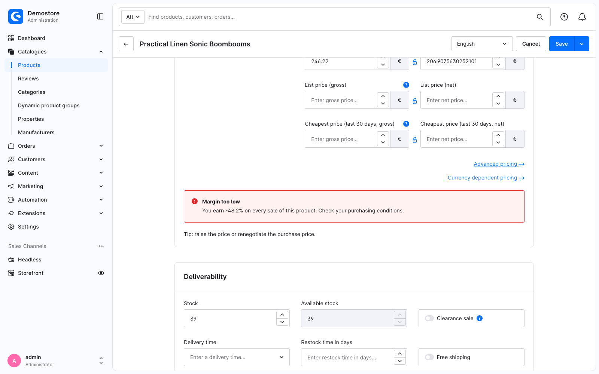

---
nav:
  title: Tutorial
  position: 20

---

# Tutorial: extend the Administration with Single File Components

<!--@include: ../../../../../../snippets/guide/administration_sfc_experimental.md-->

In five chapters, you build a plugin from scratch. At the end, it warns a merchant on the product detail page when a product's profit margin is too low:

Start with the first chapter, which sets up your development environment.

## Chapters

<PageRef page="set-up-your-environment" title="1. Set up your environment" sub="Docker, the plugin skeleton, and the build" />
<PageRef page="your-first-override" title="2. Your first override" sub="Put your own markup on the product detail page" />
<PageRef page="read-the-base-component" title="3. Read the component you extend" sub="useSwPreviousState() and real product data" />
<PageRef page="build-your-own-component" title="4. Build your own component" sub="A base SFC with props and state of its own" />
<PageRef page="make-it-extensible" title="5. Make your component extensible" sub="sw-block, swDefinePublic and swDefineOverride" />
