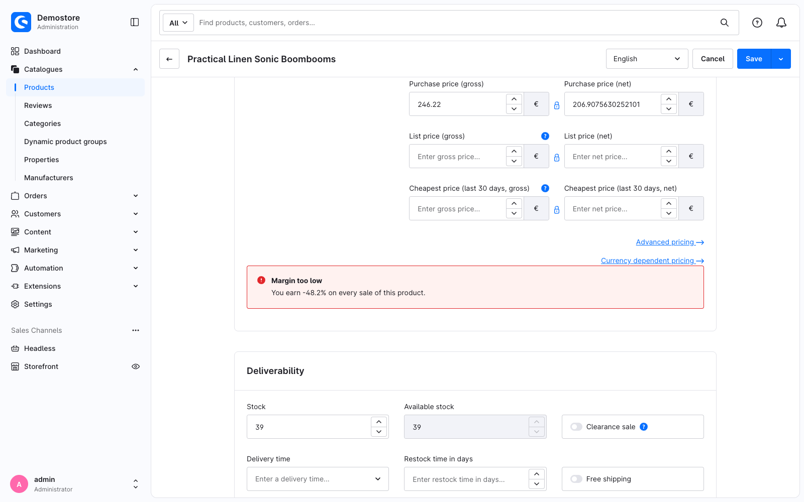

---
nav:
  title: 3. Read the component you extend
  position: 30

---

# Chapter 3: Read the component you extend

<!--@include: ../../../../../../snippets/guide/administration_sfc_experimental.md-->

The banner says the same thing on every product. In this chapter it reads the product out of the component it extends and works out the actual margin.

## Where that state lives

`sw-product-detail-base` is not a Single File Component. Like most of the Administration today it is a pair of files:

```text
src/Administration/…/view/sw-product-detail-base/
├── index.js                          ← the Options API configuration
└── sw-product-detail-base.html.twig  ← the template you took the block name from
```

`index.js` exports an Options API object - `data()`, `computed`, `methods`, `props` - and everything in it hangs off `this` when the component runs. That object is what your override reads from, so it is worth opening alongside the template when you plan an override. `sw-product-detail-base` has a `product` computed:

```javascript
// src/Administration/…/view/sw-product-detail-base/index.js
computed: {
    product() {
        return Shopware.Store.get('swProductDetail').product;
    },
    // …
},
```

## `useSwPreviousState()`

Your override is not that component and has no `this` of its own to reach it through. It asks for the state instead:

```ts
const previousState = useSwPreviousState();
```

Like the macros, it is auto-imported, and it exists only inside an `.override.vue` file. What it gives you is everything the component you override exposes: its `data`, `computed`, `methods` and `props` - or, once that component has been migrated to a Single File Component, everything it published for extensions.

So `previousState.product` is the product currently open in the form, including unsaved edits.

::: warning Read values with `.value`
`previousState.product` is a ref, so read it with `.value` in your script:

```ts
const name = previousState.product.value?.name;
```

In a template Vue unwraps it for you, as it does with any ref.
:::

## Work out the margin

A product carries its selling price in `price` and, optionally, what it cost you in `purchasePrices`. Both are arrays with one entry per currency, so the first entry is the one shown in the form:

```ts
// A price field holds one entry per currency; the first one is what the form shows.
function firstNetPrice(prices: unknown): number | null {
    const [first] = (prices ?? []) as { net?: number }[];

    return typeof first?.net === 'number' ? first.net : null;
}

const margin = computed(() => {
    const product = previousState.product.value;
    const sellingPrice = firstNetPrice(product?.price);
    const purchasePrice = firstNetPrice(product?.purchasePrices);

    if (!sellingPrice || !purchasePrice) {
        return null;
    }

    return (sellingPrice - purchasePrice) / sellingPrice;
});
```

::: info Types for entity fields
`firstNetPrice` narrows the price field by hand because the generated entity schema types it loosely. Better type safety for entity data out of the box is being worked on.
:::

## Using values in the template

Your override's bindings are available inside its `<sw-block extends>` content, and they read like any other Vue template binding:

```html
<sw-block extends="sw_product_detail_base_price_form">
    <p>{{ message }}</p>

    <mt-banner :variant="isTooLow ? 'critical' : 'positive'">
        {{ message }}
    </mt-banner>
</sw-block>
```

::: warning Mutating a binding in the template
Mutating a binding inside a template - `@click="counter++"` - is not supported. Wrap the mutation in a function and call that from the event handler instead: `@click="increment()"`.
:::

## The whole file

The margin and the verdict are computed in the script; the template just reads them:

```vue
<!-- <plugin root>/src/Resources/app/administration/src/override/sw-product-detail-base.override.vue -->
<template>
    <sw-block extends="sw_product_detail_base_price_form">
        <sw-block-parent />

        <mt-banner
            class="swag-margin-hint"
            :variant="isTooLow ? 'critical' : 'positive'"
            :title="isTooLow ? 'Margin too low' : 'Margin looks healthy'"
        >
            {{ message }}
        </mt-banner>
    </sw-block>
</template>

<script setup lang="ts">
import { computed } from 'vue';

const previousState = useSwPreviousState();

// A price field holds one entry per currency; the first one is what the form shows.
function firstNetPrice(prices: unknown): number | null {
    const [first] = (prices ?? []) as { net?: number }[];

    return typeof first?.net === 'number' ? first.net : null;
}

const margin = computed(() => {
    const product = previousState.product.value;
    const sellingPrice = firstNetPrice(product?.price);
    const purchasePrice = firstNetPrice(product?.purchasePrices);

    if (!sellingPrice || !purchasePrice) {
        return null;
    }

    return (sellingPrice - purchasePrice) / sellingPrice;
});

const isTooLow = computed(() => margin.value !== null && margin.value < 0.25);

const message = computed(() => {
    if (margin.value === null) {
        return 'This product has no purchase price, so no margin can be calculated.';
    }

    return `You earn ${(margin.value * 100).toFixed(1)}% on every sale of this product.`;
});

swDefineOverride({});
</script>
```

## Checkpoint

Reload a product that has a purchase price set:



Edit the purchase price and watch the percentage follow along.

## Two more composables

`useSwPreviousState()` has two companions, and all three exist only inside an override:

| Composable | Returns |
| --- | --- |
| `useSwPreviousState()` | The state of the component you override. Refs are **not** unwrapped |
| `useSwProps()` | The props that component was given, read only |
| `useSwContext()` | Its Vue setup context: `emit`, `attrs`, `slots`, `expose` |

A base component needs none of them: it reads its own props from `defineProps()` and emits through `defineEmits()`, because its `<script setup>` runs the ordinary way. That is [Chapter 4](build-your-own-component).

*Reference: [`useSwPreviousState()`](../api-reference/composables/use-sw-previous-state), [`useSwProps()`](../api-reference/composables/use-sw-props), [`useSwContext()`](../api-reference/composables/use-sw-context).*

## What this replaces

<Tabs>
<Tab title="Single File Component">

```vue
<script setup lang="ts">
import { computed } from 'vue';

const previousState = useSwPreviousState();

const margin = computed(() => {
    const product = previousState.product.value;
    // …
});

swDefineOverride({});
</script>
```

</Tab>
<Tab title="Twig / Options API">

```javascript
Shopware.Component.override('sw-product-detail-base', {
    template,

    computed: {
        margin() {
            const product = this.product;
            // …
        },
    },
});
```

</Tab>
</Tabs>

`this.<name>` becomes `previousState.<name>.value`, and the override config becomes plain setup code. What you gain is an explicit boundary: `previousState` is visibly *the other component*, where `this` silently mixed both.

Next: [Build your own component](build-your-own-component).
