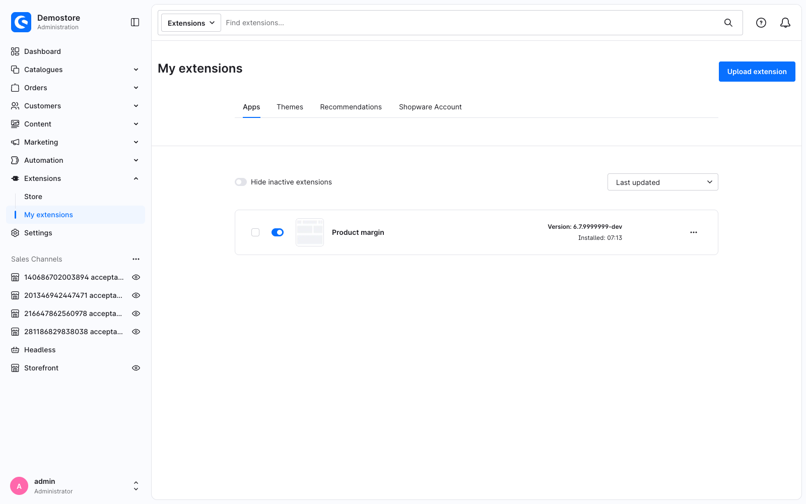

---
nav:
  title: 1. Set up your environment
  position: 10

---

# Chapter 1: Set up your environment

<!--@include: ../../../../../../snippets/guide/administration_sfc_experimental.md-->

At the end of this chapter you have a running shop in Docker and an installed plugin that does nothing yet. The first `.vue` file comes in [Chapter 2](your-first-override).

## A shop to develop against

Before you start, install Docker and [Shopware CLI](https://developer.shopware.com/docs/products/cli/). The tutorial uses Shopware CLI throughout.

In your terminal, go to the directory where the tutorial project should live, and create a shop from the `trunk` branch:

```bash
shopware-cli project create swag-sfc-tutorial dev-trunk --docker
```

`dev-trunk` installs the current state of `trunk`, so you get the newest state of the experimental API. Any release from 6.7.16.0 on works as well. Then start the shop:

```bash
cd swag-sfc-tutorial
shopware-cli project dev
```

That starts the containers, installs Shopware if it is not installed yet, and opens a dashboard with the shop URL, the admin URL and the credentials.

<PageRef page="../../../../../development/dev-environment" title="Development environment" sub="The full Shopware CLI Docker setup, its dashboard and its options" />

### Running commands inside the container

PHP and the database run inside the containers, and the service hostnames the shop is configured with only resolve there. So every command that touches the shop has to run inside the `web` container:

<Tabs>
<Tab title="Shopware CLI">

```bash
shopware-cli project console cache:clear
```

Shopware CLI runs the command inside the container for you. The alias `swx` is shorter and does the same:

```bash
swx plugin:refresh
```

</Tab>
<Tab title="Composer">

```bash
docker compose exec web composer install
```

`docker compose exec web` runs any command inside the container, Composer included. To run several commands, open a shell there instead:

```bash
docker compose exec web bash
```

</Tab>
</Tabs>

Everywhere below, console commands are written as `shopware-cli project console …`. In a shell inside the `web` container, `bin/console …` does the same.

### Demo data

A fresh shop has no products. The tutorial needs some: from [Chapter 2](your-first-override) on you open a product, and from [Chapter 3](read-the-base-component) on its purchase price matters. The demo data generator creates 1,000 products with random prices and purchase prices, plus customers, orders and categories. It ships with `shopware/dev-tools`, so install that first:

```bash
shopware-cli project composer require --dev shopware/dev-tools
```

Then generate the data and refresh the search indices:

```bash
shopware-cli project console framework:demodata --env=prod
```

```bash
shopware-cli project console dal:refresh:index
```

All three take about two minutes together. `--env=prod` is required: the generator refuses to run in the `dev` environment.

## The plugin

Create this structure below your shop's `custom/plugins` directory:

```text
custom/plugins/SwagProductMargin/
├── composer.json
└── src/
    ├── SwagProductMargin.php
    └── Resources/
        └── app/
            └── administration/
                └── src/
                    └── main.ts
```

The path matters: Shopware finds your Administration code at `src/Resources/app/administration/src/`, and `main.ts` inside it is the entry point. The rest of this tutorial writes `<plugin root>` for `custom/plugins/SwagProductMargin`, so that directory is:

```text
<plugin root>/src/Resources/app/administration/src/
```

Everything below it is yours to organise into whatever directories you like - the build searches the whole tree. This tutorial ends up with `override/`, `component/` and `override-demo/` directories, but nothing depends on those names.

`main.ts` is the one file you create empty. The main flow of this tutorial leaves it empty, because the build finds your code on its own, but it has to exist for the plugin to be picked up:

```typescript
// <plugin root>/src/Resources/app/administration/src/main.ts
// Intentionally empty: overrides register themselves and components are imported where they are used.
```

```json
// <plugin root>/composer.json
{
    "name": "swag/product-margin",
    "description": "Warns when a product's profit margin is too low",
    "type": "shopware-platform-plugin",
    "license": "MIT",
    "autoload": {
        "psr-4": {
            "Swag\\ProductMargin\\": "src/"
        }
    },
    "extra": {
        "shopware-plugin-class": "Swag\\ProductMargin\\SwagProductMargin",
        "label": {
            "en-GB": "Product margin"
        }
    }
}
```

```php
// <plugin root>/src/SwagProductMargin.php
<?php declare(strict_types=1);

namespace Swag\ProductMargin;

use Shopware\Core\Framework\Plugin;

class SwagProductMargin extends Plugin
{
}
```

::: info More on the PHP side
This tutorial keeps the PHP to the absolute minimum. Plugin metadata, versioning, lifecycle methods and services are covered in the [Plugin base guide](../../../plugin-base-guide).
:::

Install and switch it on:

```bash
shopware-cli project console plugin:refresh
```

```bash
shopware-cli project console plugin:install --activate SwagProductMargin
```

You need those two once for each new plugin. Editing files inside an already-activated plugin does not need them.

## Build the Administration

Your `.vue` files are compiled into the Administration bundle. Pick the right command and you save a lot of waiting:

<Tabs>
<Tab title="Watcher (while developing)">

```bash
shopware-cli project admin-watch
```

Serves the Administration with hot module replacement. Save a file, the browser updates. Use this for Chapters 2 to 5.

</Tab>
<Tab title="Full build">

```bash
shopware-cli project admin-build
```

Compiles the Administration and every extension into static assets, the way a production install runs it. Slower, but it is what your users will actually get, so run it at least once before you hand it to anyone.

</Tab>
</Tabs>

<PageRef page="../../../../../development/tooling/using-watchers" title="Hot module replacement" sub="Watchers and build commands for the Administration and the Storefront" />

## Turn on editor support

Everything the build rejects is also reported by ESLint, on the exact line, as you type. Setting that up before you write the first component is worth the one command:

```bash
shopware-cli project console administration:setup-extension-tooling
```

It writes a `tsconfig.json` and an `eslint.config.mjs` into your plugin and shows you which settings to configure in your IDE.

You can run the checks by hand with this command:

```bash
shopware-cli project console administration:check-extensions -- --only=SwagProductMargin
```

```text
  SwagProductMargin  custom/plugins/SwagProductMargin
    TypeScript ✔ passed       managed · 4.9s
    ESLint     ✔ passed       managed · 3.6s
```

The `--` is required: everything after it is passed on to the checker, and without it the console rejects `--only` as an unknown option.

::: info `vue-tsc` is not installed
If the check reports that `vue-tsc` is not installed, run this command:

```bash
docker compose exec web npm ci --prefix vendor/shopware/administration/Resources/app/administration
```

:::

Working inside the [shopware/shopware](https://github.com/shopware/shopware) repository itself? There, `composer admin:setup-extension-tooling` and `composer admin:check-extensions` do the same.

::: info Experimental
Both commands were newly introduced and their usage may still change. [Give us feedback](../roadmap#give-us-feedback).
:::

## Checkpoint

Open the Administration and go to **Extensions → My extensions**. Search for `Product margin`: it is listed and switched on.



Nothing else is visible yet, because the plugin has no Administration code. That is [Chapter 2](your-first-override).
