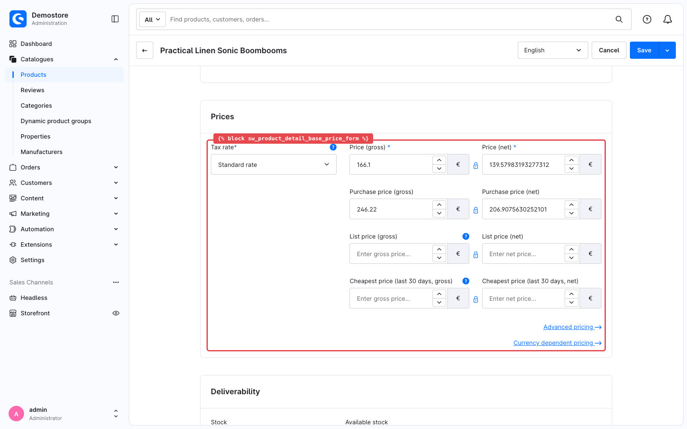
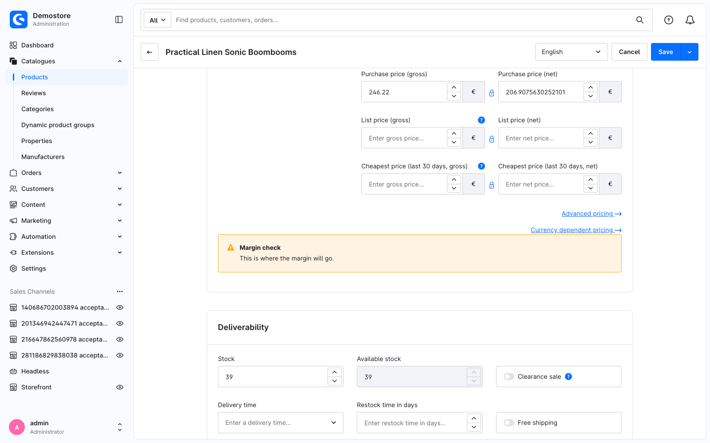

---
nav:
  title: 2. Your first override
  position: 20

---

# Chapter 2: Your first override

<!--@include: ../../../../../../snippets/guide/administration_sfc_experimental.md-->

The plugin from [Chapter 1](set-up-your-environment) does nothing. In this chapter it puts a banner of your own onto the product detail page, right under the price fields.

## Pick the spot

In the Administration, go to **Catalogues → Products**, click any product, stay on the **General** tab and scroll down to the **Prices** card. The price fields inside it are what this chapter puts a banner under:



That card is rendered by the core component `sw-product-detail-base`, and its template marks the places extensions may hook into. The outlined area above is one of them:

```twig
{# src/Administration/…/view/sw-product-detail-base/sw-product-detail-base.html.twig #}

<mt-card :title="$t('sw-product.detailBase.cardTitlePrices')">

    
    <sw-product-price-form :allow-edit="acl.can('product.editor')" />
    

</mt-card>

```

Every `` name is an extension point. `sw_product_detail_base_price_form` is the one that wraps the price fields, so that is where the banner goes.

::: tip Finding a block
Block names are stable identifiers, and the fastest way to a name is the component's template in [shopware/shopware](https://github.com/shopware/shopware). Search for a piece of the text or a CSS class you can see on screen, then take the enclosing block.
:::

## One file, and its name is the registration

Create a single file:

```text
<plugin root>/src/Resources/app/administration/src/override/sw-product-detail-base.override.vue
```

That filename is doing two jobs, and there is no registration call anywhere to do them instead:

* `sw-product-detail-base` - **which component** this file overrides.
* `.override.vue` - **that** it is an override rather than a component of its own.

`sw-product-detail-base/index.override.vue` would mean exactly the same thing. Where in your plugin the file sits does not matter; the build scans your whole Administration directory for `*.override.vue`, imports every file it finds and registers it. You never add an import to `main.ts`.

## The shape of the file

An override is an ordinary Vue Single File Component with two Shopware rules layered on top. Start with the skeleton:

```vue
<!-- <plugin root>/src/Resources/app/administration/src/override/sw-product-detail-base.override.vue -->
<template>
    <!-- what you contribute to the component you override -->
</template>

<script setup lang="ts">
swDefineOverride({});
</script>
```

Two things to note before filling it in.

**It has to be `<script setup>`.** A plain `<script>` with an Options API object is rejected at build time.

**`swDefineOverride()` is mandatory.** It is auto-imported. It lists the state this file replaces in the component it overrides; this file replaces none yet, so it passes an empty object.

## `sw-block`: where your markup goes

To change the markup of a component, you first pick the block you want to touch and then target it with `<sw-block extends>`. This tutorial picked `sw_product_detail_base_price_form` out of `sw-product-detail-base.html.twig` above, and the name is used verbatim.

The `<template>` of an override file exists only to declare those targets. It renders nothing on its own; it modifies the blocks of the base component when *that* component renders. Two components express it:

```html
<sw-block extends="sw_product_detail_base_price_form">
    <sw-block-parent />
    <p>… and this is mine</p>
</sw-block>
```

* **`<sw-block extends="…">`** replaces the target block with the content that goes in here. To keep the original content, use `<sw-block-parent />`.
* **`<sw-block-parent />`** renders whatever was in that extension point before you: the original content, or the previous extension in the chain.

If you do not use `<sw-block-parent />`, the original markup is removed - so be aware. These are the techniques you can use:

<Tabs>
<Tab title="Append">

```html
<sw-block extends="sw_product_detail_base_price_form">
    <sw-block-parent />
    <p>I go after</p>
</sw-block>
```

</Tab>
<Tab title="Prepend">

```html
<sw-block extends="sw_product_detail_base_price_form">
    <p>I go before</p>
    <sw-block-parent />
</sw-block>
```

</Tab>
<Tab title="Replace">

```html
<sw-block extends="sw_product_detail_base_price_form">
    <p>The price fields are gone now</p>
</sw-block>
```

</Tab>
</Tabs>

When several extensions target the same block they form a chain, and each one's `<sw-block-parent />` renders the previous one's output. That is why rendering the parent matters even when your own change looks additive: it is what keeps the other plugins on the page.

::: info Coming from TwigJS?
`<sw-block extends>` is `` in an override template, and `<sw-block-parent />` is ``. The section at the end of this page puts the two side by side, and the **migration guide** - *page planned, [#20186](https://github.com/shopware/shopware/issues/20186)* - will walk a whole extension through the change.
:::

## The whole file

```vue
<!-- <plugin root>/src/Resources/app/administration/src/override/sw-product-detail-base.override.vue -->
<template>
    <sw-block extends="sw_product_detail_base_price_form">
        <sw-block-parent />

        <mt-banner
            class="swag-margin-hint"
            variant="attention"
            title="Margin check"
        >
            This is where the margin will go.
        </mt-banner>
    </sw-block>
</template>

<script setup lang="ts">
swDefineOverride({});
</script>
```

`mt-banner` is one of the Administration's globally registered components - no import needed, it resolves by tag name.

## Checkpoint

Start the watcher, or run a build:

```bash
shopware-cli project admin-watch
```

Go back to the product you opened at the start of this chapter and scroll to **Prices**:



::: info About the spacing
Block content sits flush against the content above it, with no gap. We will address that later on.
:::

Your plugin is on a core page, and the core page has not been touched.

If nothing appears, the [troubleshooting page](../troubleshooting) lists the usual causes.

## What this replaces

The same override written the way the Administration has worked so far:

<Tabs>
<Tab title="Single File Component">

```vue
<!-- override/sw-product-detail-base.override.vue -->
<template>
    <sw-block extends="sw_product_detail_base_price_form">
        <sw-block-parent />
        <mt-banner title="Margin check">This is where the margin will go.</mt-banner>
    </sw-block>
</template>

<script setup lang="ts">
swDefineOverride({});
</script>
```

</Tab>
<Tab title="Twig / Options API">

```twig
{# override/sw-product-detail-base/sw-product-detail-base.html.twig #}

    
    <mt-banner title="Margin check">This is where the margin will go.</mt-banner>

```

```javascript
// override/sw-product-detail-base/index.js
import template from './sw-product-detail-base.html.twig';

Shopware.Component.override('sw-product-detail-base', {
    template,
});
```

```javascript
// main.js
import './override/sw-product-detail-base';
```

</Tab>
</Tabs>

Both still work, and both can live in the same plugin.

Next: [Read the component you extend](read-the-base-component), where the banner gets a real number in it.
