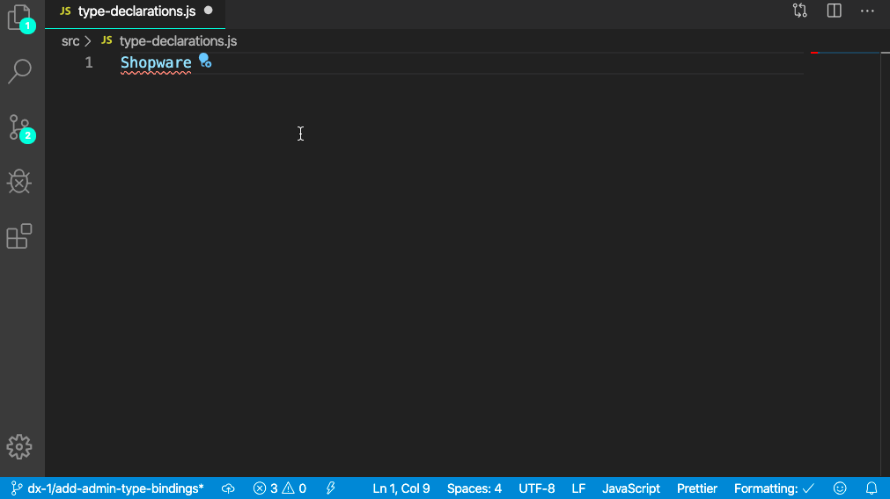

---
nav:
  title: The Shopware object
  position: 270

---

# The Shopware object

## Overview

The global `Shopware` object is the bridge between the Shopware Administration and your plugin as third party code. It provides utility functions to interface to the rest of the Administration.

::: warning
Don't try to access other parts of the Administration directly, always use the `Shopware` object.
:::

It is bound to a window object in order to be accessible everywhere and can therefore be inspected with the browser console in the developer tools. To take a look at it, open the `Administration` in your browser and run this in the dev-tools console:

```javascript
// run this command in the dev-tools of your browser
console.log(Shopware);
```

There are lots of things bound to this object. So here is a short overview of the most commonly used parts.

## Component

The `Component` property of the global `Shopware` contains the component registry, wich is responsible for handling the VueJS components. If you want to write your own components you have to register them with the `Component.register()` method. Those components are small reusable building blocks which you can use to implement your features.

```javascript
const { Component } = Shopware;

Component.register('sw-dashboard-index', {
    template,
});
```

Learn more about them here: [Creating administration component](add-custom-component)

## Module

The `Module` property of the global `Shopware` contains the module registry. A `Module` is an encapsulated unit of routes and pages, which implements a whole feature. For example there are modules for customers, orders, settings, etc.

```javascript
const { Module } = Shopware;

Module.register('your-module', {});
```

Learn more about them here: [Creating administration module](add-custom-module)

## A more general overview

We now have discussed the most commonly used parts of the `Shopware` object, but there is much more to discover. Take a look at all these options in a brief overview below:

| Property   | Description                                                                                 |
| :--------- | :------------------------------------------------------------------------------------------ |
| ApiService | Registry which holds services to fetch data from the api                                    |
| Component  | A registry for VueJS `components`                                                           |
| Context    | A set of contexts for the `app` and the `api`                                               |
| Defaults   | A collection of default values                                                              |
| Directive  | A registry for [VueJS `directives`](https://vuejs.org/v2/guide/custom-directive.html)       |
| Filter     | A registry for [VueJS template `filters`](https://vuejs.org/v2/guide/filters.html)          |
| Helper     | A collection of helpers, e.g. the `DeviceHelper` where you can listen on the `resize` event |
| Locale     | A registry for `locales`                                                                    |
| Mixin      | A registry for `mixins`                                                                     |
| Module     | A registry for `modules`                                                                    |
| Plugin     | An interface to add `promise`based hooks to run when the Administration launches            |
| Service    | A helper to get quick access to service, e.g. `Shopware.Service('snippetService')`          |
| Shortcut   | A registry for keyboard shortcuts                                                           |
| State      | A wrapper for the [VueX](https://vuex.vuejs.org/) store to manage state                     |
| Utils      | A collection of utility methods like `createId`                                             |

## TypeScript declarations

::: info
TypeScript declarations are available from Shopware Version 6.4.4.0
:::

The Shopware Administration is written in pure JavaScript. To provide you with the benefits of TypeScript and the best possible developer experience while working in JavaScript files we're providing TypeScript declaration files within the Administration. These files are helping you to understand how the Shopware object works and what arguments you have to provide for example when you're creating a new module or registering a new component.



In the example above you can see how the TypeScript declarations are helping you to register a module. It automatically marks your code and points out what is missing.

## Next steps

As you might have noticed, the `Shopware` object can be used in a lot of cases. Besides registering components and modules, here are some guides about [adding filters](add-filter), about [adding mixins](add-mixins) and about [using our utils](using-utils) - all by using the Shopware object.
