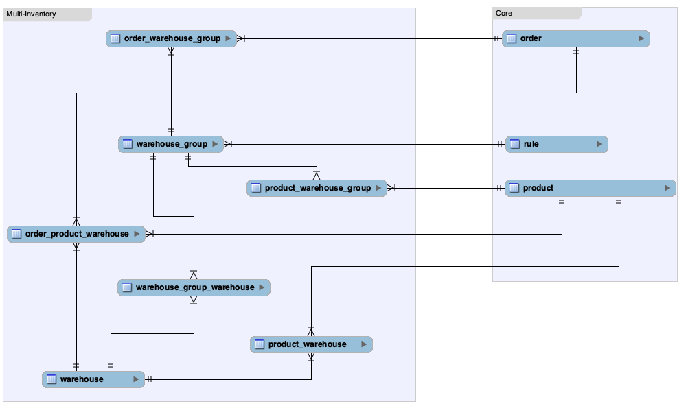

---
nav:
  title: Multi Inventory
  position: 20

---

# Multi-Inventory

## Pre-requisites and setup

### Commercial Plugin

Multi-Inventory is part of the Commercial plugin available along with the Beyond plan. This feature requires:

* Shopware 6 instance
* [Shopware Beyond](https://docs.shopware.com/en/shopware-6-en/features/shopware-beyond) license
* Activated Commercial plugin. Refer to [plugin base guide](../../../../guides/plugins/plugins/plugin-base-guide#install-your-plugin) for installation instructions

### Admin UI

While this feature is supposed to be used by API first, i.e. by ERP systems, it still comes with an user interface for the Administration. Refer to [My extensions](https://docs.shopware.com/en/shopware-6-en/extensions/myextensions) section of shopware docs to explore more about it.

### Admin API

To create, modify or delete Warehouses, WarehouseGroups etc., related to Multi-Inventory, you can access Admin API endpoints described further.

Meanwhile, refer to the following links regarding the general use of the Admin API:

* [Authentication & Authorization](https://shopware.stoplight.io/docs/admin-api/ZG9jOjEwODA3NjQx-authentication)
* [Request & Response Structure](https://shopware.stoplight.io/docs/admin-api/ZG9jOjEyMzAzNDU1-request-and-response-structure)
* [Endpoint Structure](https://shopware.stoplight.io/docs/admin-api/ZG9jOjEyMzA1ODA5-endpoint-structure)

## Data structure

The Multi-Inventory feature implements a specific data structure for its internal stock handling. The following entity-relationship model visually represents the new entities, as well as the relationships between them and platform entities.



## Working with the API

The following examples contain payloads for typical use-cases of this feature. Basically all new entities fully support the Admin API via sync service or their generic entity endpoints.

### Creating or updating a WarehouseGroup and assigning it to an existing Warehouse

```json

// POST /api/warehouse-group
// PATCH /api/warehouse-group/8cf7736855594501aaf86351e147c61e

{
    "id": "8cf7736855594501aaf86351e147c61e",
    "name": "Group A",
    "description": "Lorem ipsum dolor sit amet, consetetur sadipscing elitr, sed diam nonumy eirmod tempor invidunt ut labore.",
    "priority": 25,
    "ruleId": "93248b220a064424a1f6e90010820ba2",
    "warehouses":  [{
        "id": "4ce2bd36d2824153812fcb6a97f22d22"
    }]
}
```

### Creating or updating a Warehouse and assigning it to an existing WarehouseGroups

```json

// POST /api/warehouse
// PATCH /api/warehouse/4ce2bd36d2824153812fcb6a97f22d22

{
    "id": "4ce2bd36d2824153812fcb6a97f22d22",
    "name": "Warehouse A",
    "groups": [{
        "id": "8cf7736855594501aaf86351e147c61e"
    }, {
        "id": "4154501a3812fcb6a501aaf8c7736855"
    }]
}
```

### Assigning WarehouseGroups to Products, creating ProductWarehouses via association

```json

// POST /api/_action/sync

[{
    "action": "upsert",
    "entity": "product",
    "payload": [{
        "id": "86d38702be7e4ac9a941583933a1c6f5",
        "versionId": "0fa91ce3e96a4bc2be4bd9ce752c3425",
        "warehouseGroups": [{
            "id": "8cf7736855594501aaf86351e147c61e"
        }],
        "warehouses": [{
            "id": "f5c850109fe64c228377cbd369903b75",
            "productId": "86d38702be7e4ac9a941583933a1c6f5",
            "productVersionId": "0fa91ce3e96a4bc2be4bd9ce752c3425",
            "warehouseId":"4ce2bd36d2824153812fcb6a97f22d22",
            "stock": 0
        }]
    }]
}]
```

### Updating ProductWarehouse stocks

You can update `product_warehouse.stock` in batch via SyncApi, or patch a specific entity directly via entity repository.

```json

// POST /api/_action/sync

[{
    "action": "upsert",
    "entity": "product_warehouse",
    "payload": [{
        "id": "f5c850109fe64c228377cbd369903b75",
        "stock": 1500
    }, {
        "id": "228377cbd369903b75f5c850109fe64c",
        "stock": 0
    }]
}]

// PATCH /api/product-warehouse/f5c850109fe64c228377cbd369903b75

{
    "id": "f5c850109fe64c228377cbd369903b75",
    "stock": 1500
}
```

## Concept

::: info
Every described behavior only applies to Products that are assigned to WarehouseGroups and every unrelated Product will use the default Shopware behavior.
:::

### ERP System as Single-Source-of-Truth

Multi-Inventory is intended to be used as an interface between Shopware and your resource management software. This means that Shopware will only calculate the availability of Products based on your Warehouse configuration and changes stocks of a Warehouse when an order is created. This prevents oversales while also making your system the single source of truth - making it easier to maintain both systems at the same time.

### Product Availability

Availability of Products is defined in 2 steps:

* WarehouseGroups can be assigned to Rules (Rule builder)
  * If the rule is invalid, this Group will not be considered in calculating Product availability.
  * Products/Warehouses can still be available via other groups.
  * If multiple rules are valid, WarehouseGroups can be prioritized with their own priority, they are not tied to rule priority.
* Products can have a stock per Warehouse
  * All Warehouses inside an active WarehouseGroup are taken into account for calculating the total stock of a specific Product.
  * Warehouses are unique, but can be assigned to multiple Groups (e.g. all Warehouses in the Group "Germany" can also be in the Group "Europe").

If both conditions are true (e.g. "Customer is in a specific customer group" and "requested stock <= total Product stock of all valid Warehouses"), the requested Product is considered available. This calculation also considers other Product properties like `max_purchase`, `min_purchase`, and `purchase_steps`.

## Caveats

When working with the Multi-Inventory feature, there are some caveats to keep in mind

* We decided to *not* add the functionality of `product.available_stock` to Multi-Inventory. The stock of Products (or rather ProductWarehouses) will now be reduced immediately after an order was placed. It is no longer necessary to set any order state (for Products assigned to WarehouseGroups) to reduce the stock.
  * Order states are still important for any other workflow, e.g. FlowBuilder triggers, or event subscribers in general.
* Multi-Inventory will not recalculate the stock of Products assigned to WarehouseGroups when editing existing orders in any way. The whole stock handling in this regard is supposed to be done by an external ERP system, the information then need to be pushed to your Shopware instance (e.g. by immediate or daily syncs).
* If you decide to stop using Multi-Inventory for certain products (deleting existing data or deactivating the feature), Shopware will fall back into its default behavior. This is especially important when editing existing orders, since the stocks were taken from ProductWarehouse entities. Shopware will use incorrect data or values to increase/decrease Product stocks, if the order originally included ProductWarehouses.
