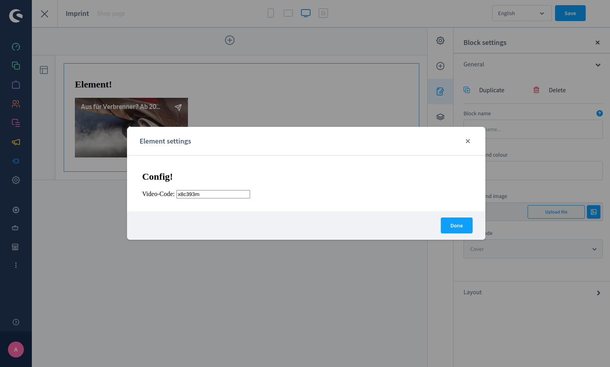

---
nav:
  title: Add CMS element via AdminExtensionSDK
  position: 30

---

# Add CMS Element via Admin Extension SDK

## Overview

This article will teach you how to create a new CMS element via the Admin Extension SDK. The plugin in this example will be named `SwagBasicAppCmsElementExample`, similar to the other guides.

## Prerequisites

* Knowledge on the creation of [Plugins](/docs/guides/plugins/plugins/plugin-base-guide) or [Apps](/docs/guides/plugins/apps/app-base-guide)
* Knowledge on the [creation of custom admin components](/docs/guides/plugins/plugins/administration/add-custom-component#creating-a-custom-component)
* Understanding the [Admin Extension SDK](https://shopware.github.io/admin-extension-sdk/docs/guide/getting-started/installation)

::: info
This example uses TypeScript, which is recommended, but not required for developing Shopware.
:::

## Creating your custom element

Similar to [Creating a new custom element via plugin](/docs/guides/plugins/plugins/content/cms/add-cms-element#creating-your-custom-element), this article describes creating a new custom element via app.
Creating a new element requires Admin Extension SDK.

Consider the same scenario to allow a shop manager configure a link to display the Dailymotion video. That is exactly what you are going to build.

### Target structure

You can decide what approach to use when creating apps since everything here is loaded via iFrame. However, Shopware's best practice is a full Vue.js approach.

When our extension is finished, you will get the following file structure:

```bash
// <plugin root>/src/Resources/app/administration/src
├── base
│   └── mainCommands.ts
├── main.ts
├── viewRenderer.ts
└── views
    └── swag-dailymotion
        ├── swag-dailymotion-config.ts
        ├── swag-dailymotion-element.ts
        └── swag-dailymotion-preview.ts
```

## Initial loading of components

Everything starts in the `main.ts` file:

```js
import 'regenerator-runtime/runtime';
import { location } from '@shopware-ag/admin-extension-sdk';

// Only execute extensionSDK commands when
// it is inside a iFrame (only needed for plugins)
if (location.isIframe()) {
    if (location.is(location.MAIN_HIDDEN)) {
        // Execute the base commands
        import('./base/mainCommands');
    } else {
        // Render different views
        import('./viewRenderer');
    }
}
```

This is the main file, which is executed first and functions as the entry point.

Start with `if(location.isIframe())` to make sure only content used inside iFrames is loaded. While the SDK is used in apps and plugins, this check ensures the code is executed in the right place.

Next you need `if(location.is(location.MAIN_HIDDEN))` to **load the main commands**, which are defined in the `mainCommands.ts` file. This will only be used to load logic, but not templates into the Administration.

Lastly, the `else` case will be responsible for specific loading of views via `viewRenderer.ts`. This is where the view templates will be loaded.

### Loading all required templates

Now, create the `viewRenderer.ts` file, which includes the three mandatory files needed for a CMS element as below:

* `swag-dailymotion-config.ts`, which will handle the content of the CMS element configuration
* `swag-dailymotion-element.ts`, which represents the actual target element in the CMS
* `swag-dailymotion-preview.ts`, which is responsible for the preview, when selecting the CMS element in its selection screen

Observe that every file is named according to the component and prefixed with `swag-dailymotion`, (vendor prefix) to ensure no other developer accidentally chooses the same name.

Let us see how the component loading via `viewRenderer.ts` looks like:

```js
import Vue from 'vue';
import { location } from '@shopware-ag/admin-extension-sdk';

// watch for height changes
location.startAutoResizer();

// start app views
const app = new Vue({
    el: '#app',
    data() {
        return { location };
    },
    components: {
        'SwagDailymotionElement':
            () => import('./views/swag-dailymotion/swag-dailymotion-element'),
        'SwagDailymotionConfig':
            () => import('./views/swag-dailymotion/swag-dailymotion-config'),
        'SwagDailymotionPreview':
            () => import('./views/swag-dailymotion/swag-dailymotion-preview'),
    },
    template: `
        <SwagDailymotionElement
            v-if="location.is('swag-dailymotion-element')"
        ></SwagDailymotionElement>
        <SwagDailymotionConfig
            v-else-if="location.is('swag-dailymotion-config')"
        ></SwagDailymotionConfig>
        <SwagDailymotionPreview
            v-else-if="location.is('swag-dailymotion-preview')"
        ></SwagDailymotionPreview>
    `,
});
```

Really straightforward, isn't it? As you probably know from Vue.js's Options API, you just need to load, register and use the Vue.js component to make them work.

What's especially interesting here is the use of the `location` object. This is a main concept of the Admin Extension SDK, where Shopware provides dedicated `locationIds` to offer you places to inject your templates into. For further information on that, it is recommend to have a look at the documentation of the [Admin Extension SDK](https://shopware.github.io/admin-extension-sdk/docs/guide/concepts/locations) to learn more about its concepts.

In your case, we will get your own **auto-generated** `locationIds`, depending on the name of your CMS element and suffixes, such as `-element`, `-config`, and `-preview`.

Those will be available after **registering the component**, which we will do in the following chapter.

## Registering a new element

For this topic we head to `mainCommands.ts`, since the registration of CMS elements is something to be done in a global scope.

```js
import { cms } from '@shopware-ag/admin-extension-sdk';

const CMS_ELEMENT_NAME = 'swag-dailymotion';
const CONSTANTS = {
    CMS_ELEMENT_NAME,
    PUBLISHING_KEY: `${CMS_ELEMENT_NAME}__config-element`,
};

void cms.registerCmsElement({
    name: CONSTANTS.CMS_ELEMENT_NAME,
    label: 'Dailymotion video',
    defaultConfig: {
        dailyUrl: {
            source: 'static',
            value: '',
        },
    },
});

export default CONSTANTS;
```

At first, you import the Admin Extension SDK's cms object, used for `cms.registerCmsElement` to register a new element.

That is all about what is required to register your CMS element. As a best practice, it is recommended to create a **constant** for the CMS element name and the publishing key. This makes it easier to maintain and keep track of changes. The publishing key can be predefined since the name must be a combination of CMS element name and the `__config-element` suffix as shown above.

## Templates and communication with the Administration

The last files are the components inside our `views` folder. Just like you know it from typical CMS element loading, we will create a folder with the full component name, containing 3 files as shown below:

```bash
// <plugin root>/src/Resources/app/administration/src
views
└── swag-dailymotion
    ├── swag-dailymotion-config.ts
    ├── swag-dailymotion-element.ts
    └── swag-dailymotion-preview.ts
```

You can vary the structure of `swag-dailymotion`'s contents and create folders for each of the three. However, let us keep it simple with single file components.

### The config file

Let's go through each of the files to talk about it's contents, starting with `swag-dailymotion-config.ts`:

```js
import Vue from 'vue'
import { data } from "@shopware-ag/admin-extension-sdk";
import CONSTANTS from "../../base/mainCommands";

export default Vue.extend({
    template: `
        <div>
          <h2>
            Config!
          </h2>
          Video-Code: <input v-model="dailyUrl" type="text"/><br/>
        </div>
    `,

    data(): Object {
        return {
            element: null
        }
    },

    computed: {
        dailyUrl: {
            get(): string {
                return this.element?.config?.dailyUrl?.value || '';
            },

            set(value: string): void {
                this.element.config.dailyUrl.value = value;

                data.update({
                    id: CONSTANTS.PUBLISHING_KEY,
                    data: this.element,
                });
            }
        }
    },

    created() {
        this.createdComponent();
    },

    methods: {
        async createdComponent() {
            this.element = await data.get({ id: CONSTANTS.PUBLISHING_KEY });
        }
    }
});
```

This file is the config component used to define every type of configuration for the CMS element. Most of the code will be common for experienced Shopware 6 developers, so here are some important highlights:

* Import `data` from the Admin Extension SDK, which is required for data handling between this app and Shopware
* The `element` variable contains the typical CMS element object and is also used to manage the element configuration you want to edit
* The `publishingKey` is used to tell the Admin Extension SDK in Shopware what piece of information you want to fetch. In this case, you need the `element` data

So, now you need a simple input field to get a `dailyUrl` for the Dailymotion video to be displayed. For that, first fetch the element via `data.get()` as seen in `createdComponent` and then link it to the computed property `dailyUrl` with getters and setters to mutate it. Using `data.update({ id, data })` you provide the publishing key `id` as a target and `data` for the data you want to save in Shopware.

With these small additions to typical CMS element behavior, you have already done with the config modal.



### The element file

Now let's have a look at the result of `swag-dailymotion-element.ts`:

```js
import Vue from 'vue'
import { data } from "@shopware-ag/admin-extension-sdk";
import CONSTANTS from "../../base/mainCommands";

export default Vue.extend({
    template: `
        <div>
            <h2>
              Element!
            </h2>
            <div class="sw-cms-el-dailymotion">
                <div class="sw-cms-el-dailymotion-iframe-wrapper">
                    <iframe
                        frameborder="0"
                        type="text/html"
                        width="100%"
                        height="100%"
                        :src="dailyUrl">
                    </iframe>
                </div>
            </div>
        </div>
    `,

    data(): { element: object|null } {
        return {
            element: null
        }
    },

    computed: {
        dailyUrl(): string {
            return `https://www.dailymotion.com/embed/video/${this.element?.config?.dailyUrl?.value || ''}`;
        }
    },

    created() {
        this.createdComponent();
    },

    methods: {
        async createdComponent() {
            this.element = await data.get({ id: CONSTANTS.PUBLISHING_KEY });
            data.subscribe(CONSTANTS.PUBLISHING_KEY, this.elementSubscriber);
        },

        elementSubscriber(response: { data: unknown, id: string }): void {
            this.element = response.data;
        }
    }
});
```

Here, you have the main rendering logic for the Administration's CMS element. This file shows what your element will look like when it's done. So besides a template and the computed `dailyUrl`, used to correctly load the Dailymotion video player, the only interesting part is the `createdComponent` method.

It initially fetches the `element` data, as you've already seen it in the config file. After that, using `data.subscribe(id, method)` it subscribes to the publishing key, which will update the element data automatically if something changes. It doesn't matter if the changes originate from our config modal outside Shopware or from somewhere else inside Shopware.


### The preview file

Lastly, have a look at `swag-dailymotion-preview.ts`. In most cases, not much logic is to be found here, since this is the preview loaded when choosing a CMS element for your block. It makes sense to show an example preview, a miniature skeleton of the result, or just the Dailymotion logo. Therefore, the following code will suffice for your example extension:

```js
import Vue from 'vue'

export default Vue.extend({
    template: `
        <h2>
          Preview!
        </h2>
    `,
});
```


## Storefront implementation

After everything for the admin is done, there is still the need for a storefront representation of your blocks. This works similarly to typical plugin development, with an exception to the path. All Storefront templates must match the following path pattern: `<app-name>/Resources/views/storefront/element/<elementname>.html.twig`

Since everything is already described in guide [CMS element development for plugins](/docs/guides/plugins/plugins/content/cms/add-cms-element#storefront-implementation), the following example just shows how your Storefront template (`swag-daiĺymotion/Resources/views/storefront/element/cms-element-swag-dailymotion.html.twig`) could look like:

```twig

<div class="cms-element-swag-dailymotion" style="height: 100%; width: 100%">
    
    <div class="cms-el-swag-dailymotion">
        <div style="position:relative; padding-bottom:56.25%; height:0; overflow:hidden;">
            <iframe style="width:100%; height:100%; position:absolute; left:0px; top:0px; overflow:hidden"
                    src="https://www.dailymotion.com/embed/video//{{ element.config.dailyUrl.value }}"
                    frameborder="0"
                    type="text/html"
                    width="100%"
                    height="100%">
            </iframe>
        </div>
    </div>
    
</div>

```
