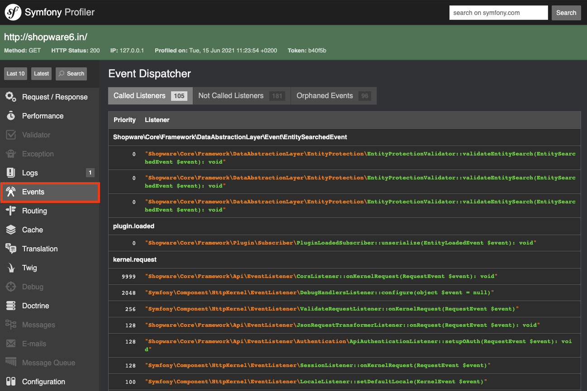

---
nav:
  title: Finding events
  position: 20

---

# Finding Events

## Overview

Shopware 6 is fully extensible via plugins.
Part of this extensibility is the usage of events, upon which one could react.

This guide will cover how you can find those events in the first place, in order to use them in your plugin.

## DAL Events

At first we will start with the [Data Abstraction Layer events](../data-handling/using-database-events).
They're fired whenever a [DAL entity](../data-handling/add-custom-complex-data) is read, written, created, or deleted.

There usually is no need to find them, since the pattern for them is always the same.
You can use them by following this pattern: `entity_name.event`.
For products, this could be e.g. `product.written` or `product.deleted`. For your custom entity, this then would be
`custom_entity.written` or `custom_entity.deleted`.

However, some default Shopware entities come with special "Event classes", which are basically a class, which contains all
possible kinds of events as constants.
Have a look at the [product event class](https://github.com/shopware/platform/blob/v6.4.0.0/src/Core/Content/Product/ProductEvents.php) for example.
This way you can also find out about all the possible DAL events available in Shopware.

Finding those "event classes" can be done by searching for the term `@Event` in your project.

You can use those events in a [subscriber](../../plugin-fundamentals/listening-to-events) like the following:

```php
public static function getSubscribedEvents(): array
{
    return [
        ProductEvents::PRODUCT_LOADED_EVENT => 'onProductsLoaded',
        'custom_entity.written' => 'onCustomEntityWritten'
    ];
}
```

As you can see, you can either use the event class constants, if available, or the string itself.

You'll then have access to several event specific information, e.g. your listener method will have access to an [EntityWrittenEvent](https://github.com/shopware/platform/blob/v6.4.0.0/src/Core/Framework/DataAbstractionLayer/Event/EntityWrittenEvent.php)
instance when subscribing to the `written` event.

```php
public function onCustomEntityWritten(EntityWrittenEvent $event): void
{
}
```

You can find all of those DAL event classes [here](https://github.com/shopware/platform/tree/v6.4.0.0/src/Core/Framework/DataAbstractionLayer/Event).

## General PHP events

If the [DAL events](#DAL events) didn't match your use case, there are a few more events built into Shopware.
These are not auto-generated events, but rather events we built in with purpose.

There are multiple ways to find them:

- By actually looking at the code, that you want to extend
- By specifically searching for them
- By having a look at the service definition of a given class

### Looking at the code

You will most likely look into our Core code quite a lot, while trying to understand what's happening and why things are happening.
On your journey looking through the code, you may stumble upon code looking like this:

```php
$someEvent = new SomeEvent($parameters, $moreParameters);
$this->eventDispatcher->dispatch($someEvent, $someEvent->getName());
```

This is an event that's being fired manually, which you can react upon.
Make sure to always have a look at the event class itself in order to find out which information it contains.

The second parameter of the `dispatch` is optional and represents the actual event's name.
If the second parameter is not applied, the class name will be used as a fallback.

When subscribing to those events, your event listener method will have access to the previously created event instance.

```php
public static function getSubscribedEvents(): array
{
    return [
        'some_event' => 'registeringToSomeEvent',
        // If there is no name applied to the event, the class name is the fallback
        SomeEvent::class => 'registeringToSomeEvent'
    ];
}

public function registeringToSomeEvent(SomeEvent $event): void
{
}
```

The [next section](#Specifically searching for events) will cover how to find those events without randomly stumbling upon them.

### Specifically searching for events

If you're really looking for a fitting event for your purpose, you might want to directly search for them.
This can be done by searching through the `<shopware root>/platform/src` or the `<shopware root>/vendor/shopware/platform/src` directory,
depending on whether you are using the [development](https://github.com/shopware/development) or the [production template](https://github.com/shopware/production).
Use one of the following search terms:

- `extends NestedEvent`: This way you will find the events themselves.
- `extends Event`: This way you will find the events themselves.
- `->dispatch`: Here you will find all the occurrences where the events are actually being fired.

### Looking at the service definition

Every service, that wants to fire an event sooner or later, needs access to the `event_dispatcher` in order to do so.

Hence, you can have a look at all the service definitions for the [Dependency injection container](../../plugin-fundamentals/dependency-injection)
and therefore quickly figure out, which services and classes are having access to the said `event_dispatcher`:

```xml
<?xml version="1.0" ?>

<container xmlns="http://symfony.com/schema/dic/services"
           xmlns:xsi="http://www.w3.org/2001/XMLSchema-instance"
           xsi:schemaLocation="http://symfony.com/schema/dic/services http://symfony.com/schema/dic/services/services-1.0.xsd">

    <services>
        <service id="Some\Service">
            <argument type="service" id="Another/Service"/>
            <argument type="service" id="event_dispatcher"/>
        </service>
    </services>
</container>
```

Therefore, you could simply search for occurrences of the `event_dispatcher` in the respective `.xml` files.

You can also do this the other way around, by having a look at the service's constructor parameters.

```php
public function __construct(
    Some\Service $someService,
    EventDispatcherInterface $eventDispatcher
) {
    $this->someService = $someService;
    $this->eventDispatcher = $eventDispatcher;
}
```

If it's having access to the `EventDispatcherInterface`, you're most likely going to find at least one event being fired
in that service.

### Other common event types

There's a few more event "types" or classes that you may stumble upon, which are worth knowing.

#### Page Loaded Events

Usually when a [Storefront page](../../storefront/add-custom-page) is being loaded, a respective "page is being loaded" event is fired
as well.

You can find an example in the [GenericPageLoader](https://github.com/shopware/platform/blob/v6.4.0.0/src/Storefront/Page/GenericPageLoader.php), which is kinda a "default page" to be used pretty often.
It dispatches an `GenericPageLoadedEvent` every time the page is being loaded.

This way, you can react to this and e.g. add more meta information to the said page.

You can find those events by searching for the term "PageLoadedEvent".

#### Criteria Events

You should be familiar with the `Criteria` class, at least if you've dealt with the [Data Abstraction Layer](../data-handling/).
There are many methods, that will dispatch a "criteria" event whenever a given default Shopware entity is being loaded using
a `Criteria` instance.

Let's have a look at an [example code](https://github.com/shopware/platform/blob/v6.4.0.0/src/Core/Content/Product/SalesChannel/Listing/ResolveCriteriaProductListingRoute.php#L55-L59):

```php
/**
 * @Since("6.2.0.0")
 * @Entity("product")
 * @Route("/store-api/product-listing/{categoryId}", name="store-api.product.listing", methods={"POST"})
 */
public function load(string $categoryId, Request $request, SalesChannelContext $context, Criteria $criteria): ProductListingRouteResponse
{
    $this->eventDispatcher->dispatch(
        new ProductListingCriteriaEvent($request, $criteria, $context)
    );

    return $this->getDecorated()->load($categoryId, $request, $context, $criteria);
}
```

So whenever the product listing route is being called, and therefore products are being loaded via the DAL and therefore via a
`Criteria` object, the `ProductListingCriteriaEvent` is being fired.

You can use this event to modify the `Criteria` object and therefore add or remove conditions, add or remove associations etc.
Of course, the code above is just one example excerpt and there are many more of those events for different entities.

Finding those events can be done by searching for the term `CriteriaEvent`.

::: info
Those "criteria events" are not generated automatically and therefore it is not guaranteed to exist for a given entity.
:::

#### Business events

Business events are fired everytime an important business / ecommerce action occurred, such as "A customer registered" or "An order was placed".

Therefore, you can use them to react on those events, most times there even is an event fired **before** an action happened.
Have a look at those two example events:

- [CustomerBeforeLoginEvent](https://github.com/shopware/platform/blob/v6.4.0.0/src/Core/Checkout/Customer/SalesChannel/AccountService.php#L97-L98)
- [CustomerLoginEvent](https://github.com/shopware/platform/blob/v6.4.0.0/src/Core/Checkout/Customer/SalesChannel/AccountService.php#L109-L110)

The kind of information they contain and which you can modify is different for each event, so you'll have to have a look at the respective
event classes to find out about it.

Those business events can be found by either searching for the term `implements BusinessEventInterface` or `implements MailActionInterface`.
The latter implement the `MailActionInterface` because they're events which will result in a mail being sent, e.g. when a customer placed an order.
Customer login however will obviously not result in a mail being sent and therefore is "only" implement the `BusinessEventInterface`.

### Using the Symfony profiler

Since Shopware is built upon the Symfony framework, it also grants access to the [Symfony profiler](https://symfony.com/doc/current/profiler.html).

Using the profiler, you can easily find all fired events in the current request.
You can do so by opening up the profiler and clicking on the "Events" tab on the left.



There you will find all events that were fired in the current request including their respective name to be used.

## Storefront events

We're also making use of events in our Storefront javascript plugins.
We've already covered Storefront events in this [guide](../../storefront/reacting-to-javascript-events).

However, it's not really explaining how you can find them in the first place.
For this case, we're using the same plain method like before: Simply searching for them or by looking through the code.

### Finding events in the code

In the Storefront javascript plugins, you can notice custom events by the following pattern:

```javascript
this.$emitter.publish('someEvent', additionalData);
```

Therefore, you could subscribe to the event named `someEvent` and gain access to `additionalData` here.

```javascript
this.$emitter.subscribe('someEvent', (additionalData) => {
    // Do stuff
});
```

### Searching for javascript events

Searching for the said javascript events is done by searching for the following term in either the `<shopware root>/platform/src/Storefront/Resources/app/storefront/src` directory for
the [development template](https://github.com/shopware/development) or the `<shopware root>/vendor/shopware/platform/src/Storefront/Resources/app/storefront/src` directory
for the [production template](https://github.com/shopware/production):
`$emitter.publish`.
This way, you'll find all occurrences of plugins actually firing a custom event.

## Administration events

In the Administration, most events you can find and deal with are default vue events, which you can learn about [here](https://vuejs.org/v2/guide/events.html).

However, for the sake of the two-way data-binding, we're sometimes firing events, which looks like this:

```javascript
this.$emit('some-event', additionalData);
```

Therefore you can also find those occurrences by searching for `$emit` in the `<shopware root>/platform/src/Administration/Resources/app/administration/src` directory for
the [development template](https://github.com/shopware/development) or the `<shopware root>/vendor/shopware/platform/src/Administration/Resources/app/administration/src` directory
for the [production template](https://github.com/shopware/production).

### Vue extension

One more note here:
There's a vue browser extension which can greatly help will development in general, but also with finding events.

[Vue.js devtools for Firefox](https://addons.mozilla.org/de/firefox/addon/vue-js-devtools/)
[Vue.js devtools for Google Chrome](https://chrome.google.com/webstore/detail/vuejs-devtools/nhdogjmejiglipccpnnnanhbledajbpd)

## Flow builder events

From Shopware 6.5, all events data in the Flow Builder will be stored in the `StorableFlow`, hence the `getAvailableData` function can no more be used to get data from the Flow Builder. For more information on this refer to [Create a new trigger (event)](../../../../../guides/plugins/plugins/framework/flow/add-flow-builder-trigger#create-a-new-trigger-event) section of this guide.
