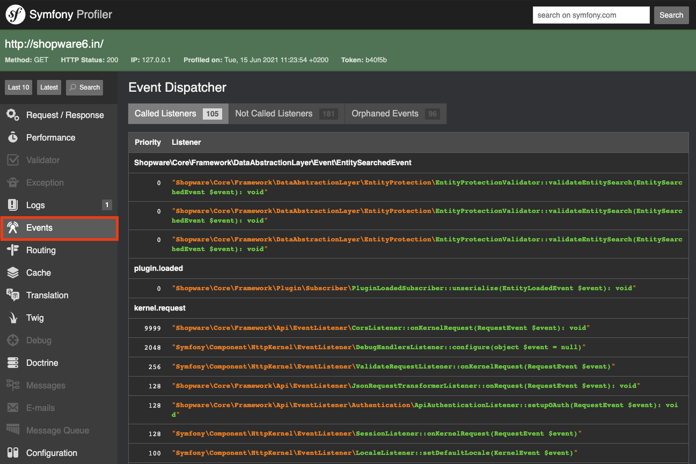

---
nav:
  title: Finding Events
  position: 20

---

# Finding Events

## Overview

Shopware 6 is fully extensible via plugins. Part of this extensibility comes from the ability to react to events.

This guide covers how to find events and use them in plugins.

## DAL Events

[Data Abstraction Layer events](../data-handling/using-database-events) are fired whenever a [DAL entity](../data-handling/add-custom-complex-data) is read, written, created, or deleted.

There usually is no need to find them, since the pattern for them is always the same.
You can use them by following this pattern: `entity_name.event`.
For products, this could be e.g. `product.written` or `product.deleted`. For your custom entity, this then would be
`custom_entity.written` or `custom_entity.deleted`.

However, some default Shopware entities come with special "Event classes", which are basically a class, which contains all
possible kinds of events as constants.
Have a look at the [product event class](https://github.com/shopware/shopware/blob/v6.4.0.0/src/Core/Content/Product/ProductEvents.php) for example.
This way you can also find out about all the possible DAL events available in Shopware.

Finding those "event classes" can be done by searching for the term `@Event` in your project.

You can use those events in a [subscriber](../event/listening-to-events.md) like the following:

```php
public static function getSubscribedEvents(): array
{
    return [
        ProductEvents::PRODUCT_LOADED_EVENT => 'onProductsLoaded',
        'custom_entity.written' => 'onCustomEntityWritten'
    ];
}
```

As you can see, you can either use the event class constants, if available, or the string itself.

You'll then have access to several event specific information, e.g. your listener method will have access to an [EntityWrittenEvent](https://github.com/shopware/shopware/blob/v6.4.0.0/src/Core/Framework/DataAbstractionLayer/Event/EntityWrittenEvent.php)
instance when subscribing to the `written` event.

```php
public function onCustomEntityWritten(EntityWrittenEvent $event): void
{
}
```

You can find all of those DAL event classes [here](https://github.com/shopware/shopware/tree/v6.4.0.0/src/Core/Framework/DataAbstractionLayer/Event).

## General PHP events

If the [DAL events](#DAL events) didn't match your use case, there are a few more events built into Shopware.
These are not auto-generated events, but rather events we built in with purpose.

There are multiple ways to find them:

- By actually looking at the code, that you want to extend
- By specifically searching for them
- By having a look at the service definition of a given class

### Looking at the code

You will most likely look into our Core code quite a lot, while trying to understand what's happening and why things are happening.
On your journey looking through the code, you may stumble upon code looking like this:

```php
$someEvent = new SomeEvent($parameters, $moreParameters);
$this->eventDispatcher->dispatch($someEvent, $someEvent->getName());
```

This is an event that's being fired manually, which you can react upon.
Make sure to always have a look at the event class itself in order to find out which information it contains.

The second parameter of the `dispatch` is optional and represents the actual event's name.
If the second parameter is not applied, the class name will be used as a fallback.

When subscribing to those events, your event listener method will have access to the previously created event instance.

```php
public static function getSubscribedEvents(): array
{
    return [
        'some_event' => 'registeringToSomeEvent',
        // If there is no name applied to the event, the class name is the fallback
        SomeEvent::class => 'registeringToSomeEvent'
    ];
}

public function registeringToSomeEvent(SomeEvent $event): void
{
}
```

The [next section](#Specifically searching for events) will cover how to find those events without randomly stumbling upon them.

### Specifically searching for events

If you're really looking for a fitting event for your purpose, you might want to directly search for them.
This can be done by searching through the `<shopware root>/platform/src` or the `<shopware root>/vendor/shopware/shopware/src` directory,
depending on whether you are using the [development](https://github.com/shopwareArchive/development) or the [production template](https://github.com/shopware/template).
Use one of the following search terms:

- `extends NestedEvent`: This way you will find the events themselves.
- `extends Event`: This way you will find the events themselves.
- `implements ShopwareEvent`: This way you will find the events themselves.
- `->dispatch`: Here you will find all the occurrences where the events are actually being fired.

### Looking at the service definition

Services that want to fire events need access to the `event_dispatcher`. Noting the service definitions for the [Dependency injection container](../../services/dependency-injection.md) is advisable for determining which services and classes have access to the `event_dispatcher`:

```php
<?php declare(strict_types=1);

use Some\Service;
use Symfony\Component\DependencyInjection\Loader\Configurator\ContainerConfigurator;

use function Symfony\Component\DependencyInjection\Loader\Configurator\service;

return static function (ContainerConfigurator $configurator): void {
    $services = $configurator->services();

    $services->set(Service::class)
        ->args([
            service('Another/Service'),
            service('event_dispatcher'),
        ]);
};
```

Search for occurrences of the `event_dispatcher` in the respective service definition files, or alternatively check the service's constructor parameters:

```php
public function __construct(
    Some\Service $someService,
    EventDispatcherInterface $eventDispatcher
) {
    $this->someService = $someService;
    $this->eventDispatcher = $eventDispatcher;
}
```

If it can access the `EventDispatcherInterface`, then at least one event can likely be fired in that service.

### Other common event types

There are a few other event "types" or classes worth knowing.

#### Page loaded events

Usually when a [Storefront page](../../storefront/controllers/add-custom-page.md) is loaded, a respective "page is being loaded" event is also fired.

The [GenericPageLoader](https://github.com/shopware/shopware/blob/v6.4.0.0/src/Storefront/Page/GenericPageLoader.php) provides an example of a "default page". It dispatches an `GenericPageLoadedEvent` every time the page is loaded.

This way, you can react to this and e.g. add more meta information to the said page.

You can find those events by searching for the term "PageLoadedEvent".

#### Criteria events

You should be familiar with the `Criteria` class, at least if you've dealt with the [Data Abstraction Layer](../data-handling/).
There are many methods, that will dispatch a "criteria" event whenever a given default Shopware entity is being loaded using
a `Criteria` instance.

Let's have a look at an [example code](https://github.com/shopware/shopware/blob/v6.4.0.0/src/Core/Content/Product/SalesChannel/Listing/ResolveCriteriaProductListingRoute.php#L55-L59):

```php
#[Route(path: '/store-api/product-listing/{categoryId}', name: 'store-api.product.listing', methods: ['POST'], defaults: ['_entity' => 'product'])]
public function load(string $categoryId, Request $request, SalesChannelContext $context, Criteria $criteria): ProductListingRouteResponse
{
    $this->eventDispatcher->dispatch(
        new ProductListingCriteriaEvent($request, $criteria, $context)
    );

    return $this->getDecorated()->load($categoryId, $request, $context, $criteria);
}
```

So whenever the product listing route is being called, and therefore products are being loaded via the DAL and therefore via a
`Criteria` object, the `ProductListingCriteriaEvent` is being fired.

You can use this event to modify the `Criteria` object and therefore add or remove conditions, add or remove associations etc.
Of course, the code above is just one example excerpt and there are many more of those events for different entities.

Finding those events can be done by searching for the term `CriteriaEvent`.

::: info
Those "criteria events" are not generated automatically and therefore it is not guaranteed to exist for a given entity.
:::

#### Route events

Symfony provides some general [kernel level routing events](https://symfony.com/doc/current/reference/events.html#kernel-events), e.g `kernel.request` or `kernel.response`.
However, those events are thrown on every route, so it's too generic when you only want to react on a specific route.
Therefore, we have added fine-grained route events that are thrown for every route:
| Event name | Scope | Event Type | Description |
|------------|-------|------------|-------------|
| `{route}.request` | Global | `Symfony\Component\HttpKernel\Event\RequestEvent` | Route specific alias for symfony's `kernel.request` event. |
| `{route}.response` | Global | `Symfony\Component\HttpKernel\Event\ResponseEvent` | Route specific alias for symfony's `kernel.response` event. For storefront routes this contains the already rendered template, for store-api routes this contains the already encoded JSON |
| `{route}.render` | Storefront | `Shopware\Storefront\Event\StorefrontRenderEvent` | Thrown before twig rendering in the storefront. |
| `{route}.encode` | Store-API | `Symfony\Component\HttpKernel\Event\ResponseEvent` | Thrown before encoding the API response to JSON, allowing easy manipulation of the returned data. **Note:** This was only introduced in 6.6.11.0 |
| `{route}.controller` | Global | `\Symfony\Component\HttpKernel\Event\ControllerEvent` | Route specific alias for symfony's `kernel.controller` event. **Note:** This was only introduced in 6.6.11.0 |

To subscribe to a specific event, replace the `{route}` placeholder with the [actual symfony route name](https://symfony.com/doc/current/routing.html), e.g. `store-api.product.listing`.

```php
public static function getSubscribedEvents(): array
{
    return [
        'store-api.product.listing.request' => 'onListingRequest',
        'store-api.product.listing.encode' => 'onListingEncode'
    ];
}

public function onListingRequest(RequestEvent $event): void
{
}

public function onListingEncode(ResponseEvent $event): void
{
}
```

#### Business events

Business events are fired everytime an important business / ecommerce action occurred, such as "A customer registered" or "An order was placed".

Therefore, you can use them to react on those events, most times there even is an event fired **before** an action happened.
Have a look at those two example events:

- [CustomerBeforeLoginEvent](https://github.com/shopware/shopware/blob/v6.4.0.0/src/Core/Checkout/Customer/SalesChannel/AccountService.php#L97-L98)
- [CustomerLoginEvent](https://github.com/shopware/shopware/blob/v6.4.0.0/src/Core/Checkout/Customer/SalesChannel/AccountService.php#L109-L110)

The kind of information they contain and which you can modify is different for each event, so you'll have to have a look at the respective
event classes to find out about it.

Those business events can be found by either searching for the term `implements BusinessEventInterface` or `implements MailActionInterface`.
The latter implement the `MailActionInterface` because they're events which will result in a mail being sent, e.g. when a customer placed an order.
Customer login however will obviously not result in a mail being sent and therefore is "only" implement the `BusinessEventInterface`.

### Using the Symfony profiler

Since Shopware is built upon the Symfony framework, it also grants access to the [Symfony profiler](https://symfony.com/doc/current/profiler.html).

Use the profiler to easily find all fired events in the current request. Open the profiler and clicking on the "Events" tab on the left.



There you will find all events that were fired in the current request, including the respective name to use.

## Storefront events

Storefront JavaScript plugins also use events, as described in the [Reacting to JavaScript guide](../../storefront/javascript/reacting-to-javascript-events.md). To find events, either look for them in the code or do a search.

### Finding events in the code

In Storefront JavaScript plugins, you can notice custom events by the following pattern:

```javascript
this.$emitter.publish('someEvent', additionalData);
```

Subscribe to the event named `someEvent` and gain access to `additionalData`:

```javascript
this.$emitter.subscribe('someEvent', (additionalData) => {
    // Do stuff
});
```

### Searching for JavaScript events

Search for JavaScript events by searching for the following term in either the `<shopware root>/platform/src/Storefront/Resources/app/storefront/src` directory for
the [development template](https://github.com/shopwareArchive/development) or the `<shopware root>/vendor/shopware/shopware/src/Storefront/Resources/app/storefront/src` directory
for the [production template](https://github.com/shopware/template):
`$emitter.publish`.
This way, you'll find all occurrences of plugins actually firing a custom event.

## Administration events

In the Administration, most events are default Vue events. More details are available in [Vue documentation](https://vuejs.org/guide/essentials/event-handling.html).

Regarding two-way data-binding, we're sometimes firing events, which looks like this:

```javascript
this.$emit('some-event', additionalData);
```

Find those occurrences by searching for `$emit` in the `<shopware root>/platform/src/Administration/Resources/app/administration/src` directory for
the [development template](https://github.com/shopwareArchive/development) or the `<shopware root>/vendor/shopware/shopware/src/Administration/Resources/app/administration/src` directory
for the [production template](https://github.com/shopware/template).

### Vue extension

A Vue browser extension helps with general development as well as with finding events:

- [Vue.js devtools for Firefox](https://addons.mozilla.org/de/firefox/addon/vue-js-devtools/)
- [Vue.js devtools for Google Chrome](https://chromewebstore.google.com/detail/vuejs-devtools/nhdogjmejiglipccpnnnanhbledajbpd)

## Flow builder events

All events data in the Flow Builder are stored in the `StorableFlow`. The `getAvailableData` function can no longer be used. For more information refer to [Create a new trigger (event)](../../../../../guides/plugins/plugins/framework/flow/add-flow-builder-trigger#create-a-new-trigger-event).
