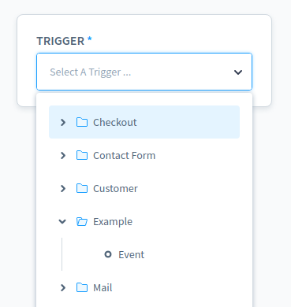
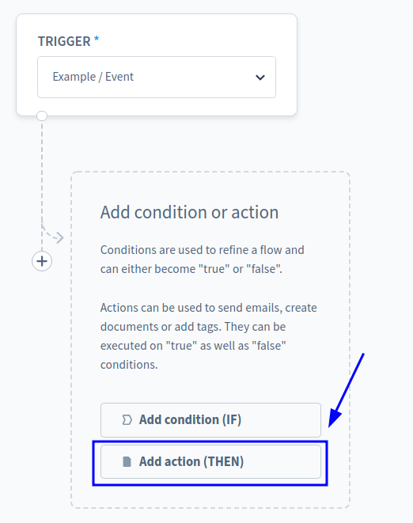
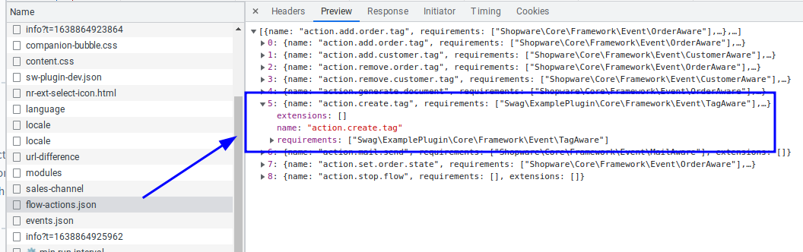
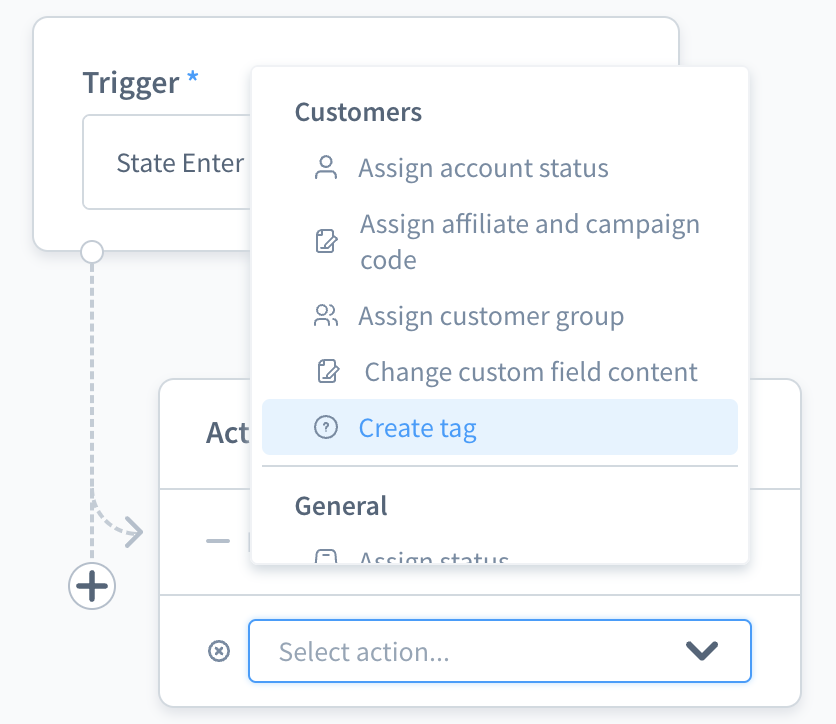
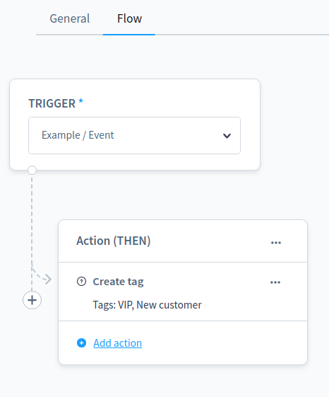
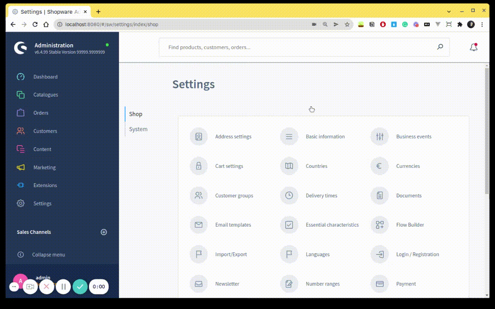

# Add custom flow Action


  This functionality is available starting with Shopware 6.4.6.0


## Overview

In this guide, you'll learn how to create custom flow action in Shopware. The flow builder uses actions to perform business tasks. This example will introduce a new custom action called `create tags`.
## Prerequisites

In order to add your own custom flow action for your plugin, you first need a plugin as base. Therefore, you can refer to the [Plugin Base Guide.](../../plugin-base-guide.md)

You also should be familiar with the [Dependency Injection container](../../plugin-fundamentals/dependency-injection.md) as this is used to register your custom flow action and [Listening to events](../../plugin-fundamentals/listening-to-events.md#creating-your-own-subscriber) to create a subscriber class.

It might be helpful to gather some general understanding about the [concept of Flow Builder](../../../../../concepts/framework/flow-concept.md) as well.

## Existing triggers and actions

You can refer to the [Flow reference](../../../../../resources/references/core-reference/flow-reference.md) to read triggers and actions detail.

## Create custom flow action

To create a custom flow action, firstly you have to make a plugin and install it, you can refer to the [Plugin Base Guide](../../plugin-base-guide.md) to do it. I will create a plugin named `ExamplePlugin`. We have to implement both backend (PHP) code and a user interface in the Administration to manage it. Let's start with the PHP part first, which handles the main logic of our action. After that, there will be an example to show your new actions in the Administration.

## Creating flow action in PHP

### Create new Aware interface

 First of all, we need to define an aware interface for your own action. I intended to create the `CreateTagAction`, so I need to create a related aware named `TagAware`, will be placed in directory `<plugin root>/src/Core/Framework/Event`. Our new interface has to extend from interfaces `Shopware\Core\Framework\Event\FLowEventAware`:


```php
<?php declare(strict_types=1);
namespace Swag\ExamplePlugin\Core\Framework\Event;
use Shopware\Core\Framework\Event\FlowEventAware;

interface TagAware extends FlowEventAware
{
}
```


### Create new action

In this example, we will name it `CreateTagAction`. It will be placed in the directory `<plugin root>/src/Core/Content/Flow/Dispatching/Action`. Our new class has to extend from the abstract class `Shopware\Core\Framework\Event\FLowEvent`. Below you can find an example implementation:


```php
<?php declare(strict_types=1);

namespace Swag\ExamplePlugin\Core\Content\Flow\Dispatching\Action;

use Shopware\Core\Content\Flow\Dispatching\Action\FlowAction;
use Shopware\Core\Framework\DataAbstractionLayer\EntityRepositoryInterface;
use Shopware\Core\Framework\Uuid\Uuid;
use Swag\ExamplePlugin\Core\Framework\Event\TagAware;
use Shopware\Core\Framework\Event\FlowEvent;

class CreateTagAction extends FlowAction
{
    private EntityRepositoryInterface $tagRepository;

    public function __construct(EntityRepositoryInterface $tagRepository)
    {
        // you would need this repository to create a tag
        $this->tagRepository = $tagRepository;
    }

    public static function getName(): string
    {
        // your own action name
        return 'action.create.tag';
    }

    public static function getSubscribedEvents(): array
    {
        return [
            self::getName() => 'handle',
        ];
    }

    public function requirements(): array
    {
        return [TagAware::class];
    }

    public function handle(FlowEvent $event): void
    {
        // config is the config data when created a flow sequence
        $config = $event->getConfig();

        // make sure your tags data is exist
        if (!\array_key_exists('tags', $config)) {
            return;
        }

        $baseEvent = $event->getEvent();

        $tags = $config['tags'];

        // just a step to make sure you're dispatching correct action
        if (!$baseEvent instanceof TagAware || empty($tags)) {
            return;
        }

        $tagData = [];
        foreach ($tags as $tag) {
            $tagData[] = [
                'id' => Uuid::randomHex(),
                'name' => $tag,
            ];
        }

        // simply create tags
        $this->tagRepository->create($tagData, $baseEvent->getContext());
    }
}
```


As you can see, several methods are already implemented:

- `__constructor`: This only defines the default expected value. This is overwritten at runtime with the actual value, that the shop owner set in the Administration.
- `getName`: Returns a unique technical name for your action.
- `requirements`: This defines which interfaces that the action belongs to.
- `handle`: Use this method to handle your action stuff.

And we also need to register this action in the container as a service, make sure you have defined a tag `<tag name="flow.action" priority="600">` at `<plugin root>/src/Resources/config/services.xml`, that your action would be added to response of *`/api/_info/flow-actions.json`* API and `priority` will decide the order of action of API response:


```xml
<service id="Swag\ExamplePlugin\Core\Content\Flow\Dispatching\Action\CreateTagAction">
    <argument type="service" id="tag.repository" />
    <tag name="kernel.event_subscriber"/>
    <tag name="flow.action" priority="600"/>
</service>
```


Great, your own action is created completely. Let's go to the next step.

### Define action scope

 At this step, you will know how to define your action scope, for `CreateTagAction`, I intended it would be available for all events. Let's see the code below:


```php
<?php declare(strict_types=1);

namespace Swag\ExamplePlugin\Core\Content\Flow\Subscriber;

use Shopware\Core\Framework\Event\BusinessEventCollectorEvent;
use Swag\ExamplePlugin\Core\Framework\Event\TagAware;
use Symfony\Component\EventDispatcher\EventSubscriberInterface;

class BusinessEventCollectorSubscriber implements EventSubscriberInterface
{
    public static function getSubscribedEvents()
    {
        return [
            BusinessEventCollectorEvent::NAME => 'addTagAware',
        ];
    }

    public function addTagAware(BusinessEventCollectorEvent $event): void
    {
        foreach ($event->getCollection()->getElements() as $definition) {
            $definition->addAware(TagAware::class);
        }
    }
}
```


And don't forget to register your subscriber to the container at `<plugin root>/src/Resources/config/services.xml`.


```xml
<service id="Swag\ExamplePlugin\Core\Content\Flow\Subscriber\BusinessEventCollectorSubscriber">
    <tag name="kernel.event_subscriber"/>
</service>
```


Well done, you are successfully created your custom action in Backend in PHP.


  This functionality is available starting with Shopware 6.4.6.0


## Add custom action in Administration

After we are done with the PHP code, `action.create.tag` is received from the response of `/api/_info/flow-actions.json`. However, the custom action displays in the action list without label. These further steps in Administration will help you show the action label and add configuration for it.

To see action list, we select a Trigger, for example [Example\Event] from the Trigger drop-down in the Flow tab. After that, we choose option `ACTION (THEN)`. A action component appears with action list.






### Step 1: Show action label in action list

First, we need to define an action name in `example-plugin.constant.js`. To be consistent with the custom action defined in our PHP code, we also create a constant called `CREATE_TAG` to represent `action.create.tag` which get from the response of `/api/_info/flow-actions.json`.




```jsx
export const ACTION = Object.freeze({
    CREATE_TAG: 'action.create.tag',
});

export default {
    ACTION,
};
```


Next, we override `sw-flow-sequence-action` component to show `CREATE_TAG` label in action list. For example, we override `getActionTitle` method to add icon, label for `CREATE_TAG` action.


```jsx
import { ACTION } from '../../constant/swag-example-plugin.constant';

const { Component } = Shopware;

Component.override('sw-flow-sequence-action', {
    methods: {
        getActionTitle(actionName) {
            if (actionName === ACTION.CREATE_TAG) {
                return {
                    value: actionName,
                    icon: 'default-badge-help',
                    label: this.$tc('swag-example-plugin.titleCreateTag'),
                }
            }

            return this.$super('getActionTitle', actionName);
        },
    },
});
```


Here is the result for the after the **Step 1**.



### Step 2: Add configuration for action

First, we customise `modalName` for the configuration modal, add an `actionDescription` computed property and create the `getCreateTagDescription` method to show action the configuration description.


```jsx
import { ACTION } from '../../constant/swag-example-plugin.constant';

const { Component } = Shopware;

Component.override('sw-flow-sequence-action', {
    computed: {
        modalName() {
            if (this.selectedAction === ACTION.CREATE_TAG) {
                return 'swag-example-plugin-modal';
            }

            return this.$super('modalName');
        },

        actionDescription() {
            const actionDescriptionList = this.$super('actionDescription');

            return {
                ...actionDescriptionList,
                [ACTION.CREATE_TAG] : (config) => this.getCreateTagDescription(config),
            };
        },
    },

    methods: {
        getCreateTagDescription(config) {
            const tags = config.tags.join(', ');

           return this.$tc('swag-example-plugin.descriptionTags', 0, {
                tags
            });
        },

        getActionTitle(actionName) {
            if (actionName === ACTION.CREATE_TAG) {
                return {
                    value: actionName,
                    icon: 'default-badge-help',
                    label: this.$tc('swag-example-plugin.titleCreateTag'),
                }
            }

            return this.$super('getActionTitle', actionName);
        },
    },
});
```


Then, we need a modal to save your action config. For example, we create a component `swag-example-plugin-modal`.

#### JavaScript file


```jsx
import template from './swag-example-plugin-modal.html.twig';
const { Component } = Shopware;

Component.register('swag-example-plugin-modal', {
    template,

    props: {
        sequence: {
            type: Object,
            required: true,
        },
    },

    data() {
        return {
            tags: [],
        };
    },

    created() {
        this.createdComponent();
    },

    methods: {
        createdComponent() {
            this.tags = this.sequence?.config?.tags || [];
        },

        onClose() {
            this.$emit('modal-close');
        },

        onAddAction() {
            const sequence = {
                ...this.sequence,
                config: {
                    ...this.config,
                    tags: this.tags
                },
            };

            this.$emit('process-finish', sequence);
        },
    },
});
```


#### Twig template file


```html

    <sw-modal
        class="swag-example-plugin-modal"
        :title="$tc('swag-example-plugin.titleCreateTag')"
        @modal-close="onClose"
    >
        
            <sw-multi-tag-select
                v-model="tags"
                :label="$tc('swag-example-plugin.labelTags')"
            />
        

        
            <template #modal-footer>
                
                    <sw-button
                        class="swag-example-plugin-modal__cancel-button"
                        size="small"
                        @click="onClose"
                    >
                        {{ $tc('global.default.cancel') }}
                    </sw-button>
                

                
                    <sw-button
                        class="swag-example-plugin-modal__save-button"
                        variant="primary"
                        size="small"
                        @click="onAddAction"
                    >
                        {{ sequence.id
                        ? $tc('swag-example-plugin.buttonSaveAction')
                        : $tc('swag-example-plugin.buttonAddAction') }}
                    </sw-button>
                
            </template>
        
    </sw-modal>

```


Here is the final result


Click on [Save action] and we will get the result as below screenshot.



### Demo

Now you can view the whole demo for this custom Flow builder trigger and action as below.



The source code for this demo you could find it at [Flow Builder ExamplePlugin](https://github.com/huytdq94/sw-example-plugin-flow-builder).
