---
nav:
  title: Add Flow Builder action
  position: 10

---

# Add custom flow Action

## Overview

In this guide, you'll learn how to create custom flow action in Shopware. The flow builder uses actions to perform business tasks. This example will introduce a new custom action called `create tags`.

## Prerequisites

In order to add your own custom flow action for your plugin, you first need a plugin as base. Therefore, you can refer to the [Plugin Base Guide.](../../plugin-base-guide)

You also should be familiar with the [Dependency Injection container](../../plugin-fundamentals/dependency-injection) as this is used to register your custom flow action and [Listening to events](../../plugin-fundamentals/listening-to-events#creating-your-own-subscriber) to create a subscriber class.

It might be helpful to gather some general understanding about the [concept of Flow Builder](../../../../../concepts/framework/flow-concept) as well.

## Existing triggers and actions

You can refer to the [Flow reference](../../../../../resources/references/core-reference/flow-reference) to read triggers and actions detail.

## Create custom flow action

To create a custom flow action, firstly you have to make a plugin and install it. Refer to the [Plugin Base Guide](../../plugin-base-guide.md) to do it. For instance, lets create a plugin named `CreateTagAction`. You must implement both backend (PHP) code and a user interface in the Administration to manage it. Let's start with the PHP part first, which handles the main logic of our action. After that, there will be an example to show your new actions in the Administration.

## Creating flow action in PHP

### Create new Aware interface

 First of all, we need to define an aware interface for your own action. I intended to create the `CreateTagAction`, so I need to create a related aware named `TagAware`, will be placed in directory `<plugin root>/src/Core/Framework/Event`. Our new interface has to extend from interfaces `Shopware\Core\Framework\Event\FLowEventAware`:

```php
// <plugin root>/src/Core/Framework/Event/TagAware.php
<?php declare(strict_types=1);
namespace Swag\ExamplePlugin\Core\Framework\Event;
use Shopware\Core\Framework\Event\FlowEventAware;
use Shopware\Core\Framework\Event\IsFlowEventAware;

#[IsFlowEventAware]
interface TagAware extends FlowEventAware
{
    ...

    public const TAG = 'tag';

    public const TAG_ID = 'tagId';

    public function getTag();

    ...
}
```

### Create new action

In this example, we will name it `CreateTagAction`. It will be placed in the directory `<plugin root>/src/Core/Content/Flow/Dispatching/Action`. Below you can find an example implementation:

```php
// <plugin root>/src/Core/Content/Flow/Dispatching/Action/CreateTagAction.php
<?php declare(strict_types=1);

namespace Swag\CreateTagAction\Core\Content\Flow\Dispatching\Action;

use Shopware\Core\Content\Flow\Dispatching\Action\FlowAction;
use Shopware\Core\Content\Flow\Dispatching\StorableFlow;
use Shopware\Core\Framework\DataAbstractionLayer\EntityRepository;
use Shopware\Core\Framework\Uuid\Uuid;
use Swag\CreateTagAction\Core\Framework\Event\TagAware;
use Symfony\Component\DependencyInjection\Attribute\AutoconfigureTag;

#[AutoconfigureTag('flow.action', ['priority' => 600, 'key' => 'action.create.tag'])]
class CreateTagAction extends FlowAction
{
    private EntityRepository $tagRepository;

    public function __construct(EntityRepository $tagRepository)
    {
        // you would need this repository to create a tag
        $this->tagRepository = $tagRepository;
    }

    public static function getName(): string
    {
        // your own action name
        return 'action.create.tag';
    }

    public function requirements(): array
    {
        return [TagAware::class];
    }

    public function handleFlow(StorableFlow $flow): void
    {
        // config is the config data when created a flow sequence
        $config = $flow->getConfig();

        // make sure your tags data exists
        if (!\array_key_exists('tags', $config)) {
            return;
        }

        $tags = $config['tags'];

        // just a step to make sure you're dispatching correct action
        if (!$flow->hasStore(TagAware::TAG_ID) || empty($tags)) {
            return;
        }

        // get tag id
        $tagId = $flow->getStore(TagAware::TAG_ID);

        // get tag
        $tag = $flow->getData(TagAware::TAG);

        $tagData = [];
        foreach ($tags as $tag) {
            $tagData[] = [
                'id' => Uuid::randomHex(),
                'name' => $tag,
            ];
        }

        // simply create tags
        $this->tagRepository->create($tagData, $flow->getContext());
    }
}
```

As you can see, several methods are already implemented:

- `__constructor`: This only defines the default expected value. This is overwritten at runtime with the actual value, that the shop owner set in the Administration.
- `getName`: Returns a unique technical name for your action.
- `requirements`: This defines which interfaces the action belongs to.
- `handleFlow`: Use this method to handle your action stuff.
    - Use `$flow->getStore($key)` if you want to get the data from aware interfaces. E.g: `tag_id` in `TagAware`, `customer_id` from `CustomerAware` and so on.
    - Use `$flow->getData($key)` if you want to get the data from original events or additional data. E.g: `tag`, `customer`, `contactFormData` and so on.

The `#[AutoconfigureTag('flow.action', ['priority' => 600, 'key' => 'action.create.tag'])]` attribute on the class, as shown above, ensures that your action is registered in the DI container and included in the response of the *`/api/_info/flow-actions.json`* API. The `priority` determines the order of the action in the API response. The `tag.repository` argument is automatically injected via autowiring.

Great, your own action is created completely. Let's go to the next step.

### Define action scope

In this step, you will know how to define your action scope for `CreateTagAction`.
There are three scopes for the `CreateTagAction`:

- Available for all *already Events*.
- Available for only one or multiple *already Events.*
- Available for new event (new event from this plugin).

#### `CreateTagAction` available for all *already Events*

- Just define the empty array in `CreateTagAction::requirements`

```php
    // plugin root>/src/Core/Content/Flow/Dispatching/Action/CreateTagAction.php
    ...

    public function requirements(): array
    {
        return [];
    }

    ...
```

That means when you define the requirements like the code above, all triggers in the flow builder can define the action `CreateTagAction` for the next progress.

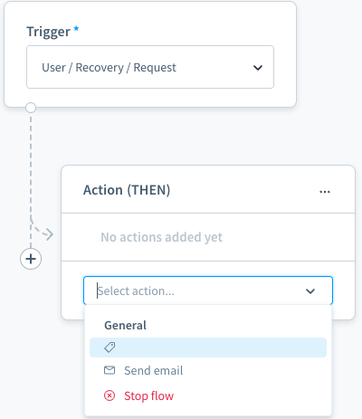

Here, the action name is empty as the action name snippet is not yet defined.

#### `CreateTagAction` available for only one or multiple *already Events*

Make the `CreateTagAction` available for all events related to Order and Customer.

```php
    // <plugin root>/src/Core/Content/Flow/Dispatching/Action/CreateTagAction.php
    ...

    public function requirements(): array
    {
        return [OrderAware::class, CustomerAware::class];
    }

    ...
```

#### `CreateTagAction` available for new event

- For this case, you can define a new event and make the `CreateTagAction` available for this event.

- Event must implement the `TagAware`

```php
// <plugin root>/src/Core/Content/Flow/Subscriber/BusinessEventCollectorSubscriber.php
<?php declare(strict_types=1);

namespace Swag\CreateTagAction\Core\Content\Event;

use Shopware\Core\Framework\Context;
use Shopware\Core\Framework\Event\EventData\EntityType;
use Shopware\Core\Framework\Event\EventData\EventDataCollection;
use Shopware\Core\System\Tag\TagDefinition;
use Shopware\Core\System\Tag\TagEntity;
use Swag\CreateTagAction\Core\Framework\Event\TagAware;
use Symfony\Contracts\EventDispatcher\Event;

class BasicExampleEvent extends Event implements TagAware
{
    public const EVENT_NAME = 'example.event';

    private TagEntity $tag;

    private Context $context;

    public function __construct(Context $context, TagEntity $tag)
    {
        $this->tag = $tag;
        $this->context = $context;
    }

    public function getName(): string
    {
        return self::EVENT_NAME;
    }

    public static function getAvailableData(): EventDataCollection
    {
        return (new EventDataCollection())
            ->add('tag', new EntityType(TagDefinition::class));
    }

    public function getContext(): Context
    {
        return $this->context;
    }

    public function getTag(): TagEntity
    {
        return $this->tag;
    }
}
```

- Define the `TagAware` in `CreateTagAction::requirements`

```php
    // <plugin root>/src/Core/Content/Flow/Dispatching/Action/CreateTagAction.php
    ...

    public function requirements(): array
    {
        return [TagAware::class];
    }

    ...
```

- To show the new event in Flow Builder Triggers list

```php
// <plugin root>/src/Core/Content/Subscriber/BusinessEventCollectorSubscriber.php
<?php declare(strict_types=1);
namespace Swag\CreateTagAction\Core\Content\Subscriber;

use Shopware\Core\Framework\Event\BusinessEventCollector;
use Shopware\Core\Framework\Event\BusinessEventCollectorEvent;
use Swag\CreateTagAction\Core\Content\Event\BasicExampleEvent;
use Symfony\Component\EventDispatcher\EventSubscriberInterface;

class BusinessEventCollectorSubscriber implements EventSubscriberInterface
{
    private BusinessEventCollector $businessEventCollector;

    public function __construct(BusinessEventCollector $businessEventCollector)
    {
        $this->businessEventCollector = $businessEventCollector;
    }

    public static function getSubscribedEvents()
    {
        return [
            BusinessEventCollectorEvent::NAME => 'onAddExampleEvent',
        ];
    }

    public function onAddExampleEvent(BusinessEventCollectorEvent $event): void
    {
        $collection = $event->getCollection();

        $definition = $this->businessEventCollector->define(BasicExampleEvent::class);

        if (!$definition) {
            return;
        }

        $collection->set($definition->getName(), $definition);
    }
}
```

Since the `BusinessEventCollectorSubscriber` class implements `EventSubscriberInterface`, Symfony's autoconfigure feature automatically registers it as an event subscriber. The `BusinessEventCollector` argument is automatically injected via autowiring. No additional service configuration is needed.

- Define the Event snippet

```json
// <plugin root>/src/Resources/app/administration/src/module/sw-flow/snippet/en-GB.json
{
  "sw-flow": {
    "triggers": {
      "example": "Example",
      "event": "Event"
    }
  }
}
```

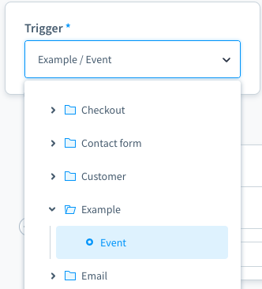

Well, you have successfully created your custom action in Backend in PHP.

## Add custom action in Administration

After we are done with the PHP code, `action.create.tag` is received from the response of `/api/_info/flow-actions.json`. However, the custom action displays in the action list without label. These further steps in Administration will help you show the action label and add configuration for it.

To see the action list, we select a Trigger, for example [example\event], from the Trigger drop-down in the Flow tab. After that, we choose option `ACTION (THEN)`. An action component appears with an action list.

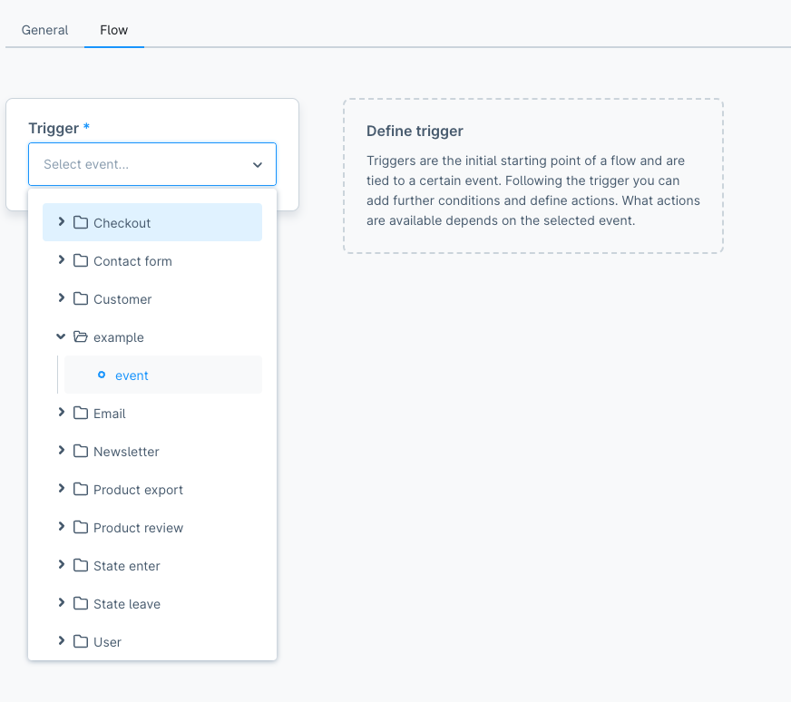

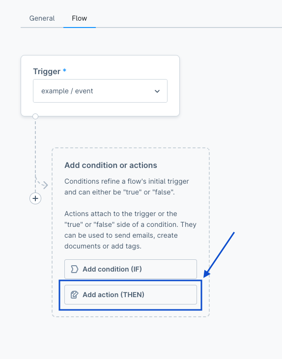

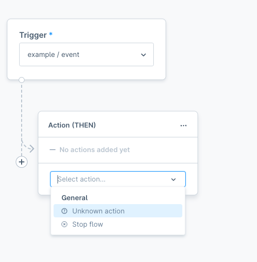

### Step 1: Show action label in action list

First, we need to define information like `constants`, `snippets` to show on the action list. To be consistent with the custom action defined in our PHP code, create an action name called `CREATE_TAG` to represent `action.create.tag`, which gets from the response of `/api/_info/flow-actions.json`.

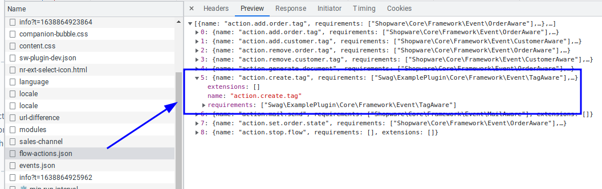

```JS
// <plugin root>src/Resources/app/administration/src/constant/create-tag-action.constant.js
export const ACTION = Object.freeze({
    CREATE_TAG: 'action.create.tag',
});

export const GROUP = 'customer'

export default {
    ACTION, GROUP
};
```

And then add snippets for labels:

```JS
// src/Resources/app/administration/src/snippet/en-GB.json
{
    "create-tag-action": {
        "titleCreateTag": "Create tag",
        "labelTags": "Tags",
        "placeholderTags": "Enter tags",
        "buttonSaveAction": "Save action",
        "buttonAddAction": "Add action",
        "descriptionTags": "Tags: {tags}"
    }
}
```

Do it as the same with `de-DE.json` file for translation of DE language.

After that, we also need to override the `sw-flow-sequence-action` component in the core:

```JS
// <plugin root>/src/Resources/app/administration/src/extension/sw-flow-sequence-action/index.js
import { ACTION, GROUP } from '../../constant/create-tag-action.constant';

const { Component } = Shopware;

Component.override('sw-flow-sequence-action', {
    computed: {
        // Not necessary if you use an existing group
        // Push the `groups` method in computed if you are defining a new group
        groups() {
            this.actionGroups.unshift(GROUP);

            return this.$super('groups');
        },

        modalName() {
            if (this.selectedAction === ACTION.CREATE_TAG) {
                return 'sw-flow-create-tag-modal';
            }

            return this.$super('modalName');
        },
    },

    methods: {
        getActionDescriptions(sequence) {
            if(sequence.actionName === ACTION.CREATE_TAG){
                return this.getCreateTagDescription(sequence.config)
            }
            return this.$super('getActionDescriptions', sequence)
        },
        
        getCreateTagDescription(config) {
            const tags = config.tags.join(', ');

            return this.$tc('create-tag-action.descriptionTags', 0, {
                tags
            });
        },

        getActionTitle(actionName) {
            if (actionName === ACTION.CREATE_TAG) {
                return {
                    value: actionName,
                    icon: 'regular-tag',
                    label: this.$tc('create-tag-action.titleCreateTag'),
                    group: GROUP,
                }
            }

            return this.$super('getActionTitle', actionName);
        },
    },
});

```

Do not forget to import the file to the entry file `main.js`:

```JS
// <plugin root>/src/Resources/app/administration/src/main.js
import './extension/sw-flow-sequence-action';
```

**Grouping Actions**

As you can see, we already defined the constant for the group in `create-tag-action.constant.js`

```JS
export const GROUP = 'customer'
```

The new action `action.create.tag` will be shown on the Customer group.

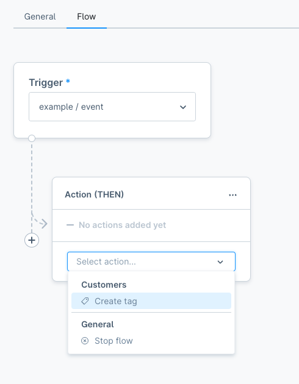

It will default on the General group if it is not defined.

Here is a list of group names you should take a look at:

| Group Name | Group Headline |
| :--- | :--- |
| general | General|
| tag | Tag |
| customer | Customer |
| order | Order |

### Step 2: Add configuration for action

If you click the Create tag action, the below error will be shown on the console. That means we're going the right way.

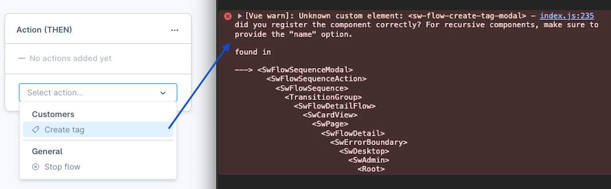

Because in `sw-flow-sequence-action`, we expect that the new modal has the name `sw-flow-create-tag-modal`.

```JS
modalName() {
    if (this.selectedAction === ACTION.CREATE_TAG) {
        return 'sw-flow-create-tag-modal';
    }

    return this.$super('modalName');
},
```

To define the modal, just create a new folder `sw-flow-create-tag-modal` in `src/Resources/app/administration/src/component` and create some files following:

#### JavaScript file

```JS
// <plugin root>/src/Resources/app/administration/src/component/sw-flow-create-tag-modal/index.js
import template from './sw-flow-create-tag-modal.html.twig';

const { Data: { Criteria, EntityCollection } } = Shopware;
const { Component, Context } = Shopware;

Component.register('sw-flow-create-tag-modal', {
    template,

    inject: [
        'repositoryFactory',
    ],

    props: {
        sequence: {
            type: Object,
            required: true,
        },
    },

    data() {
        return {
            tagCollection: [],
        };
    },

    computed: {
        tagRepository() {
            return this.repositoryFactory.create('tag');
        },

        tagCriteria() {
            const criteria = new Criteria(1, 25);
            const { config } = this.sequence;
            const tagIds = Object.keys(config.tagIds);
            if (tagIds.length) {
                criteria.addFilter(Criteria.equalsAny('id', tagIds));
            }

            return criteria;
        },
    },

    created() {
        this.createdComponent();
    },

    methods: {
        createdComponent() {
            this.tagCollection = this.createTagCollection();

            const { config } = this.sequence;
            if (this.sequence.id && config?.tagIds) {
                this.getTagCollection();
            }
        },

        getTagCollection() {
            return this.tagRepository.search(this.tagCriteria)
                .then(tags => {
                    this.tagCollection = tags;
                })
                .catch(() => {
                    this.tagCollection = [];
                });
        },

        createTagCollection() {
            return new EntityCollection(
                this.tagRepository.route,
                this.tagRepository.entityName,
                Context.api,
            );
        },

        onClose() {
            this.$emit('modal-close');
        },

        onAddTag(data) {
            this.tagCollection.add(data);
        },

        onRemoveTag(data) {
            this.tagCollection.remove(data);
        },

        getConfig() {
            const tagIds = {};
            this.tagCollection.forEach(tag => {
                Object.assign(tagIds, {
                    [tag.id]: tag.name,
                });
            });

            return {
                tagIds,
            };
        },

        onAddAction() {
            const config = this.getConfig();
            const data = {
                ...this.sequence,
                config,
            };

            this.$emit('process-finish', data);
        },
    },
});
```

#### Twig template file

```twig
// <plugin root>/src/Resources/app/administration/src/component/sw-flow-create-tag-modal/sw-flow-create-tag-modal.html.twig

<sw-modal
    class="create-tag-action-modal"
    :title="$tc('create-tag-action.titleCreateTag')"
    @modal-close="onClose"
>
    
        <sw-entity-tag-select
            v-model="tagCollection"
            class="sw-flow-create-tag-modal__tags-field"
            required
            :label="$tc('create-tag-action.labelTags')"
            :placeholder="$tc('create-tag-action.placeholderTags')"
            @item-add="onAddTag"
            @item-remove="onRemoveTag"
        />
    

    
        <template #modal-footer>
            
                <sw-button
                    class="create-tag-action-modal__cancel-button"
                    size="small"
                    @click="onClose"
                >
                    {{ $tc('global.default.cancel') }}
                </sw-button>
            

            
                <sw-button
                    class="create-tag-action-modal__save-button"
                    variant="primary"
                    size="small"
                    @click="onAddAction"
                >
                    {{ $tc('create-tag-action.buttonSaveAction') }}
                </sw-button>
            
        </template>
    
</sw-modal>

```

Please update the file `main.js` like this:

```JS
// <plugin root>/src/Resources/app/administration/src/main.js
import './extension/sw-flow-sequence-action';
import './component/sw-flow-create-tag-modal';
```

Here is the final result

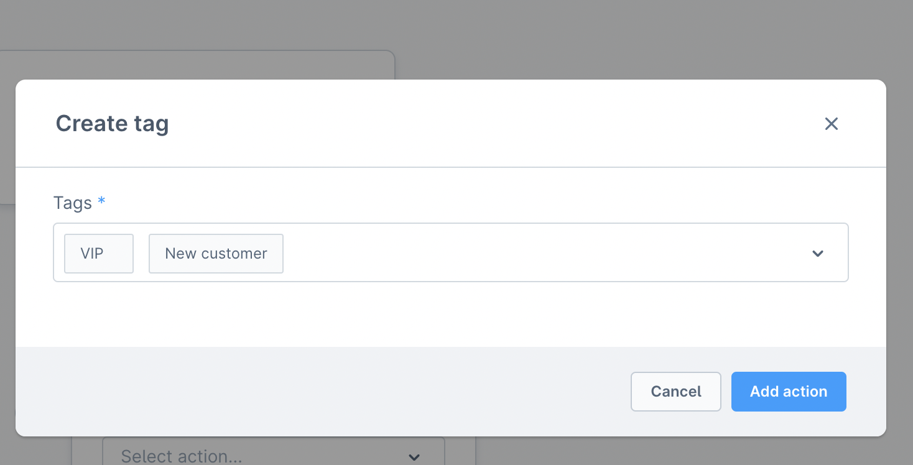

Click on [Save action] and we will get the result as below screenshot.

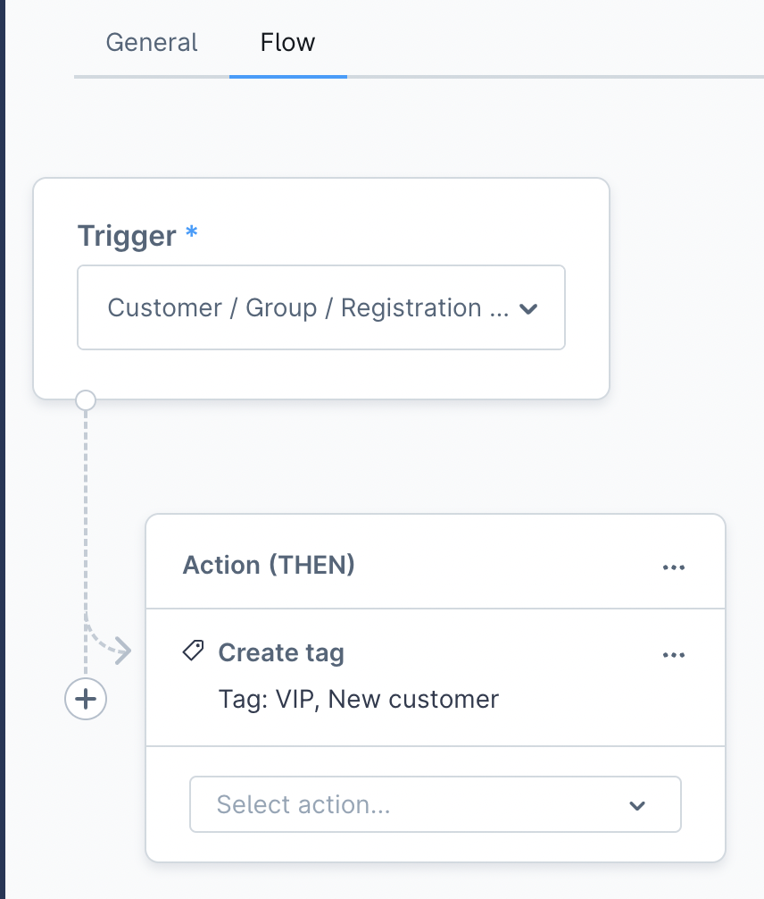

#### Custom configuration for action without the modal

You don't need a modal for the configuration. It can be added automatically.

Imagine, your action is already in the action list after [the first step](#step-1-show-action-label-in-action-list)

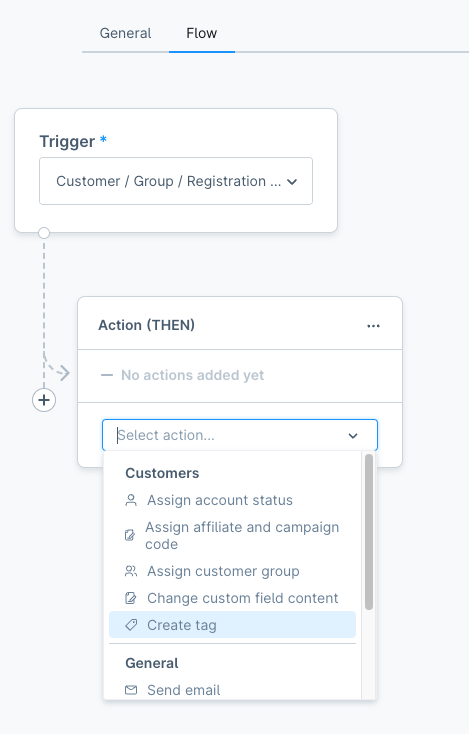

First, override the `openDynamicModal` method in the plugin to check if the value matches the desired action. Then, call the `onSaveActionSuccess` directly with the configuration. After the check, call `return`.

#### JavaScript

```JS
// <plugin root>/src/Resources/app/administration/src/extension/sw-flow-sequence-action/index.js
const { Component } = Shopware;

Component.register('sw-flow-sequence-action', {
    methods: {
        openDynamicModal(value) {
            if (!value) {
                return;
            }

            const actionName = this.flowBuilderService.getActionName('CREATE_TAG');

            if (value === actionName) {
                this.selectedAction = actionName;
                const config = {
                    tagIds: {
                        'tag_id_1': 'Vip',
                        'tag_id_2': 'New Customer',
                    },
                };

                // Config can be a result from an API.
                this.onSaveActionSuccess({ config });
                return;
            }

            // handle for the rest of actions.
        },
    },
});
```

Now, after you click on the action, the new sequence will automatically be added to the action list like this:


### Demo

You can view the whole demo for this custom Flow Builder trigger and action below:

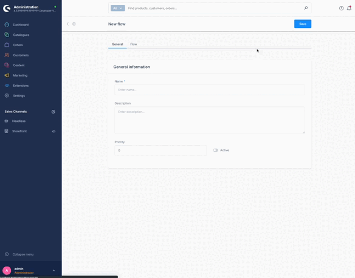
