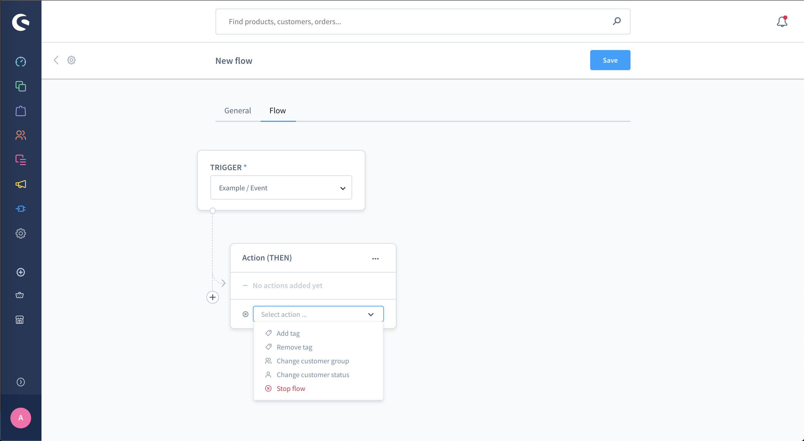

# Add customer flow action

::: info
  This functionality is available starting with Shopware 6.4.6.0
:::

## Overview

In this guide, you'll learn how to create a custom flow trigger in Shopware. Triggers are used by the flow builder. This example will introduce a new custom trigger. The shop owner is then able to define what to do with the new trigger.

## Prerequisites

In order to add your own custom flow trigger for your plugin, you first need a plugin as base. Therefore, you can refer to the [Plugin Base Guide](../../plugin-base-guide).

You also should be familiar with [Add custom event](../event/add-custom-event) to know how to create an event. Please refer to the [Flow Builder concept](../../../../../concepts/framework/flow-concept)
for better integration later.

## Existing triggers and actions

You can refer to the [Flow reference](../../../../../resources/references/core-reference/flow-reference) to read triggers and actions detail.

## Event interfaces and classes

Any event that implements one of these interfaces will be available in the trigger list of the Flow Builder module in Administration. Besides, the event will have the ability to execute the action that belongs to the interface.

- `MailAware`: This interface provides `MailRecipientStruct` and `salesChannelId`.

- `OrderAware`: This interface provides `orderId`, which is used to add tags, sendmail or generate documents, etc...

- `CustomerAware`: This interface same as `OrderAware` but for customer, which provide `customerId`, used to add tags, remove tags, sendmail, etc...

- `UserAware`: This interface provides `userId` for all actions related to the user.

- `SalesChannelAware`: This interface simply provides `salesChannelId`.

## Create custom flow trigger

To create a custom flow trigger, firstly you have to create a plugin and install it, you can refer to the [Plugin Base Guide](../../plugin-base-guide) to do it. I will create a plugin named `ExamplePlugin`. There will be an example to actually show your new trigger in the Administration.

### Create a new trigger (event)

In this example, we will name it ExampleEvent to some actions related to customers when dispatching this event. It will be placed in the directory `<plugin root>/src/Core/Checkout/Customer/Event`. Our new event has to implement Shopware\Core\Framework\Event\CustomerAware interface to enable actions requiring this Aware.

Currently, you will need to also implement `Shopware\Core\Framework\Event\BusinessEventInterface;` in case the feature flag `FEATURE_NEXT_17858` is inactive. Please take note that this interface will be removed in `v6.5` .

Below you can find an example implementation:

```php
// <plugin root>/src/Core/Checkout/Customer/Event/ExampleEvent.php
<?php declare(strict_types=1);

namespace Swag\ExamplePlugin\Core\Checkout\Customer\Event;

use Shopware\Core\Checkout\Customer\CustomerDefinition;
use Shopware\Core\Checkout\Customer\CustomerEntity;
use Shopware\Core\Framework\Context;
use Shopware\Core\Framework\Event\CustomerAware;
use Shopware\Core\Framework\Event\BusinessEventInterface;
use Shopware\Core\Framework\Event\EventData\EntityType;
use Shopware\Core\Framework\Event\EventData\EventDataCollection;
use Symfony\Contracts\EventDispatcher\Event;

class ExampleEvent extends Event implements CustomerAware, BusinessEventInterface
{
    public const EVENT_NAME = 'example.event';

    private CustomerEntity $customer;

    private Context $context;

    public function __construct(Context $context, CustomerEntity $customer)
    {
        $this->customer = $customer;
        $this->context = $context;
    }

    public function getName(): string
    {
        return self::EVENT_NAME;
    }

    public function getCustomer(): CustomerEntity
    {
        return $this->customer;
    }

    public function getCustomerId(): string
    {
        return $this->customer->getId();
    }

    public static function getAvailableData(): EventDataCollection
    {
        return (new EventDataCollection())
            ->add('customer', new EntityType(CustomerDefinition::class));
    }

    public function getContext(): Context
    {
        return $this->context;
    }
}
```

::: info
  Available starting with Shopware 6.5.0.0
:::

From 6.5, in Flow Builder, the original event will be deprecated and we will only use a class `StorableFlow`. All event data will be stored in the `StorableFlow`, hence the `getAvailableData` function can no more be used to get data from the Flow Builder.

We have created many Aware interfaces. These Aware are the conditions to restore event data in Flow Builder via `FlowStorer` respective.

| Aware interface | Storer respective |
| :--- | :--- |
| Shopware\Core\Content\Flow\Dispatching\Aware\ConfirmUrlAware | Shopware\Core\Content\Flow\Dispatching\Storer\ConfirmUrlStorer |
| Shopware\Core\Content\Flow\Dispatching\Aware\ContactFormDataAware | Shopware\Core\Content\Flow\Dispatching\Storer\ContactFormDataStorer |
| Shopware\Core\Content\Flow\Dispatching\Aware\ContentsAware | Shopware\Core\Content\Flow\Dispatching\Storer\ContentsStorer |
| Shopware\Core\Content\Flow\Dispatching\Aware\ContextTokenAware | Shopware\Core\Content\Flow\Dispatching\Storer\ContextTokenStorer |
| Shopware\Core\Content\Flow\Dispatching\Aware\CustomerGroupAware | Shopware\Core\Content\Flow\Dispatching\Storer\CustomerGroupStorer |
| Shopware\Core\Content\Flow\Dispatching\Aware\CustomerRecoveryAware | Shopware\Core\Content\Flow\Dispatching\Storer\CustomerRecoveryStorer |
| Shopware\Core\Framework\Event\CustomerAware | Shopware\Core\Content\Flow\Dispatching\Storer\CustomerStorer |
| Shopware\Core\Content\Flow\Dispatching\Aware\DataAware | Shopware\Core\Content\Flow\Dispatching\Storer\DataStorer |
| Shopware\Core\Content\Flow\Dispatching\Aware\EmailAware | Shopware\Core\Content\Flow\Dispatching\Storer\EmailStorer |
| Shopware\Core\Framework\Event\MailAware | Shopware\Core\Content\Flow\Dispatching\Storer\MailStorer |
| Shopware\Core\Content\Flow\Dispatching\Aware\MessageAware | Shopware\Core\Content\Flow\Dispatching\Storer\MessageStorer |
| Shopware\Core\Content\Flow\Dispatching\Aware\NameAware | Shopware\Core\Content\Flow\Dispatching\Storer\NameStorer |
| Shopware\Core\Content\Flow\Dispatching\Aware\NewsletterRecipientAware | Shopware\Core\Content\Flow\Dispatching\Storer\NewsletterRecipientStorer |
| Shopware\Core\Framework\Event\OrderAware | Shopware\Core\Content\Flow\Dispatching\Storer\OrderStorer |
| Shopware\Core\Content\Flow\Dispatching\Aware\OrderTransactionAware | Shopware\Core\Content\Flow\Dispatching\Storer\OrderTransactionStorer |
| Shopware\Core\Framework\Event\ProductAware | Shopware\Core\Content\Flow\Dispatching\Storer\ProductStorer |
| Shopware\Core\Content\Flow\Dispatching\Aware\RecipientsAware | Shopware\Core\Content\Flow\Dispatching\Storer\RecipientsStorer |
| Shopware\Core\Content\Flow\Dispatching\Aware\ResetUrlAware | Shopware\Core\Content\Flow\Dispatching\Storer\ResetUrlStorer |
| Shopware\Core\Content\Flow\Dispatching\Aware\ReviewFormDataAware | Shopware\Core\Content\Flow\Dispatching\Storer\ReviewFormDataStorer |
| Shopware\Core\Content\Flow\Dispatching\Aware\ShopNameAware | Shopware\Core\Content\Flow\Dispatching\Storer\ShopNameStorer |
| Shopware\Core\Content\Flow\Dispatching\Aware\SubjectAware | Shopware\Core\Content\Flow\Dispatching\Storer\SubjectStorer |
| Shopware\Core\Content\Flow\Dispatching\Aware\TemplateDataAware | Shopware\Core\Content\Flow\Dispatching\Storer\TemplateDataStorer |
| Shopware\Core\Content\Flow\Dispatching\Aware\UrlAware | Shopware\Core\Content\Flow\Dispatching\Storer\UrlStorer |
| Shopware\Core\Framework\Event\UserAware | Shopware\Core\Content\Flow\Dispatching\Storer\UserStorer |

```php
<?php declare(strict_types=1);

namespace Swag\ExamplePlugin\Core\Checkout\Customer\Event;

use Shopware\Core\Checkout\Customer\CustomerEntity;
use Shopware\Core\Framework\Event\CustomerAware;
use Shopware\Core\Framework\Event\ShopNameAware;
use Shopware\Core\Framework\Event\EventData\EventDataCollection;
use Symfony\Contracts\EventDispatcher\Event;

class ExampleEvent extends Event implements CustomerAware, ShopNameAware
{
    public const EVENT_NAME = 'example.event';

    private CustomerEntity $customer;

    public function __construct(CustomerEntity $customer, string $shopName)
    {
        $this->customer = $customer;
        $this->shopName = $shopName;
    }

    public function getName(): string
    {
        return self::EVENT_NAME;
    }

    public function getCustomerId(): string
    {
        return $this->customer->getId();
    }

    public static function getAvailableData(): EventDataCollection
    {
        return (new EventDataCollection());
    }

    public function getShopName(): string
    {
        return $this->shopName;
    }
}
```

In the example above, to get the `customerId` and `shopName` data events, you need to store these data via `CustomerStorer` and `ShopNameStorer`.

```php
class CustomerStorer extends FlowStorer
{
	public function store(FlowEventAware $event, array $stored): array
	{
    		if (!$event instanceof CustomerAware || isset($stored['customerId'])) {
        		return $stored;
    		}

    		$stored['customerId'] = $event->getCustomerId();

    		return $stored;
	}

	public function restore(StorableFlow $storable): void
	{
    		if (!$storable->hasStore('customerId')) {
        		return;
    		}

   		$storable->setData('customer', $this->getCustomer($storable->getStore('customerId')));
	}

	private function getCustomer(string $customerId): Customer
	{
		// load customer via $customerId
		
		return $customer;
	}
}
```

```php
class ShopNameStorer extends FlowStorer
{
    public function store(FlowEventAware $event, array $stored): array
    {
        if (!$event instanceof ShopNameAware || isset($stored['shopName'])) {
            return $stored;
        }

        $stored['shopName'] = $event->getShopName();

        return $stored;
    }

    public function restore(StorableFlow $storable): void
    {
        if (!$storable->hasStore('shopName')) {
            return;
        }

        $storable->setData('shopName', $storable->getStore('shopName'));
    }
}
```

We already have Aware interfaces, but if you want to use the custom data that is not available, you can define a new Aware interface and a Storer respective.

```php
<?php declare(strict_types=1);

namespace Swag\ExamplePlugin\Core\Checkout\Customer\Event;

use Shopware\Core\Framework\Event\CustomExampleDataAware;
use Shopware\Core\Framework\Event\EventData\EventDataCollection;
use Symfony\Contracts\EventDispatcher\Event;

class ExampleEvent extends Event implements CustomExampleDataAware
{
    public const EVENT_NAME = 'example.event';

    private string $customExampleData;

    public function __construct(string $customExampleData)
    {
        $this->customExampleData = $customExampleData;
    }

    public function getName(): string
    {
        return self::EVENT_NAME;
    }

    public function getCustomExampleData(): string
    {
        return $this->customExampleData;
    }

    public static function getAvailableData(): EventDataCollection
    {
        return (new EventDataCollection());
    }
}
```

Aware:

```php
interface CustomExampleDataAware extends FlowEventAware
{
    public const CUSTOM_EXAMPLE_DATA = 'customExampleData';

    public function getCustomExampleData(): string;
}
```

Storer respective:

```php
class CustomExampleDataStorer extends FlowStorer
{
    public function store(FlowEventAware $event, array $stored): array
    {
        if (!$event instanceof CustomExampleDataAware || isset($stored[CustomExampleDataAware::CUSTOM_EXAMPLE_DATA])) {
            return $stored;
        }

        $stored[CustomExampleDataAware::CUSTOM_EXAMPLE_DATA] = $event->getCustomExampleData();

        return $stored;
    }

    public function restore(StorableFlow $storable): void
    {
        if (!$storable->hasStore(CustomExampleDataAware::CUSTOM_EXAMPLE_DATA)) {
            return;
        }

        $storable->setData(CustomExampleDataAware::CUSTOM_EXAMPLE_DATA, $storable->getStore(CustomExampleDataAware::CUSTOM_EXAMPLE_DATA));
    }
}
```

In Flow Actions, you can get the data easily via `getStore` and `getData`.

```php
class SendMailAction
{
	public function handleFlow(StorableFlow $flow)
	{
		$shopName = $flow->getStore('shopName');
		$customer = $flow->getData('customer');
		$customExampleData = $flow->getData('customExampleData');
	}
}
```

Take a look at the [Add Flow Builder Action](/guides/plugins/plugins/framework/flow/add-flow-builder-action) section of the guide for how to use data in Flow Actions.

### Add your new event to the flow trigger list

At this step you need to add your new event to the flow trigger list, let see the code below:

```php
// <plugin root>/src/Core/Checkout/Customer/Subscriber/BusinessEventCollectorSubscriber.php
<?php declare(strict_types=1);

namespace Swag\ExamplePlugin\Core\Checkout\Customer\Subscriber;

use Shopware\Core\Framework\Event\BusinessEventCollector;
use Shopware\Core\Framework\Event\BusinessEventCollectorEvent;
use Swag\ExamplePlugin\Core\Checkout\Customer\Event\ExampleEvent;
use Symfony\Component\EventDispatcher\EventSubscriberInterface;

class BusinessEventCollectorSubscriber implements EventSubscriberInterface
{
    private BusinessEventCollector $businessEventCollector;

    public function __construct(BusinessEventCollector $businessEventCollector) {
        $this->businessEventCollector = $businessEventCollector;
    }

    public static function getSubscribedEvents()
    {
        return [
            BusinessEventCollectorEvent::NAME => ['onAddExampleEvent', 1000],
        ];
    }

    public function onAddExampleEvent(BusinessEventCollectorEvent $event): void
    {
        $collection = $event->getCollection();

        $definition = $this->businessEventCollector->define(ExampleEvent::class);

        if (!$definition) {
            return;
        }

        $collection->set($definition->getName(), $definition);
    }
}
```

Please note that your subscriber has to have a higher priority point to ensure your event is added before any subscriber `BusinessEventCollectorEvent` to prevent missing awareness or action. I set 1000 for `onAddExampleEvent` action:

```php
// <plugin root>/src/Core/Checkout/Customer/Subscriber/BusinessEventCollectorSubscriber.php
public static function getSubscribedEvents()
{
   return [
      BusinessEventCollectorEvent::NAME => ['onAddExampleEvent', 1000],
   ];
}
```

And don't forget to register your subscriber to the container at `<plugin root>/src/Resources/config/services.xml`

```xml
// <plugin root>/src/Resources/config/services.xml
<service id="Swag\ExamplePlugin\Core\Checkout\Customer\Subscriber\BusinessEventCollectorSubscriber">
    <argument type="service" id="Shopware\Core\Framework\Event\BusinessEventCollector"/>
    <tag name="kernel.event_subscriber"/>
</service>
```

Well done, you have successfully created your own flow trigger.

### Let's check the result

Go to Administration page -> Settings -> Flow Builder, then click Add flow to create a new flow, search for Example Event. You could see your event is available and having actions related to the Customer likes to Add tag, Remove tag, etc...


