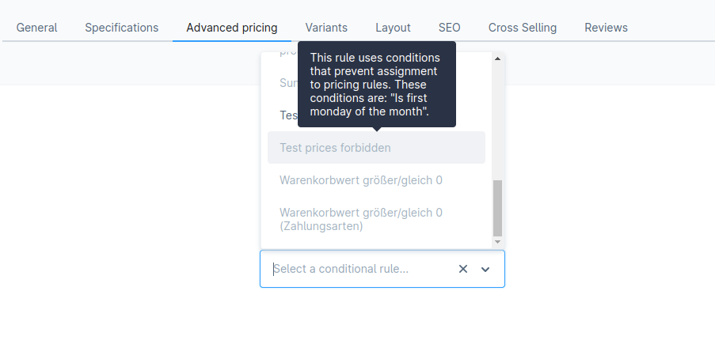

---
nav:
  title: Add custom rules
  position: 10

---

# Add Custom Rules

## Overview

In this guide you will learn how to create rules in Shopware. Rules are used by the rule builder.

This example will introduce a new rule, which checks if it is the first monday of the month or not. The shop owner is then able to react on this specific day every month with special prices or dispatch methods.

## Prerequisites

In order to add your own custom rules for your plugin, you first need a plugin as base. Therefore, you can refer to the [Plugin Base Guide](../../plugin-base-guide).

You also should be familiar with the [Dependency Injection container](../../plugin-fundamentals/dependency-injection) as this is used to configure your services.

It might be helpful to gather some general understanding about the concept of [Rules](../../../../../concepts/framework/rule) as well.

## Create custom rule

To create a custom rule, we have to implement both backend \(PHP\) code and a user interface in the Administration to manage it. Let's start with the PHP part first, which basically handles the main logic of our rule. After that, there will be an example to actually show your new rule in the Administration.

### Creating rule in PHP

First of all, we need a new Rule class. In this example, we name it as `FirstMondayOfTheMonthRule`. It will be placed in the directory `<plugin root>/src/Core/Rule`. Our new class has to extend from the abstract class `Shopware\Core\Framework\Rule\Rule`. Below you can find an example implementation.

```php
// <plugin root>/src/Core/Rule/FirstMondayOfTheMonthRule.php
<?php declare(strict_types=1);

namespace SwagCustomRules\Core\Rule;

use Shopware\Core\Framework\Rule\Rule;
use Shopware\Core\Framework\Rule\RuleScope;
use Symfony\Component\Validator\Constraints\Type;

class FirstMondayOfTheMonthRule extends Rule
{
    protected bool $isFirstMondayOfTheMonth;

    public function __construct()
    {
        parent::__construct();

        // Will be overwritten at runtime. Reflects the expected value.
        $this->isFirstMondayOfTheMonth = false;
    }

    public function getName(): string
    {
        return 'first_monday';
    }

    public function match(RuleScope $scope): bool
    {
        $isFirstMondayOfTheMonth = $this->isCurrentlyFirstMondayOfTheMonth(date("Y-m-d") );

        // Checks if the shop owner set the rule to "First monday => Yes"
        if ($this->isFirstMondayOfTheMonth) {
            // Shop administrator wants the rule to match if there's currently the first monday of the month.
            return $isFirstMondayOfTheMonth;
        }

        // Shop administrator wants the rule to match if there's currently NOT the first monday of the month.
        return !$isFirstMondayOfTheMonth;
    }

    public function getConstraints(): array
    {
        return [
            'isFirstMondayOfTheMonth' => [new Type('bool')]
        ];
    }

    private function isCurrentlyFirstMondayOfTheMonth($dateString)
    {
        $date = new \DateTime($dateString);
        $dayOfWeek = (int) $date->format('w');

        // Check if it's Monday (1 is Monday)
        if ($dayOfWeek !== 1) {
            return false;
        }

        // Check if the date is within the first seven days of the month
        $dayOfMonth = (int) $date->format('j');
        if ($dayOfMonth > 7) {
            return false;
        }

        // If it passed both checks, it's the first Thursday of the month
        return true;
    }
}
```

As you can see, several methods are already implemented:

* `__constructor`: This only defines the default expected value. This is overwritten at runtime with the actual value, that the shop owner set in the Administration.
* `getName`: Returns a unique technical name for your rule.
* `match`: This checks whether the rule applies. Accordingly, a boolean is returned whether the rule applies or not.
* `getConstraints`: This method returns an array of the possible fields and its types. You could also return the `NotBlank` class here, to require this field.

With `autoconfigure` enabled in your `services.php`, any class extending `Rule` is automatically tagged as `shopware.rule.definition` — no explicit service registration is needed.
Please keep in mind: The variables to be used in the rule have to be 'protected' and not 'private', otherwise they won't work properly.

::: warning
Never execute database queries or any other time-consuming operations within the `match()` method of your rule, as it will drastically impact the performance of your store. Stick to the rule scope when evaluating whether your rule matches or not.
:::

```php
// Scope usage: Check if the customer is logged in
$customer = $scope->getSalesChannelContext()->getCustomer();
$loggedIn = $customer !== null;
```

It is possible to add config to our rule. This makes it possible to skip the [Custom rule component](#custom-rule-component) and the [Custom rule Administration template](#custom-rule-administration-template) parts.

```php
    public function getConfig(): RuleConfig
    {
        return (new RuleConfig())->booleanField('isFirstMondayOfTheMonth');
    }
```

when [Showing rule in the Administration](#showing-rule-in-the-administration) we would not use a custom component but we would render the `sw-condition-generic` component.

### Active rules

You can access all active rules by using the `getRuleIds` method of the context.

```php
$context->getRuleIds();
```

### Showing rule in the Administration

Now we want to implement our new rule in the Administration so that we can manage it. To achieve this, we have to call the `addCondition` method of the [RuleConditionService](https://github.com/shopware/shopware/blob/v6.6.0.0/src/Administration/Resources/app/administration/src/app/service/rule-condition.service.ts), by decorating this service. The decoration of services in the Administration will be covered in our [Adding services](../../administration/services-utilities/add-custom-service#Decorating%20a%20service) guide.

Create a new directory called `<plugin root>/src/Resources/app/administration/src/decorator`. In this directory we create a new file called `rule-condition-service-decoration.js`.

```javascript
// <plugin root>src/Resources/app/administration/src/decorator/rule-condition-service-decoration.js
import '../../core/component/swag-first-monday';

Shopware.Application.addServiceProviderDecorator('ruleConditionDataProviderService', (ruleConditionService) => {
    ruleConditionService.addCondition('first_monday', {
        component: 'swag-first-monday',
        label: 'Is first monday of the month',
        scopes: ['global']
    });

    return ruleConditionService;
});
```

As you can see, this is decorating the `RuleConditionService` by using its name `ruleConditionDataProviderService`. The decoration adds a new condition called `first_monday`. Make sure to match the name we have used in the `getName` method in PHP. Next, we define the component, in our case, `swag-first-monday`, which is responsible for rendering the rule inside the Administration. We will create this component in the next step. Furthermore, we defined a label, which will be displayed in the rule builder selection. The last option is the scope, which in our case is `global`, as we have not specified a specific one in our core class.

We also have to create a `main.js` file in our Administration sources directory and import the decorator file we've created above. The `main.js` file is used as an entry point to load Administration modules from Shopware plugins:

```javascript
// <plugin root>/src/Resources/app/administration/src/main.js
import './decorator/rule-condition-service-decoration';
```

::: info
It may be possible that rules, with your newly created condition, aren't selectable in some places inside the Administration — for example, inside the promotion module. That is because rules are "context-aware". To learn more about that feature [click here](#context-awareness)
:::

#### Creating a new group in the administration

The rule will now be added to the list of rules in the admin. It might be useful to create a new group for your rules. We can create a new group by using the `upsertGroup` method of the [RuleConditionService](https://github.com/shopware/shopware/blob/v6.6.0.0/src/Administration/Resources/app/administration/src/app/service/rule-condition.service.ts).

```javascript
  // <plugin root>src/Resources/app/administration/src/decorator/rule-condition-service-decoration.js
  Shopware.Application.addServiceProviderDecorator('ruleConditionDataProviderService', (ruleConditionService) => {
      ruleConditionService.upsertGroup('days_of_the_month', {
        id: 'days_of_the_month',
        name: 'Days of the month',
      });

      return ruleConditionService;
  });
```

Now that we have our group, we have to link this group to our condition. This is easily done by adding the `group` property to our condition.

```javascript
// <plugin root>src/Resources/app/administration/src/decorator/rule-condition-service-decoration.js
import '../../core/component/swag-first-monday';

Shopware.Application.addServiceProviderDecorator('ruleConditionDataProviderService', (ruleConditionService) => {
    ruleConditionService.addCondition('first_monday', {
        component: 'swag-first-monday',
        label: 'Is first monday of the month',
        scopes: ['global'],
        group: 'days_of_the_month', // [!code focus]
    });

    return ruleConditionService;
});
```

### Custom rule component

Now that you have registered your rule to the Administration, you would still be lacking the actual component `swag-first-monday`. As you have already defined a path for it in your service decoration, create the following directory: `<plugin root>/src/Resources/app/administration/src/core/component/swag-first-monday`. If you are unfamiliar with creating components in Shopware, refer to the [add your own component](../../administration/module-component-management/add-custom-component) section.

Here's an example of what this component could look like:

```javascript
// <plugin root>/src/Resources/app/administration/src/core/component/swag-first-monday/index.js
import template from './swag-first-monday.html.twig';

Shopware.Component.extend('swag-first-monday', 'sw-condition-base', {
    template,

    computed: {
        selectValues() {
            return [
                {
                    label: this.$tc('global.sw-condition.condition.yes'),
                    value: true
                },
                {
                    label: this.$tc('global.sw-condition.condition.no'),
                    value: false
                }
            ];
        },

        isFirstMondayOfTheMonth: {
            get() {
                this.ensureValueExist();

                if (this.condition.value.isFirstMondayOfTheMonth == null) {
                    this.condition.value.isFirstMondayOfTheMonth = false;
                }

                return this.condition.value.isFirstMondayOfTheMonth;
            },
            set(isFirstMondayOfTheMonth) {
                this.ensureValueExist();
                this.condition.value = { ...this.condition.value, isFirstMondayOfTheMonth };
            }
        }
    }
});
```

As you can see, our `swag-first-monday` has to extend from the `sw-condition-base` component and has to bring a custom template, which will be explained in the next step. Let's have a look at each property and method. The first computed property is `selectValues`, which returns an array containing the values "true" and "false". Those will be used in the template later on, as they will be the selectable options for the shop administrator. Do not get confused by the call `this.$tc\('global.sw-condition.condition.yes'\)`; it's just loading a translation by its name, in this case, "Yes" and "No".

::: info
When dealing with boolean values, make sure to always return strings here.
:::

The second and last computed property is `isFirstMondayOfTheMonth`, which uses a getter and setter to define the value of the condition.

### Custom rule Administration template

The last step is, creating a template for our condition. We will create a new file called `swag-first-monday.html.twig` in the same directory as the component. In our template, we have to overwrite the block `sw_condition_value_content`. In this example we define a `sw-single-select` in this block.

```twig
// <plugin root>/src/Resources/app/administration/src/core/component/swag-first-monday/swag-first-monday.html.twig

    <sw-single-select name="first-monday"
                      id="first-monday"
                      size="medium"
                      :options="selectValues"
                      v-model="isFirstMondayOfTheMonth"
                      class="field--main">
    </sw-single-select>

```

As you can see, our `sw-single-select` uses the previously created computed property `selectValues` as the `options` prop, and the value is saved into the variable `isFirstMondayOfTheMonth`. That's it; your rule is now fully integrated.

## Context awareness

::: info
This feature is available in version 6.5.0.0 or above.
:::

Rules in the Shopware Administration are aware of where users assign them. That means that a user can't add a rule to a promotion when the rule contains the condition "Cart amount". That also works the other way around. If the rule is assigned to a promotion, the user can't use the "Cart amount" condition.



It is possible to define where rules can be assigned inside the Administration.

### Defining restrictions

You have previously added the condition inside `ruleConditionDataProviderService`. This is the place where you define restrictions for the rule. The goal of this example is to restrict the user from adding a rule to advanced prices if the rules contain a specific condition.

First, get the existing definition for the rule relation as below:

```javascript
// <plugin root>src/Resources/app/administration/src/decorator/rule-condition-service-decoration.js
// Inside the addServiceProviderDecorator method
const restrictions = ruleConditionService.getAwarenessConfigurationByAssignmentName('productPrices');
```

::: info
You can find all possible relations in `Shopware\Core\Content\Rule\RuleDefinition`;
:::

Now, add your `awarenessConfiguration` and call the `addAwarenessConfiguration` method.

```javascript
type awarenessConfiguration = {
notEquals?: Array<string>,
equalsAny?: Array<string>,
snippet?: string,
}
```

```javascript
// <plugin root>src/Resources/app/administration/src/decorator/rule-condition-service-decoration.js
Shopware.Application.addServiceProviderDecorator('ruleConditionDataProviderService', (ruleConditionService) => {
    // Your newly added conditions is here

    const restrictions = ruleConditionService.getAwarenessConfigurationByAssignmentName('productPrices');

    ruleConditionService
        .addAwarenessConfiguration('productPrices', {
            notEquals: [
                'first_monday'
            ],
            equalsAny: [ ], // ignore if not needed
            snippet: 'sw-restricted-rules.restrictedAssignment.productPrices',
        });
});
```

What do `notEquals` and `equalsAny` actually mean?
With these two properties, you can define the rules you want to assign to a specific relation, i.e., `productPrices` need to have at least one condition inside `equalsAny` or should not have any condition inside of `notEquals`.

Finally, you just need a snippet, and you can choose an existing one or create one yourself. With that said, you successfully defined restrictions for your custom condition. If you now try to assign a rule with your condition to advanced prices, you should see that it is not possible, and the rule is disabled.

### Restricting rule assignments

When you add a new rule-select component to assign rules somewhere in Shopware, you should use the `sw-select-rule-create` component. With that, you can ensure that the rules you don't want to be selectable aren't selectable.
For that, we need to write some twig code. The important property here is the `rule-aware-group-key` property which should match the assignment name of the rule-aware group we just extended.

::: info
Refer to [customize administration components](../../administration/module-component-management/customizing-components) to know more about it.
:::

```twig

    <sw-select-rule-create
        rule-aware-group-key="productPrices"
        @save-rule="[YOUR SAVE METHOD]">

```

That's it! The component automatically fetches rules and marks them as disabled.

## Multi select and other components

The above guide explains the integration of a boolean and no values. If you want to go more in-depth, for example, search your entity, you can extend and use the different components that Shopware comes with. The multi select example can be found in `shopware/administration/Resources/app/administration/src/app/component/form/select/entity/sw-entity-multi-select`.

## Further reading

For more other information you can refer to [Add rule assignment configuration](../../administration/advanced-configuration/add-rule-assignment-configuration) section of the guide.
