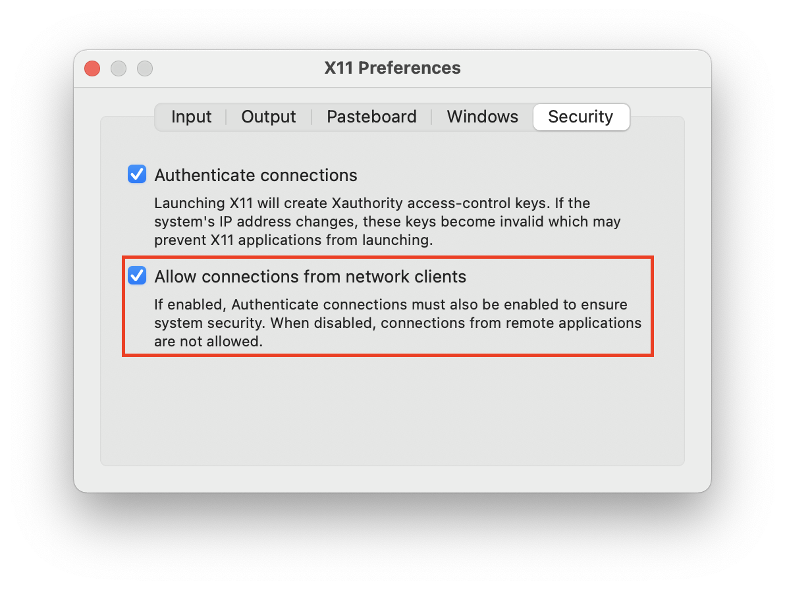

---
nav:
  title: Cypress End-to-end testing
  position: 11

---

# Cypress End-to-End Testing

## Overview

In end-to-end testing \(E2E testing in short\) real user workflows are simulated, whereby as many as possible functional areas and parts of the technology stack used in the application should be included. This way, we are able to put our UI under constant stress and ensure that Shopware's main functionalities are always working correctly.

## Prerequisites

To use Shopware E2E tests, at first you need to have a Shopware 6 installation running. Making sure, that your tests are reliable, you should have a clean installation. Cleanup means no categories, no products, no settings, nothing!

The easiest way to clean up your installation is the initialization. Using the command `composer run init` Shopware 6 gets initialized clean and without demo data. Installation of E2E dependencies can be accomplished separately by running `npm install` in the E2E folder you're using, e.g. for Shopware Administration it's `src/Administration/Resources/app/administration/test/e2e`.

Since our tests should run on an installation that is as close as possible to a release package, we use production mode. If you run the tests on a development environment, the test results may vary.

On top of that, please make sure your shop has a theme assigned. When using `composer run e2e:open` or `run`, this is done automatically.

This guide also won't teach you how to write Cypress tests in general. Please take a look at the official Cypress documentation for further guidance.

<PageRef page="https://docs.cypress.io/" title="Cypress Documentation" target="_blank" />

### Using our testsuite

The [E2E platform testsuite package](https://github.com/shopwareArchive/e2e-testsuite-platform) contains commands and helpers supporting you while building E2E tests for Shopware 6. On top of that, test data management and custom commands are included as well. More on that here: [Command reference](../../../../resources/references/core-reference/commands-reference).

This test suite is built on top of [Cypress](https://www.cypress.io/) as well as the following Cypress plugins:

* [cypress-select-tests](https://github.com/bahmutov/cypress-select-tests)
* [cypress-log-to-output](https://github.com/flotwig/cypress-log-to-output)
* [cypress-file-upload](https://github.com/abramenal/cypress-file-upload)

Here you can find the npm package of our testsuite:

<PageRef page="https://www.npmjs.com/package/@shopware-ag/e2e-testsuite-platform" title="@shopware-ag/e2e-testsuite-platform - npm" target="_blank" />

Please have a look on our [cypress.json](https://github.com/shopwareArchive/e2e-testsuite-platform/blob/3.x/cypress.json), a few of our commands expect some configuration, e.g. viewportHeight and width, because the admin menu only opens if the viewport is wide enough.

## Setup steps

When you use our [Development template](https://github.com/shopwareArchive/development), we provide you some tooling scripts located in `dev-ops/e2e/actions`, to use E2E tests more comfortably.

The`composer` scripts to run our E2E tests in CLI or in Cypress' test runner are explained in the paragraph [Executing e2e tests](end-to-end-testing#executing-e2e-tests).

<Tabs>
<Tab title="Plugin setup">

Depending on your environment \(administration or storefront\) please create the following folder structure:

```text
Resources
  `-- app
    `-- <environment>
      `-- test
        `-- e2e
          `-- cypress
            |-- fixtures
            |-- integration
            |-- plugins
            `-- support
```

We will cover the use of every folder in detail.

Within the folder `Resources/app/<environment>/test/e2e`, please run `npm init -y` to generate a `package.json` file. It is very convenient to place a script inside the newly created `package.json` to run the tests locally. Please add the following section to do so:

```javascript
"scripts": {
   "open": "node_modules/.bin/cypress open"
},
```

Now install this package with the following command:

```text
npm install @shopware-ag/e2e-testsuite-platform
```

As next step, please create a new file `e2e/cypress/plugins/index.js` with the following content:

```javascript
module.exports = require('@shopware-ag/e2e-testsuite-platform/cypress/plugins');
```

Finally, create a new file e2e/cypress/support/index.js with the following line:

```javascript
// Require test suite commands
require('@shopware-ag/e2e-testsuite-platform/cypress/support');
```

</Tab>

<Tab title="Platform: Developing with docker">
If you are using docker, you don't need to install a thing: We use the [Cypress/Included image](https://github.com/cypress-io/cypress-docker-images/tree/master/included) to use Cypress in Docker completely.

However, as we're using this image for running the test runner as well, you may need to do some configuration first. Based on this [guide](https://www.cypress.io/blog/2019/05/02/run-cypress-with-a-single-docker-command) you need to forward the XVFB messages from Cypress out of the Docker container into an X11 server running on the host machine. The guide shows an example for Mac; other operating systems might require different commands.

In case you're using Docker on Mac we have summarized the steps from the guide mentioned above, so you can follow these to prepare your environment to get the Test Runner up and running:

**Install and configure XQuartz**  

Install XQuartz via [Homebrew](https://docs.brew.sh/Installation) or alternatively [download](https://www.xquartz.org/) it from the official homepage:

```bash
brew install --cask xquartz
```

Run XQuartz via CLI or open it from your Desktop:

```bash
open -a XQuartz
```

Got to `XQuartz > Preferences` (`⌘ + ,`) and enable `Allow connections from network clients`:



::: warning
Restart your Mac before proceeding with the following steps.
:::

**Configure your environment**

Grab your IP address and save it to the environment variable `IP`:

```bash
IP=$(ipconfig getifaddr en0)
```

Depending on how you're connected you might have to use another interface instead of `en0`.

Now set the `DISPLAY` environment variable:

```bash
DISPLAY=$IP:0
```

Add `$IP` to xhost's ACL:

```bash
xhost + $IP
```

::: danger
It is **crucial** to set these environment variables in the **same terminal session** from where you will later run `psh e2e:open`!

Make sure that the `DISPLAY` environment variable on your Mac is properly set **before** you start the containers as it will be **passed** to the Cypress container when the container is **created**.
Updating the variable on your host won't update it in the container until it is re-created!
:::
</Tab>
</Tabs>

## Executing E2E tests

<Tabs>
<Tab title="Plugin setup">

If you want to run E2E tests in your plugin, just switch to the folder `Resources/app/<environment>/test/e2e` and execute the following command:

```bash
CYPRESS_baseUrl=<your-url> npm run open
```

`<your-url>` means the Storefront-URL of your Shopware environment.

It opens up the Cypress test runner which allows you to run and debug your tests, similar to the `e2e:open` command.

::: danger
Don't forget that you might need to adjust test cleanup and other environment-related things according to your plugin's setup.
:::

</Tab>

<Tab title="Execution in platform project">
If you use Docker for your development environment, you are able to start right away.

To prepare your shopware installation, your environment and install dependencies, please run the following command as first step, **outside** of your docker container:

```bash
 composer run e2e:setup
```

In our tests, we assume a clean shopware installation, so we strongly recommend to use `e2e:setup`. However, if your shopware installation is already clean and prepared, you can skip the preparation of your shopware installation by using the following command **inside** your docker container:

```bash
 composer run e2e:prepare
```

Afterwards, just use the following command outside of your container to run the Cypress Test Runner:

```bash
composer run e2e:open
```

If you want to run the tests in CLI, please use the following command outside your container:

```bash
composer e2e:cypress -- run --spec="cypress/e2e/administration/**/*.cy.js"
```

or

```bash
composer e2e:cypress -- run --spec="cypress/e2e/storefront/**/*.cy.js"
```

To see a complete overview on all psh scripts for e2e tests, feel free to refer to our [e2e command reference](../../../../../resources/references/testing-reference/e2e-commands).
</Tab>
</Tabs>

## Writing your first test

### Folder structure

In Shopware platform, you can find the tests in `src/Administration/Resources/app/administration/test/e2e`. There you can find the following folder structure, depending on your environment being Administration or Storefront:

```bash
`-- e2e
  `-- cypress
    |-- fixtures
        `-- example.json
    |-- integration
        `-- testfile.spec.js
    |-- plugins
        `-- index.js
    |-- support
        |-- commands.js
        `-- index.js
    |--cypress.json
    `--cypress.env.json
```

In the `cypress` folder, all test related folders are located. Most things will take place in these four folders:

* `fixtures`: Fixtures are used as external pieces of static data that can be used by your tests. You can use them

  with the `cy.fixture` command.

* `integration`: By default, the test files are located here. A file with the suffix "\*.spec.js" is a test file that

  contains a sequence of tests, performed in the order defined in it.

* `plugins`: Contains extensions or plugins. By default, Cypress will automatically include the plugins file before

  every single spec file it runs.

* `support`: The support folder is a great place to put reusable behavior such as custom commands or global overrides in,

  that you want to be applied and available to all of your spec files.

These two configuration files are important to mention as well:

* `cypress.json`
* `cypress.env.json`

  These are Cypress configuration files. If you need more information about them, take a look at the

  [Cypress configuration docs](https://docs.cypress.io/guides/references/configuration.html).

If you need to use this structure in a plugin, it is just the path to the `e2e` folder, which is slightly different. You can find the folder structure in the paragraph [Setup](cypress-end-to-end-testing#setup-steps).

If you want to contribute to Shopware platform's tests, please ensure to place your test in one of those folders:

```javascript
`-- integration
  |-- catalogue
  |-- content
  |-- customer
  |-- general
  |-- media-marketing
  |-- order
  |-- rule-product-stream
  `-- settings
```

::: warning
This is important because otherwise your test is not considered by our CI.
:::

### Test layout and syntax

Cypress tests are written in Javascript. If you worked with Mocha before, you will be familiar with Cypress' test layout. The test interface borrowed from Mocha provides `describe()`, `context()`, `it()` and `specify()`.

To have a frame surrounding your test and provide a nice way to keep your test organized, use `describe()` \(or `context()` as its alias\):

```javascript
describe('Test: This is my test file', () => {
    it('test something', () => {
        // This is your first test
    });
    it('tests something else', () => {
        // This is your second test
    });
});
```

The `it()` functions within the `describe()` function are your actual tests. Similar to `describe()` and `context()`, `it()` is identical to `specify()`. However, for writing Shopware tests we focus on `it()` to keep it consistent.

## Commands and assertions

In Cypress, you use commands and assertions to describe the workflow you want to test.

### Commands

Commands are the actions you need to do in order to interact with the elements of your application and reproduce the workflow to test in the end.

```javascript
it('test something', () => {
    ...
    cy.get('.sw-grid__row--0')
        .contains('A Set Name Snippet')
        .dblclick();
    cy.get('.sw-grid__row--0 input')
        .clear()
        .type('Nordfriesisch')
        .click();
    ...
    });
```

You can chain commands by passing its return value to the next one. These commands may contain extra steps to take, e.g. a `click` or `type` operation.

Cypress provides a lot of commands to represent a variety of steps a user could do. On top of that, our E2E testsuite contains a couple of [custom commands](../../../../../resources/references/testing-reference/e2e-custom-commands) specially for Shopware.

### Assertions

Assertions describe the desired state of your elements, objects and application. Cypress bundles the Chai Assertion Library \(including extensions for Sinon and jQuery\) and supports both BDD \(expect/should\) and TDD \(assert\) style assertions. For consistency reasons, we prefer BDD syntax in Shopware's tests.

```javascript
it('test something', () => {
    ...
    cy.get('.sw-loader')
        .should('not.exist')
        .should('be.visible')
        .should('not.have.css', 'display', 'none');
    cy.get('div')
        .should(($div) => {
            expect($div).to.have.length(1)
        });
    ...
    });
```

## Hooks

You might want to set hooks to run before a set of tests or before each test. At Shopware we use those to e.g. clean up Shopware itself, login to the Administration or to set the admin language.

Cypress got you covered, similar to Mocha, by providing hooks. These can be used to set conditions that you can run before or after a set of tests or each test.

```javascript
describe('We are using hooks', function() {
  before(function() {
    // runs once before all tests in the block
  })

  beforeEach(function() {
    // runs before each test in the block
  })

  afterEach(function() {
    // runs after each test in the block
  })

  after(function() {
    // runs once after all tests in the block
  })
})
```

### Build up and teardown

As we mentioned before, we use these hooks to build up the ideal situation for our test to run. This includes cleaning up the tests' state - based on a clean Shopware installation. According to Cypress' [thoughts on anti-patterns](https://docs.cypress.io/guides/references/best-practices.html#Using-after-or-afterEach-hooks) we clean up the previous state of Shopware beforehand. The reason is pretty simple: You can't be completely sure to reach the `after` hook \(sometimes tests may fail\), the safer way to cleanup your tests is the `beforeEach` hook. On top of stability advantages, it's possible to stop the tests anytime without manual cleanup.

## Handling test data

It's important and necessary the E2E tests are isolated. This means that the test should create itself beforehand, all the data needed for running. Afterwards, state in the database and the browser must be removed completely. This way, the spec avoids dependencies to demo data or data from other tests and cannot be disturbed by those.

One test should only test one workflow, the one it's written for. For example, if you want to test the creation of products, you should not include the creation of categories in your test, although its creation is needed to test the product properly. As best practise we recommend handling everything not related to the test using the [lifecycle hooks](https://docs.cypress.io/guides/core-concepts/writing-and-organizing-tests.html#Hooks) provided by Cypress.

In Shopware platform, we use Shopware's REST API to create the data we need. As a result, our tests are able to focus on one single workflow without having to test the workflows which normally need to be done to provide the data we need. Another aspect of handling it this way is, that creating test data via API is faster than doing it inside the test.

### Cypress' fixtures

To define the request you send to Shopware and to set first test data, store as `json` file in the folder `e2e/cypress/fixtures`. You can use those files to provide fixed test data which can be used directly to create the desired entity without any further searching or processing. Fortunately, Cypress provides a way to handle those fixtures by default. The command `cy.fixture()` loads this fixed set of data located in a json file.

In the example file below, this file is used in order to define and create a customer. So, it provides data so that the customer can be created in Shopware.

```json
{
  "customerNumber": "C-1232123",
  "salutation": "Mr",
  "firstName": "Pep",
  "lastName": "Eroni",
  "email": "test@example.com",
  "guest": true,
  "addresses": [
    {
        ...
    }
  ]
}
```

::: warning
Use only fields, which you can access in the UI / Storefront. Keep in mind that all tests in the file may use the fixture. So keep an eye on compatibility.
:::

A small note on ID usage: Using ids may be easier for finding elements, but it isn't a proper way for testing in every case - It depends on your application. You need to be 100% sure that the id is persistent and won't change between builds. Never use ids here if you cannot be 100% sure they will not change at all, e.g. in another build.

::: info
At our case at Shopware, Ids on UUID basis tend to change from one installation to the next, so they are not always suitable to be used as selector in your test.
:::

### API implementation

Analogue to the Administration itself, the api access of the e2e test is based on [axios](https://www.npmjs.com/package/axios), a promise based HTTP client for the browser and node.js.

Just like the Administration, we use services to access Shopware's REST API. Therefore, we use the ApiService to provide the basic methods for accessing the api. Located in `e2e/cypress/support/service/api.service.js`, ApiService is shared between all repositories and acts as a basis for all your next steps of creating fixtures. That implies that the axios implementation of all important api methods can be found there. This service acts as an interface: Next to the basic functions like get, post etc the request method is specified here as well as some Shopware-related methods which have to be available in all repositories.

::: info
Cypress provides an own axios-based way to handle requests in its command `cy.request`. However, Cypress commands are not real promises, see [Commands are not Promises](https://docs.cypress.io/guides/core-concepts/introduction-to-cypress.html#Commands-Are-Not-Promises). As we aim to parallelize the promises to fetch test data, we use our own implementation instead.
:::

### Services and commands

In order to get all test fixture data applied to our Shopware installation, we use services to send the API requests to find, create or update the data we need. To access these services conveniently, we provide custom commands, which we'll cover a bit later. Let's continue with the general things first.

All fixture services can be found in `cypress/support/service/`:

```bash
service
  |-- administration // this folder stores the Administration channel API services
    `-- <environment>
      `-- test
        `-- e2e
          `-- cypress
            |-- fixture
            |-- admin-api.service.js // Provides all methods which communicate with admin api directly
            `-- fixture.service.js // Provides all methods for general fixture handling
  |-- saleschannel // this one stores the sales channel API services
  `-- api.service.js // axios interface
```

If you want to use all known services, you can access them using custom commands. These commands can be found in `cypress/support/commands/api-commands.js` for general operation and `cypress/support/commands/fixture-commands.js` specifically for fixture handling.

#### Default fixture command

The stationary fixtures mentioned in the paragraph "Cypress' fixtures" can be sent to Shopware's REST API directly: In most cases Shopware does not need any additional data, like IDs or other data already stored in Shopware. That means the request can be sent, and the desired entity can be created immediately: You just need to use the `createDefaultFixture(endpoint, options = [])` command, as seen below:

```javascript
    beforeEach(() => {
        cy.createDefaultFixture('tax');
    });
```

In this example, a tax rate will be created with the data provided based on the `json` file located in the `fixtures` folder. Let's look at the command in detail:

```javascript
Cypress.Commands.add('createDefaultFixture', (endpoint, data = {}, jsonPath) => {
    const fixture = new Fixture();
    let finalRawData = {};

    if (!jsonPath) {
        jsonPath = endpoint;
    }

    // Get test data from cy.fixture first
    return cy.fixture(jsonPath).then((json) => {

        // Merge fixed test data with possible custom one
        finalRawData = Cypress._.merge(json, data);

        // Create the fixture using method from fixture service
        return fixture.create(endpoint, finalRawData);
    });
});
```

#### Commands of customised services

You will notice soon that some entities need data which has already been created. That means you have to find out specific IDs or employ a completely different handling. In this case, your own service has to be created, located in `e2e/cypress/support/service`. Some examples for these services are:

* Customer
* Sales channel
* Languages
* Products

In most cases, the usage of these services is similar to the basic ones already implemented. There are commands for each of those services provided by our E2E testsuite package. You don't need to define the API endpoint when using those commands. As these services are extending the `FixturesService`, all methods of it can be used in all other services as well.

#### Writing your own customised service

Let's look at the custom service `shipping.fixture.js`. This service is a rather simple example - It depicts a service in need of some customization for creating a shipping method correctly. With that being said, let's start.

Your `ShippingFixtureService` has to extend the class `AdminFixtureService`. Afterwards, you create a function called `setShippingFixture(userData)` with the parameter `userData` for the data you want to use to create your shipping method. This way, your class should look like this:

```javascript
const AdminFixtureService = require('../fixture.service.js');

class ShippingFixtureService extends AdminFixtureService {
    setShippingFixture(userData) {
        // Here we're going to create our shipping fixture
    }
}

module.exports = ShippingFixtureService;

global.ShippingFixtureService = new ShippingFixtureService();
```

All custom services hold a distinct method for creating fixtures: First, it's important to collect the necessary data via REST API. This is done by filtering POST requests used in promises. In case of your our `ShippingFixtureService`, you need the ID of the rule you want to use for the availability, and the ID of the delivery time.

```javascript
 const findRuleId = () => this.search('rule', {
        type: 'equals',
        value: 'Cart >= 0 (Payment)'
    });
 const findDeliveryTimeId = () => this.search('delivery-time', {
    type: 'equals',
    value: '3-4 weeks'
});
```

The responses of these calls are used to provide the missing IDs for your final POST request. At first, we will merge the missing data with the existing data, then create our shipping method:

```javascript
return Promise.all([
    findRuleId(),
    findDeliveryTimeId()
]).then(([rule, deliveryTime]) => {
    return this.mergeFixtureWithData(userData, {
        availabilityRuleId: rule.id,
        deliveryTimeId: deliveryTime.id
    });
}).then((finalShippingData) => {
    return this.apiClient.post('/shipping-method?_response=true', finalShippingData);
});
```

That's it! There you go: You have successfully created a customised service that sets up a shipping method in Shopware. Actually, we use this service in our platform test to create our shipping method as well. You can find the full service [here](https://github.com/shopwareArchive/e2e-testsuite-platform/blob/master/cypress/support/service/administration/fixture/shipping.fixture.js). So please look at this example to see the whole class.

Below you will find some best practices and tricks we explored to help you with your testing tasks:

* A source of information can be found in FieldCollection of the several EntityDefinition files. All fields belonging to an entity are defined there. For example, if you're searching for customer related data, please search for the `CustomerDefinition` in Shopware platform.
* If you want to extract mandatory data that is not covered by the error message received with the API's response, it's useful to reproduce your workflow manually: E.g. if you need to find out what data is mandatory for creating a customer, try to save an empty one in the Administration. Keep an eye on the developer tools of your browser while doing so, especially on the preview and response section of your request. As you get your response, you can see what data is still missing.
* If you need to set non-mandatory data, reproducing the above mentioned workflow is recommended as well: Even if the error response does not contain a readable error, you can still inspect it: All the relevant information is stored in 'data'. IDs can be found there directly, other relevant data is stored in "attributes".
* Cypress' test runner can help you a lot with inspecting API requests. Just click on the request in the test runner's log to get a full print of it in your console.

## More interesting topics

* [Unit testing with PHPUnit](../php-unit)
* [Jest unit tests in Shopware's administration](../jest-admin)
* [Jest unit tests in Shopware's storefront](../jest-storefront)
