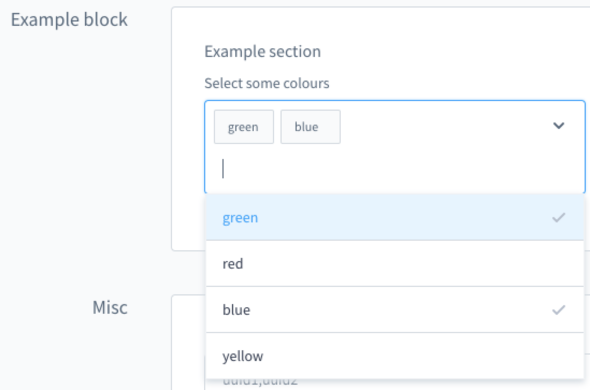

---
nav:
  title: Theme configuration
  position: 40

---

# Theme Configuration

::: info
The `configInheritance` is available from Shopware Version 6.4.8.0
:::

## Overview

This guide shows you how the theme configuration works and explains the possibilities of the settings in more depth.

## Prerequisites

This guide is built upon the guide on creating a first theme:

<PageRef page="create-a-theme" />

## Structure of theme configuration

The theme configuration for a theme is located in the `theme.json` file `<plugin root>/src/Resources` folder. Open up the `<plugin root>/src/Resources/theme.json` file with your favorite code-editor. The configuration looks like this.

```javascript
// <plugin root>/src/Resources/theme.json
{
  "name": "SwagBasicExampleTheme",
  "author": "Shopware AG",
  "description": {
    "en-GB": "My custom theme",
    "de-DE": "Mein custom thema"
  },
  "views": [
     "@Storefront",
     "@Plugins",
     "@SwagBasicExampleTheme"
  ],
  "previewMedia": "app/storefront/dist/assets/defaultThemePreview.jpg",
  "style": [
    "app/storefront/src/scss/overrides.scss",
    "@Storefront",
    "app/storefront/src/scss/base.scss"
  ],
  "script": [
    "@Storefront",
    "app/storefront/dist/storefront/js/swag-basic-example-theme/swag-basic-example-theme.js"
  ],
  "asset": [
    "@Storefront",
    "app/storefront/src/assets"
  ],
  "configInheritance": [
    "@Storefront",
    "@OtherTheme"
    ]
}
```

::: info
If you make changes or additions to the `theme.json` file, you must then execute the `theme:refresh` command to put them into effect. Run `bin/console theme:refresh` in order to update your theme.
:::

Let's have a closer look at each section.

```javascript
// <plugin root>/src/Resources/theme.json
{
  "name": "SwagBasicExampleTheme",
  "author": "Shopware AG",
  "description": {
    "en-GB": "Just another description",
    "de-DE": "Nur eine weitere Beschreibung"
  },
  ...
}
```

Here change the `name` of your theme and the `author`. It is recommended to choose a name in camel case. The `description` section is optional and as you notice it is also translatable.

The `views` section controls the template inheritance. This will be covered in the [Theme inheritance](add-theme-inheritance) guide.

```javascript
// <plugin root>/src/Resources/theme.json
{
  ...
  "views": [
     "@Storefront",
     "@Plugins",
     "@SwagBasicExampleTheme"
  ],
  ...
}
```

The `previewMedia` field provides a path `app/storefront/dist/assets/defaultThemePreview.jpg` to an image file that is relative to the root directory of the theme. It serves as a visual preview of the theme. This preview image is typically displayed within the Shopware administration interface or theme marketplace as a thumbnail or preview of the theme's appearance to give users an idea of how the theme will appear on their storefront before they activate it.

```javascript
// <plugin root>/src/Resources/theme.json
{
  ...
  "previewMedia": "app/storefront/dist/assets/defaultThemePreview.jpg",
  ...
}
```

The `style` section determines the order of the CSS compilation. In the `<plugin root>/app/storefront/src/scss/base.scss` file you can apply your changes you want to make to the `@Storefront` standard styles or add other styles you need. The `<plugin root>/app/storefront/src/scss/overrides.scss` file is used for a special case. Maybe you need to override some defined `variables` or `functions` defined by Shopware or Bootstrap, you can implement your changes here. Checkout the [Override bootstrap variables in a theme](override-bootstrap-variables-in-a-theme) guide for further information.

```javascript
// <plugin root>/src/Resources/theme.json
{
  ...
  "style": [
    "app/storefront/src/scss/overrides.scss",
    "@Storefront",
    "app/storefront/src/scss/base.scss"
  ],
  ...
}
```

## Assets

The `asset` option you can configure your paths to your assets like images, fonts, etc. The standard location to put your assets to is the `<plugin root>/app/storefront/src/assets` folder. Checkout the [Add assets to theme](add-assets-to-theme) guide for further information.

```javascript
// <plugin root>/src/Resources/theme.json
{
  ...
  "asset": [
     "app/storefront/src/assets"
   ]
  ...
}
```

If you need the assets from the default storefront theme for your custom theme, just add `@Storefront` as asset path

```javascript
// <plugin root>/src/Resources/theme.json
{
  ...
  "asset": [
     "@Storefront",
     "app/storefront/src/assets"
   ]
  ...
}
```

## Config fields

One of the benefits of creating a theme is that you can overwrite the theme configuration of the default theme or add your own configurations.

```javascript
// <plugin root>/src/Resources/theme.json
{
  ... 
  "asset":[
    ...
  ],
  "config": {
      "fields": {
        "sw-color-brand-primary": {
          "value": "#00ff00"
        }
      }
   }
}
```

In the example above, we change the primary color to green. You always inherit from the storefront config and both configurations are merged. This also means that you only have to provide the values you actually want to change. You can find a more detailed explanation of the configuration inheritance in the section [Theme inheritance](add-theme-inheritance).

::: warning
If you overwrite variables of another theme from a third party provider and these are renamed or removed at a later time, this can lead to issues and the theme can no longer be compiled. So be aware of it.
:::

The `theme.json` contains a `config` property which contains a list of tabs, blocks, sections and fields.

The key of each config field item is also the technical name which you use to access the config option in your theme or scss files. `config` entries will show up in the Administration and can be customized by the end user \(if `editable` is set to `true`, see table below\).

The following parameters can be defined for a config field item:

| Name | Meaning |
| :--- | :--- |
| `label` | Array of translations with locale code as key. *(Deprecated for v6.8: Translations are now handled via Administration snippets)* |
| `helpText` | Array of translations with locale code as key. *(Deprecated for v6.8: Translations are now handled via Administration snippets)* |
| `type` | Type of the config. Possible values: color, text, number, fontFamily, media, checkbox, switch and url |
| `editable` | If set to false, the config option will not be displayed \(e.g. in the Administration\) |
| `tab` | Name of a tab to organize the config options |
| `block` | Name of a block to organize the config options |
| `section` | Name of a section to organize the config options |
| `custom` | The defined data will not be processed but is available via API |
| `scss` | If set to false, the config option will not be injected as a SCSS variable |
| `fullWidth` | If set to true, the Administration component width will be displayed in full width |

### Translations in Theme Manager

Since the translations in `theme.config` are only used by the Theme Manager in the administration, we decided to use snippet keys for translating the configuration in order to ensure inheritance.

Each snippet key begins with `sw-theme`, followed by the theme’s technical name in kebab case. It then includes the names of the relevant `tab`, `block`, `section`, and `field`. If you're translating field options, a numeric index is added to the snippet path. If any of these elements are unnamed, `default` will be used as the replacement in the key.

At the end of the key, you append `label`. For fields, you may alternatively use `helpText` instead of `label`.

This results in the following key structure:

- **Tab**: `sw-theme.<technicalName>.<tabName>.label`
- **Block**: `sw-theme.<technicalName>.<tabName>.<blockName>.label`
- **Section**: `sw-theme.<technicalName>.<tabName>.<blockName>.<sectionName>.label`
- **Field**:  
  - `sw-theme.<technicalName>.<tabName>.<blockName>.<sectionName>.<fieldName>.label`  
  - `sw-theme.<technicalName>.<tabName>.<blockName>.<sectionName>.<fieldName>.helpText`
- **Option**: `sw-theme.<technicalName>.<tabName>.<blockName>.<sectionName>.<fieldName>.<index>.label`

#### Example

Assuming your `theme.json` is structured as follows:

```javascript
// <plugin root>/src/Resources/theme.json
{
  "name": "Just another theme",
  // ...
  "config": {
    "fields": {
      "my-single-select-field": {
        "type": "text",
        "value": "24",
        "custom": {
          "componentName": "sw-single-select",
          "options": [
            {
              "value": "16"
            },
            {
              "value": "20"
            },
            {
              "value": "24"
            }
          ]
        },
        "editable": true,
        "block": "exampleBlock",
        "section": "exampleSection"
      }
    }
  }
}
```

This would generate the following snippet keys:

- **Tab**: `sw-theme.just-another-theme.default.label`
- **Block**: `sw-theme.just-another-theme.default.exampleBlock.label`
- **Section**: `sw-theme.just-another-theme.default.exampleBlock.exampleSection.label`
- **Field**:  
  - `sw-theme.just-another-theme.default.exampleBlock.exampleSection.my-single-select-field.label`  
  - `sw-theme.just-another-theme.default.exampleBlock.exampleSection.my-single-select-field.helpText`
- **Option**:  
  - `sw-theme.just-another-theme.default.exampleBlock.exampleSection.my-single-select-field.0.label`  
  - `sw-theme.just-another-theme.default.exampleBlock.exampleSection.my-single-select-field.1.label`  
  - `sw-theme.just-another-theme.default.exampleBlock.exampleSection.my-single-select-field.2.label`

## Field types

You can use different field types in your theme manager:

A text field example:
<Tabs>
<Tab title="Since v6.7.1.0">

```javascript
// <plugin root>/src/Resources/theme.json
{
  ...
  "config": {
    "fields": {
      "modal-padding": {
        "type": "text",
        "value": "(0, 0, 0, 0)",
        "editable": true
      }
    }
  }
}
```

</Tab>

<Tab title="Before v6.8.0.0">

```javascript
// <plugin root>/src/Resources/theme.json
{
  ...
  "config": {
    "fields": {
      "modal-padding": {
        "label": {
          "en-GB": "Modal padding",
          "de-DE": "Modal Innenabstand"
        },
        "type": "text",
        "value": "(0, 0, 0, 0)",
        "editable": true
      }
    }
  }
}
```

</Tab>
</Tabs>

A number field example:

<Tabs>
<Tab title="Since v6.7.1.0">

```javascript
// <plugin root>/src/Resources/theme.json
{
  ...
  "config": {
    "fields": {
      "visible-slides": {
        "type": "number",
        "custom": {
          "numberType": "int",
          "min": 1,
          "max": 6
        },
        "value": 3,
        "editable": true
      }
    }
  }
}
```

</Tab>

<Tab title="Before v6.8.0.0">

```javascript
// <plugin root>/src/Resources/theme.json
{
  ...
  "config": {
    "fields": {
      "visible-slides": {
        "label": {
          "en-GB": "Number of visible slides",
          "de-DE": "Anzahl an sichtbaren Slider Bildern"
        },
        "type": "number",
        "custom": {
          "numberType": "int",
          "min": 1,
          "max": 6
        },
        "value": 3,
        "editable": true
      }
    }
  }
}
```

</Tab>
</Tabs>

Two boolean field examples:

<Tabs>
<Tab title="Since v6.7.1.0">

```javascript
// <plugin root>/src/Resources/theme.json
{
  ...
  "config": {
    "fields": {
      "navigation-fixed": {
        "type": "switch",
        "value": true,
        "editable": true
      }
    }
  }
}
```

or

```javascript
// <plugin root>/src/Resources/theme.json
{
  ...
  "config": {
    "fields": {
      "navigation-fixed": {
        "type": "checkbox",
        "value": true,
        "editable": true
      }
    }
  }
}
```

</Tab>

<Tab title="Before v6.8.0.0">

```javascript
// <plugin root>/src/Resources/theme.json
{
  ...
  "config": {
    "fields": {
      "navigation-fixed": {
        "label": {
          "en-GB": "Fix navigation",
          "de-DE": "Navigation fixieren"
        },
        "type": "switch",
        "value": true,
        "editable": true
      }
    }
  }
}
```

or

```javascript
// <plugin root>/src/Resources/theme.json
{
  ...
  "config": {
    "fields": {
      "navigation-fixed": {
        "label": {
          "en-GB": "Fix navigation",
          "de-DE": "Navigation fixieren"
        },
        "type": "checkbox",
        "value": true,
        "editable": true
      }
    }
  }
}
```

</Tab>
</Tabs>

## Examples for custom config fields

A custom single-select field example

<Tabs>
<Tab title="Since v6.7.1.0">

```javascript
// <plugin root>/src/Resources/theme.json
{
  "name": "Just another theme",
  "author": "Just another author",
  "description": {
    "en-GB": "Just another description",
    "de-DE": "Nur eine weitere Beschreibung"
  },
  "views": [
    "@Storefront",
    "@Plugins",
    "@SelectExample"
  ],
  "style": [
    "app/storefront/src/scss/overrides.scss",
    "@Storefront",
    "app/storefront/src/scss/base.scss"
  ],
  "script": [
    "@Storefront",
    "app/storefront/dist/storefront/js/select-example/select-example.js"
  ],
  "asset": [
    "@Storefront",
    "app/storefront/src/assets"
  ],
  "config": {
    "fields": {
      "my-single-select-field": {
        "type": "text",
        "value": "24",
        "custom": {
          "componentName": "sw-single-select",
          "options": [
            {
              "value": "16"
            },
            {
              "value": "20"
            },
            {
              "value": "24"
            }
          ]
        },
        "editable": true,
        "block": "exampleBlock",
        "section": "exampleSection"
      }
    }
  }
}
```

</Tab>

<Tab title="Before v6.8.0.0">

```javascript
// <plugin root>/src/Resources/theme.json
{
  "name": "Just another theme",
  "author": "Just another author",
  "description": {
    "en-GB": "Just another description",
    "de-DE": "Nur eine weitere Beschreibung"
  },
  "views": [
    "@Storefront",
    "@Plugins",
    "@SelectExample"
  ],
  "style": [
    "app/storefront/src/scss/overrides.scss",
    "@Storefront",
    "app/storefront/src/scss/base.scss"
  ],
  "script": [
    "@Storefront",
    "app/storefront/dist/storefront/js/select-example/select-example.js"
  ],
  "asset": [
    "@Storefront",
    "app/storefront/src/assets"
  ],
  "config": {
    "blocks": {
      "exampleBlock": {
        "label": {
          "en-GB": "Example block",
          "de-DE": "Beispiel Block"
        }
      }
    },
    "sections": {
      "exampleSection": {
        "label": {
          "en-GB": "Example section",
          "de-DE": "Beispiel Sektion"
        }
      }
    },
    "fields": {
      "my-single-select-field": {
        "label": {
          "en-GB": "Select a font size",
          "de-DE": "Wähle ein Schriftgröße"
        },
        "type": "text",
        "value": "24",
        "custom": {
          "componentName": "sw-single-select",
          "options": [
            {
              "value": "16",
              "label": {
                "en-GB": "16px",
                "de-DE": "16px"
              }
            },
            {
              "value": "20",
              "label": {
                "en-GB": "20px",
                "de-DE": "20px"
              }
            },
            {
              "value": "24",
              "label": {
                "en-GB": "24px",
                "de-DE": "24px"
              }
            }
          ]
        },
        "editable": true,
        "block": "exampleBlock",
        "section": "exampleSection"
      }
    }
  }
}
```

</Tab>
</Tabs>


A custom multi-select field example

<Tabs>
<Tab title="Since v6.7.1.0">

```javascript
// <plugin root>/src/Resources/theme.json
{
  "name": "Just another theme",
  "author": "Just another author",
  "description": {
    "en-GB": "Just another description",
    "de-DE": "Nur eine weitere Beschreibung"
  },
  "views": [
    "@Storefront",
    "@Plugins",
    "@SelectExample"
  ],
  "style": [
    "app/storefront/src/scss/overrides.scss",
    "@Storefront",
    "app/storefront/src/scss/base.scss"
  ],
  "script": [
    "@Storefront",
    "app/storefront/dist/storefront/js/select-example/select-example.js"
  ],
  "asset": [
    "@Storefront",
    "app/storefront/src/assets"
  ],
  "config": {
    "fields": {
      "my-multi-select-field": {
        "type": "text",
        "editable": true,
        "value": [
          "green",
          "blue"
        ],
        "custom": {
          "componentName": "sw-multi-select",
          "options": [
            {
              "value": "green"
            },
            {
              "value": "red"
            },
            {
              "value": "blue"
            },
            {
              "value": "yellow"
            }
          ]
        },
        "block": "exampleBlock",
        "section": "exampleSection"
      }
    }
  }
}
```

</Tab>

<Tab title="Before v6.8.0.0">

```javascript
// <plugin root>/src/Resources/theme.json
{
  "name": "Just another theme",
  "author": "Just another author",
  "description": {
    "en-GB": "Just another description",
    "de-DE": "Nur eine weitere Beschreibung"
  },
  "views": [
    "@Storefront",
    "@Plugins",
    "@SelectExample"
  ],
  "style": [
    "app/storefront/src/scss/overrides.scss",
    "@Storefront",
    "app/storefront/src/scss/base.scss"
  ],
  "script": [
    "@Storefront",
    "app/storefront/dist/storefront/js/select-example/select-example.js"
  ],
  "asset": [
    "@Storefront",
    "app/storefront/src/assets"
  ],
  "config": {
    "blocks": {
      "exampleBlock": {
        "label": {
          "en-GB": "Example block",
          "de-DE": "Beispiel Block"
        }
      }
    },
    "sections": {
      "exampleSection": {
        "label": {
          "en-GB": "Example section",
          "de-DE": "Beispiel Sektion"
        }
      }
    },
    "fields": {
      "my-multi-select-field": {
        "label": {
          "en-GB": "Select some colours",
          "de-DE": "Wähle Farben aus"
        },
        "type": "text",
        "editable": true,
        "value": [
          "green",
          "blue"
        ],
        "custom": {
          "componentName": "sw-multi-select",
          "options": [
            {
              "value": "green",
              "label": {
                "en-GB": "green",
                "de-DE": "grün"
              }
            },
            {
              "value": "red",
              "label": {
                "en-GB": "red",
                "de-DE": "rot"
              }
            },
            {
              "value": "blue",
              "label": {
                "en-GB": "blue",
                "de-DE": "blau"
              }
            },
            {
              "value": "yellow",
              "label": {
                "en-GB": "yellow",
                "de-DE": "gelb"
              }
            }
          ]
        },
        "block": "exampleBlock",
        "section": "exampleSection"
      }
    }
  }
}
```

</Tab>
</Tabs>



## Tabs, blocks and sections

You can use tabs, blocks and sections to structure and group the config options.


In the picture above are four tabs. In the "Colours" tab there is one block "Theme colours" which contains two sections named "Important colors" and "Other". You can define the block and section individually for each item. Example:

<Tabs>
<Tab title="Since v6.7.1.0">

```javascript
// <plugin root>/src/Resources/theme.json
{
  "name": "Just another theme",
  "author": "Just another author",

  "config": {
    "fields": {
      "sw-color-brand-primary": {
        "type": "color",
        "value": "#399",
        "editable": true,
        "tab": "colors",
        "block": "themeColors",
        "section": "importantColors"
      }
    }
  }
}
```

</Tab>

<Tab title="Before v6.8.0.0">

```javascript
// <plugin root>/src/Resources/theme.json
{
  "name": "Just another theme",
  "author": "Just another author",

  "config": {
    "fields": {
      "sw-color-brand-primary": {
        "label": {
          "en-GB": "Primary colour",
          "de-DE": "Primär"
        },
        "type": "color",
        "value": "#399",
        "editable": true,
        "tab": "colors",
        "block": "themeColors",
        "section": "importantColors"
      }
    }
  }
}
```

</Tab>
</Tabs>

The tab and section property is not required.

You can extend the config to add translated labels for the tabs, blocks and sections:

<Tabs>
<Tab title="Since v6.7.1.0">

```javascript
// <plugin root>/src/Resources/theme.json
{
  "name": "Just another theme",
  "author": "Just another author",

  "config": {
    "fields": {
      "sw-color-brand-primary": {
        "type": "color",
        "value": "#399",
        "editable": true,
        "tab": "colors",
        "block": "themeColors",
        "section": "importantColors"
      }
    }
  }
}
```

</Tab>

<Tab title="Before v6.8.0.0">

```javascript
// <plugin root>/src/Resources/theme.json
{
  "name": "Just another theme",
  "author": "Just another author",

  "config": {
    "blocks": {
      "colors": {
        "themeColors": {
          "en-GB": "Theme colours",
          "de-DE": "Theme Farben"
        }
      }
    },
    "sections": {
      "importantColors": {
        "label": {
          "en-GB": "Important colors",
          "de-DE": "Wichtige Farben"
        }
      }
    },
    "tabs": {
      "colors": {
          "label": {
              "en-GB": "Colours",
              "de-DE": "Farben"
          }
      } 
    },
    "fields": {
      "sw-color-brand-primary": {
        "label": {
          "en-GB": "Primary colour",
          "de-DE": "Primär"
        },
        "type": "color",
        "value": "#399",
        "editable": true,
        "tab": "colors",
        "block": "themeColors",
        "section": "importantColors"
      }
    }
  }
}
```

</Tab>
</Tabs>

## Config inheritance

The `configInheritance` option lets you configure additional themes from which your theme will inherit its fields configuration and snippets. Every theme will always inherit the fields from the `Storefront` standard theme. With this option you can add additional other themes. For example, you can have a basic theme for your corporate design and special themes for different sales channels with specific changes only needed for a single sales channel.  

```javascript
// <plugin root>/src/Resources/theme.json
{
  ...
  "configInheritance": [
     "@Storefront", 
     "@BasicTheme"
   ]
  ...
}
```

In this example the `BasicTheme` is a theme that adds all the configurations you need for your corporate design. This configurations will be inherited in your new theme which can add or change some configurations only needed in a special sales channel or for a special time. See [Theme inheritance](./add-theme-inheritance) for a more detailed example.

All configuration fields and their values from the mentioned themes in `configInheritance` are available inside the current theme, unless they are explicitly overwritten. This way custom themes can be extended without copying their configuration inside the theme.json. The relationship of the inheritance is only created while installing the theme. For updating the relationship later on, the command `theme:refresh` can be used.

## Next steps

Now that you know how to configure your theme, here is a list of things you can do.

- [Add SCSS Styling and JavaScript to a theme](add-css-js-to-theme)
- [Customize Templates](../plugins/storefront/customize-templates)
