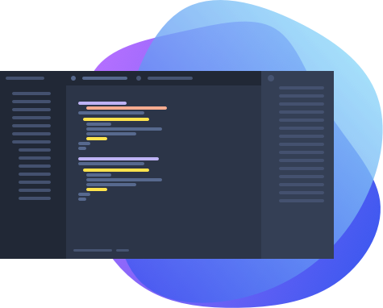

# Home

Let us help you guide through the landscape of knowledge for Shopware 6. This documentation is organised in order to facilitate knowledge for different **products**, **topics** and **depths** of interest.

The two main sections **concepts** and **guides** assist you to navigate the documentation according to your needs.

Whereas **Concepts** convey the ideas, inner workings and architectural considerations behind our product, **Guides** provide explicit examples, step-by-step tutorials that deal with specific tasks.

These two sections are complemented by the **References**, which contain structured code references, lists of flags, commands, endpoints which are useful for development.

Visit the [academy](https://academy.shopware.com/collections?category=developer-sw6) for video content. If you have any questions left, you can always ask them on [StackOverflow](https://stackoverflow.com/questions/tagged/shopware6?tab=Newest) or join our awesome community on [Discord](https://discord.com/channels/1308047705309708348/1309107911175176217).

