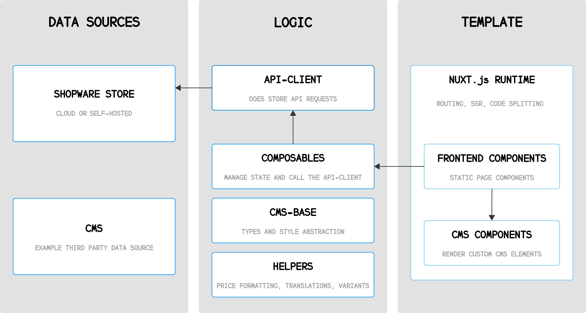

---
nav:
  title: Composable Frontends
  position: 20
---

# Composable Frontends Overview

  

Composable Frontends is Shopware's toolkit for building modern, headless storefronts with a flexible frontend architecture. It helps development teams create shopping experiences that connect to Shopware through APIs while keeping the frontend application independent from the core commerce platform.

Use Composable Frontends when your storefront needs to move beyond a standard template: custom brand experiences, fast product discovery, content-rich landing pages, or multiple customer touchpoints powered by the same Shopware backend.

## Why build with Composable Frontends?

- Create custom storefronts, landing pages, and product journeys connected to Shopware
- Use composables for commerce features such as cart, checkout, navigation, search, and CMS content
- Keep frontend development decoupled from the Shopware backend
- Start with a template or bring Shopware into an existing frontend stack
- Serve multiple channels from one commerce backend

## How it fits together

Frontends is a collection of packages that help you implement a custom storefront project. Shopware 6 acts as a supported data source, the Store API provides commerce data at runtime, and the frontend application decides how the customer experience should look and behave.

_Architecture image from the official [Shopware Frontends documentation](https://frontends.shopware.com/)._

## Start building

The dedicated [Shopware Frontends documentation](https://frontends.shopware.com/) includes setup guides, templates, composables, package references, deployment advice, and examples for common storefront features.

If you want to explore the product quickly, start with the [Try it out guide](https://frontends.shopware.com/getting-started/try-it-out.html) or review the available [setup templates](https://frontends.shopware.com/getting-started/templates.html).
