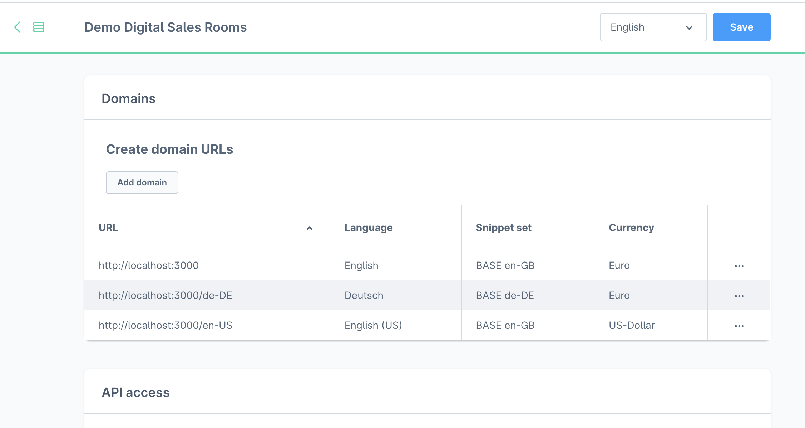
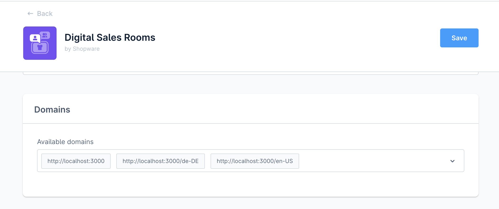

---
nav:
   title: Domain Configuration
   position: 10

---

::: warning
Based on the business use case, the merchant can decide to add *Digital Sales Rooms* to their existing sales channel or new sales channel.
When you run the frontend app server, you will always have a specific domain (eg: `https://dsr.shopware.io`)
:::

# Domain Configuration for frontend app

This section will show you how to add these domains to a sales channel.

## Setup domains for Digital Sales Rooms

::: warning
Please redeploy or rerun your frontend app to apply the domain changes into it.
:::

- After specifying the sales channel, head to the *Domains section* and add appropriate *Digital Sales Rooms* domains with appropriate languages. *Digital Sales Rooms* can switch languages by the path, you can choose your domain path to represent a language. Here is our recommendation:

```text
https://dsr.shopware.io - English
https://dsr.shopware.io/de-DE - Deutsch
https://dsr.shopware.io/en-US - English (US)
```



- These *Digital Sales Rooms* domains should be selected as *Available domains* in [Configuration Page - Appointments](./plugin-config.md#appointments)


