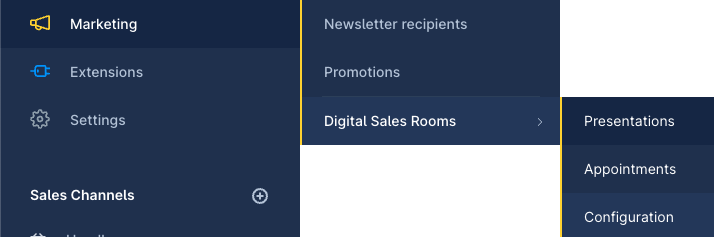

---
nav:
   title: Plugin Configuration
   position: 20

---

# Plugin Configuration

There are a lot of settings on the configuration page, but most of them are already filled by default. However, there are some settings that need to be set up.

## Navigate to the configuration page

Open Shopware CMS, select **Marketing** > **Digital Sales Rooms** > **Configuration**

## Fill the settings

### Appointments

- *Available domains* - This select box shows the list of domains of all sales channels. You should choose the *Digital Sales Rooms* domains from [this section](./domain-config.md)

### Video and Audio

- *API base url* - use value `https://api.daily.co/v1/`
- *API key* - get the value from [this section](../setup-3rd-party/realtime-video-dailyco.md#get-the-api-key)

### Realtime service

- *Hub url* - get the value from [this section](../setup-3rd-party/realtime-service-mercure.md#attach-mercure-information-into-digital-sales-rooms)
- *Hub public url* - get the value from [this section](../setup-3rd-party/realtime-service-mercure.md#attach-mercure-information-into-digital-sales-rooms)
- *Hub subscriber secret* - get the value from [this section](../setup-3rd-party/realtime-service-mercure.md#attach-mercure-information-into-digital-sales-rooms)
- *Hub publisher secret* - get the value from [this section](../setup-3rd-party/realtime-service-mercure.md#attach-mercure-information-into-digital-sales-rooms)
