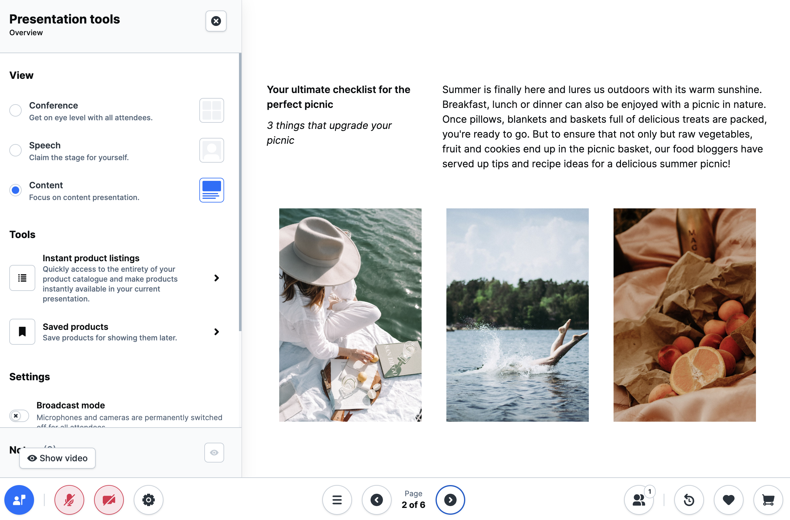

---
nav:
  title: Digital Sales Rooms
  position: 30

---

# Digital Sales Rooms Overview

*Digital Sales Rooms* is a state-of-the-art new feature that seamlessly integrates into your Shopware system landscape and co-operates with your existing e-commerce infrastructure.

You can create interactive live video events for your customers straight from your Shopware website without having to switch between a presentation tool, video conferencing system, and store system. It is one sophisticated solution to highlight your products, engage your customers, and reinforce brand loyalty.

::: warning
*Digital Sales Rooms* is a license extension and is not available as open source.
:::

::: warning
*Digital Sales Rooms* application does not belong to *the default Storefront*. It's a standalone Frontend app running with Nuxt instance. This template will be hosted in a separate instance with a new domain, which will be different from the Storefront domain.
:::

To use the Digital Sales Rooms plugin, you must perform **installation** & **3rd parties setup** & **plugin configuration**.

## Prerequisites

Review the below minimum operating requirements before you install the *Digital Sales Rooms* feature:

* [node](https://nodejs.org/en) >= v18
* [pnpm](https://pnpm.io/installation) >= 8
* [Shopware Frontends framework](https://frontends.shopware.com/) based on Nuxt 3.
* Instance of [Shopware 6](../../guides/installation) (version 6.6.0 and above).
  * Recommend installing with [devenv](../../guides/installation/setups/devenv.md)
* Third party services:
  * [Daily.co](https://daily.co/) - Refer to setup instructions for [realtime video call](./setup-3rd-party/realtime-video-dailyco.md)
  * [Mercure](https://mercure.rocks/)- Refer to setup instructions for [realtime Mercure service](./setup-3rd-party/realtime-service-mercure.md)
