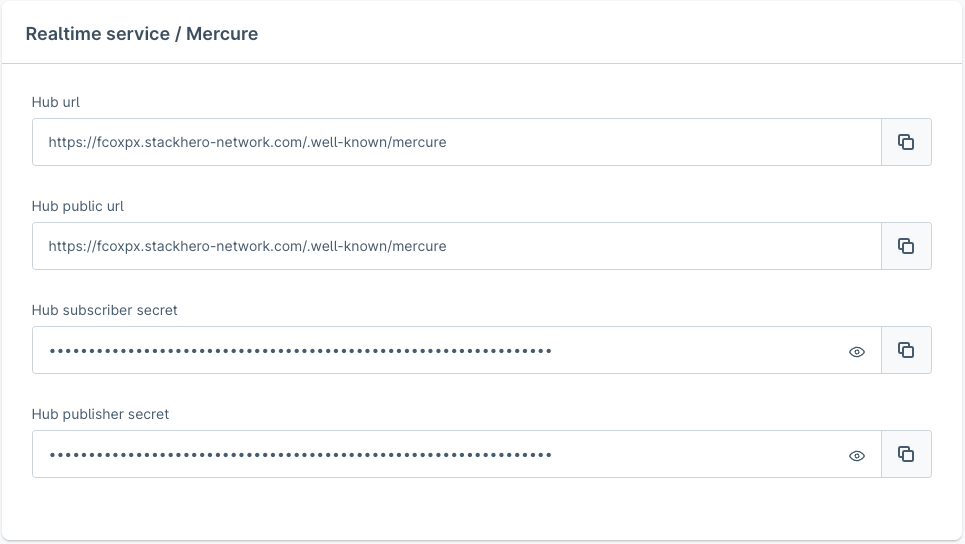

---
nav:
   title: Digital Sales Rooms installation
   position: 10

---

# Digital Sales Rooms Installation

::: warning
To access the *Digital Sales Rooms* source code, please create a support ticket in your Shopware Account and share your GitLab (not GitHub) username. You will then be granted access to the private repository.
:::

## Installation and usage

To install and use the *Digital Sales Rooms* feature, follow the below steps:

### Get the plugin

::: warning
The term "Digital Sales Rooms" has been rebranded as "Digital Sales Rooms", though no modifications have been implemented in the source code at this point.
:::

1. Clone or download the [SwagDigitalSalesRooms repository](https://gitlab.com/shopware/shopware/6/services/swagdigitalsalesrooms).
2. Extract the plugin, including the outer folder `SwagDigitalSalesRooms`, to `platform/custom/plugins` directory of Shopware repository.
3. Make sure the plugin has a PHP package structure containing `composer.json` file, `src/` folder, and so on.
4. Prepare a zip file containing the plugin as in the following structure:

```bash
# SwagDigitalSalesRooms.zip

**SwagDigitalSalesRooms**/
├── bin
├── composer.json
├── composer.lock
├── makefile
├── phpstan.neon
├── phpunit.xml
├── README.md
├── src
└── tests
```

### Run DSR template
This repository contains the Frontend Template of DSR plugin.

#### Installation
- From Shopware root folder `<shopware-root-dir>`, go to the folder of DSR templates.
```
cd ./custom/plugins/SwagDigitalSalesRooms/templates/dsr-frontends
```

- Install pnpm with global scope
```
npm install -g pnpm
```

- Generate env file
```
cp .env.template .env
```
**SHOPWARE_ENDPOINT**: This is the Shopware API Domain server.

**SHOPWARE_ACCESS_TOKEN**: This is the Shopware Access Token to connect to Shopware API. Every Sale Channel will always contain an access token. So you can copy it.

**ALLOW_ANONYMOUS_MERCURE**: This is the flag for development only. When the value = 1, it means your app is running with unsecure Mercure.

- Install dependencies
```
pnpm install
```

#### Development:
```
pnpm dev
```
Normally, port `3000` is default port, so, you can access to the domain of Frontend App `http://localhost:3000/`

#### Build
```
pnpm build
```

### Install the plugin

You can install the plugin via the admin panel or terminal server.

#### Admin panel

1. Log in to the admin panel.
2. Go to Extensions > My extensions

   

3. Click on the “Upload extension” button and choose the zip file containing the plugin from your device.

   

4. Once it is uploaded and listed, click “Install”.

   

5. On successful installation, activate the plugin by clicking on the switch button on the left.

#### Terminal server

1. Log in to a server.
2. Zip the plugin and place it in `<shopware-root-dir>/custom/plugins` directory.
3. Extract the zip file from `<shopware-root-dir>/custom/plugins` directory.
4. Run the below Symfony commands:

```bash
# refresh the list of available plugins
bin/console plugin:refresh
# find the plugin **name** (first column on the list). In this case, it is "**SwagDigitalSalesRooms"**
bin/console plugin:install **SwagDigitalSalesRooms** --activate
# clear the cache afterwards
bin/console cache:clear

# Now it is ready to use
```

### Basic configuration of Mercure Hub

Except for the self-hosted service, we recommend using any cloud-based service.

::: info
💡 We tested the service provided by [StackHero](https://www.stackhero.io/en/services/Mercure-Hub/pricing). Depending on the expected traffic, you can easily switch between the plans. For a small demo among a few people at the same time, the “Hobby” plan is sufficient.
:::

Detailed below is the minimum configuration needed for a working stack apart from project specific CMS configurations.

* **Set up CORS allowed origins** - In our case, it would be the domain where the Shopware Frontends is hosted and available. For instance: `https://shopware-pwa-gs.herokuapp.com`(frontend).

* **Set up publish allowed origins** - The domains which request the Mercure service must be added to *publish allowed origins* else it gets rejected. For instance (HTTP protocol must not be included): `shopware-pwa-gs.herokuapp.com` (frontend) and `pwa-demo-api.shopware.com`(backend - API).

* **Set up the publisher (JWT) key** - Set whatever you want.

* **Set up the subscriber (JWT) key** - Set whatever you want.

* **Other settings** - Take a look at the below sample Mercure configuration on StackHero (Default settings is recommended).


### Daily service access

Daily service is responsible for streaming a video between the attendees. It is necessary to have an account to avail its services.

#### Set up an account

1. Go to the [Daily dashboard](https://dashboard.daily.co/).
2. Visit the “developers” section on the left.
3. Get the **API KEY**.

### Configure the plugin

Once the plugin is installed, the services are up and running and have all the required credentials, then the next thing to do is to configure the Digital Sales Rooms plugin itself.

To do so,

1. Navigate to the admin panel where the Digital Sales Rooms plugin is installed.

   

2. Click the menu and select configure option to configure the below two sections:

   * **Video (daily.co)**

      * You can leave the **API Base URL** as it is `https://api.daily.co/v1/` if not necessary.
      * Insert your **API KEY**.

   

   * **Mercure**

      * Replace *Mercure Hub Url* and *Mercure Hub Public Url* with your domain’s URL where the Mercure service is working and accessible from your stack. For instance, for the URL `https://fcoxpx.stackhero-network.com`, it would be `https://fcoxpx.stackhero-network.com/.well-known/mercure`.
      * Input the secret tokens that were set up in your Mercure service configuration.

   

Daily and Mercure are two external services that are crucial for working with the Digital Sales Rooms plugin.
