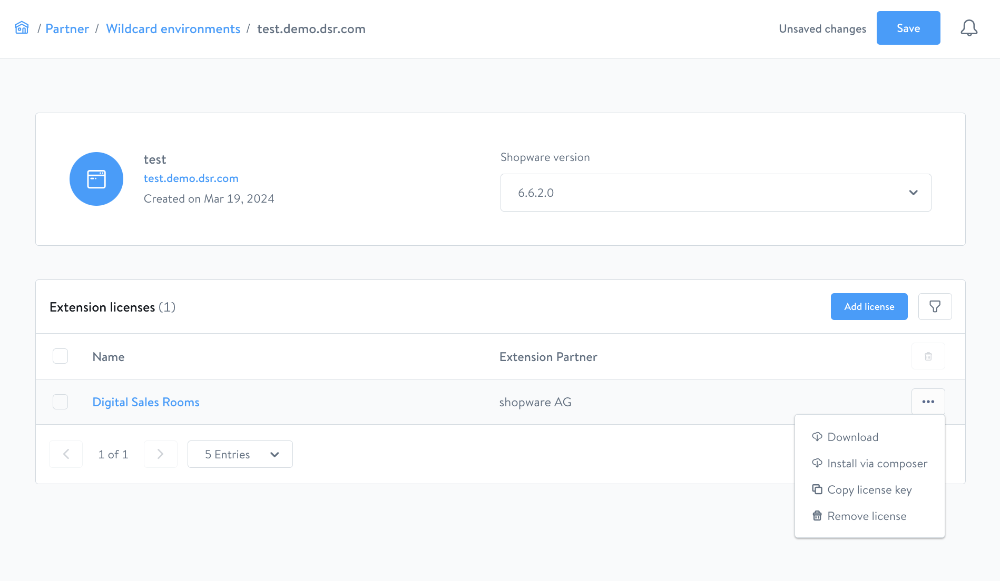

---
nav:
   title: Admin side installation
   position: 20

---

# Admin Side Installation

::: info
Digital Sales Rooms plugin is a licensed plugin. If you already know how to install a licensed plugin, you can skip this part.
:::

::: warning
As part of the Shopware Beyond plan, the **Digital Sales Rooms** is available to you as an extension.
Same with other plugins, you have multiple ways to install the plugin via composer, direct download or through your Shopware Account.
:::

In this part, we will learn how to get and install the **Digital Sales Rooms** plugin into local Shopware instance.

## Get the plugin

If you are a merchant with Shopware Beyond, you can access account.shopware.com and create a wildcard environment with attached plugins. Refer to [guideline](https://docs.shopware.com/en/account-en/extension-partner/wildcard-environments) for more info.



By this way, you can get the plugin quickly into Shopware instance via multiple ways (via composer, direct download or through your Shopware Account).

### Via download

To install a plugin via download, follow these steps:

- From wildcard environment detail page, click on the plugin and then click on the “Download” button.
- Save the zip file to your computer.
- In your Shopware 6 instance source code, go to the `custom/plugins` directory.
- Extract the zip file into the `custom/plugins` directory with name `SwagDigitalSalesRooms`.

### Via composer

To install a plugin via composer, follow these steps:

- From wildcard environment detail page, click on the plugin and then click on the "Install via composer" button.
- A modal will appear and contain all command lines to install.

## Install & activate the plugin

Once you fetch the plugin, you can run the Symfony commands below for activating the plugin:

```bash
# refresh the list of available plugins
bin/console plugin:refresh
# find the plugin **name** (first column on the list). In this case, it is "**SwagDigitalSalesRooms"**
bin/console plugin:install **SwagDigitalSalesRooms** --activate
# clear the cache afterward
bin/console cache:clear

# Now it is ready to use
```
