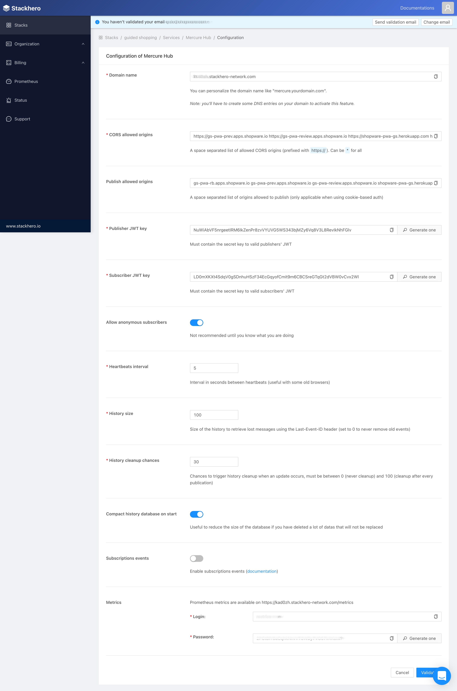

---
nav:
   title: Realtime Service - Mercure
   position: 40

---

# Realtime Service - Mercure

::: info
Symfony provides a straightforward component, built on top of the [Mercure](https://symfony.com/doc/current/mercure.html) protocol, specifically designed for this class of use cases.
[Mercure](https://mercure.rocks/docs/getting-started) is an open protocol designed from the ground up to publish updates from server to client. It is a modern and efficient alternative to timer-based polling and to WebSocket.
:::

## Mercure general settings
There are 4 main pieces of information from Mercure Hub we have to get
- *Hub url* - The hub URL.
- *Hub public url* - The hub public URL, normally it's the same as the hub URL.
- *Hub subscriber secret* - The JWT key used for authenticating subscribers
- *Hub publisher secret* - The JWT key used for authenticating publishers

## Setup
There are some ways to set up Mercure

### Setup via Stackhero (Recommended)
::: info
💡 We tested the service provided by [StackHero](https://www.stackhero.io/en/services/Mercure-Hub/pricing). Depending on the expected traffic, you can easily switch between the plans. For a small demo among a few people at the same time, the “Hobby” plan is sufficient.
:::

- Create the Stackhero account.
- Access the dashboard.
- In the **Stacks** menu item, create a new stack with the **Mercure Hub** service.
- When creating a stack successfully, tap into the Configure button.
- On this page, it's easy to find the [Mercure general settings](#mercure-general-settings), copy all the necessary information, and paste it into [the proper inputs of the configuration page](./configuration.md#realtime-service).




### Alternative setups
#### Setup via Docker
The docker image can be found at [dunglas/mercure](https://hub.docker.com/r/dunglas/mercure). It allows you to use the following *env* variables to configure Mercure.

::: warning
Use different publisher and subscriber keys for security reasons.
:::

```txt
- MERCURE_PUBLISHER_JWT_KEY: your-256-bit-publisher-key
- MERCURE_SUBSCRIBER_JWT_KEY: your-256-bit-subscriber-key
- MERCURE_EXTRA_DIRECTIVES: |-  
   cors_origins "https://my-pwa-shop.com https://en.my-pwa-shop.com"  
   anonymous 0  
   ui 1
```

You can also configure it like the self-installed version via the Caddyfile.

```txt
// Sample Caddyfile
{
    # Debug mode (disable it in production!)
    debug
    # HTTP/3 support
}
:80
log
route {
    redir / /.well-known/mercure/ui/
    encode gzip
    mercure {
        # Enable the demo endpoint (disable it in production!)
        demo
        # Publisher JWT key
        publisher_jwt MySecret
        # Subscriber JWT key
        subscriber_jwt MySecret
        # CORS
        cors_origins http://localhost:3000 http://localhost:8080 http://shopware.test http://7779-91-90-160-158.ngrok.io
        publish_origins localhost:3000 localhost:8080 shopware.test 7779-91-90-160-158.ngrok.io
        # Allow anonymous subscribers (double-check that it's what you want)
        anonymous
        # Enable the subscription API (double-check that it's what you want)
        subscriptions
    }
    respond "Not Found" 404
}
```

#### Self-host setup

The [installation guide](https://mercure.rocks/docs/hub/install) explains all the steps that are required for installing the Mercure.

```txt
mercure {
...  
publisher_jwt my-publisher-key HS256  
subscriber_jwt my-subscriber-key HS256  
cors_origins "https://my-pwa-shop.com https://en.my-pwa-shop.com"  
demo 0  
ui 0  
...
}
```
