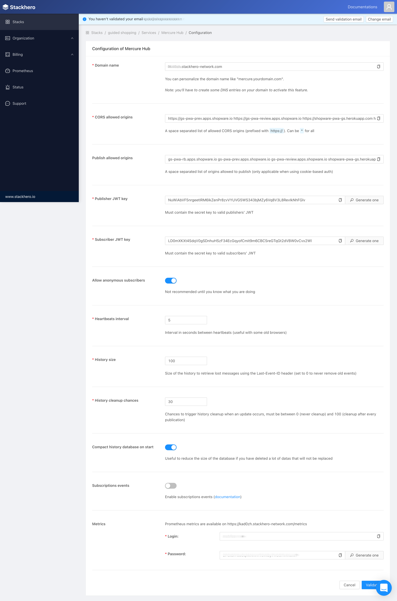
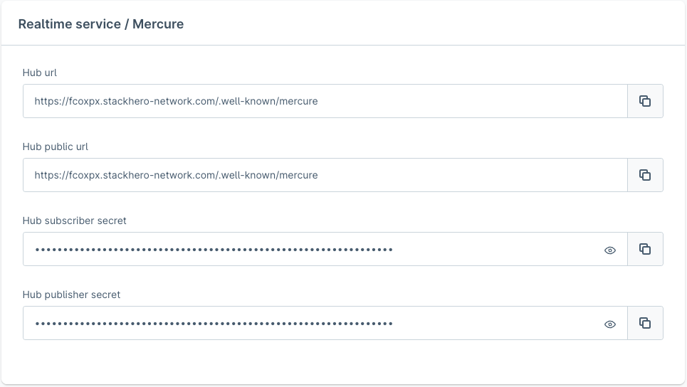

---
nav:
   title: Realtime Service - Mercure
   position: 20

---

# Realtime Service - Mercure

::: info
Symfony provides a straightforward component, built on top of the [Mercure](https://symfony.com/doc/current/mercure.html) protocol, specifically designed for this class of use cases.
[Mercure](https://mercure.rocks/docs/getting-started) is an open protocol designed from the ground up to publish updates from server to client. It is a modern and efficient alternative to timer-based polling and to WebSocket.
:::

## Setup hub

There are different ways to set up Mercure; we choose the quickest and easiest for you below:

### Setup via Stackhero (Recommended)

::: info
💡 We tested the service provided by [StackHero](https://www.stackhero.io/en/services/Mercure-Hub/pricing). Depending on the expected traffic, you can easily switch between the plans. For a small demo among a few people at the same time, the “Hobby” plan is sufficient.
:::

- Create the Stackhero account.
- Access the dashboard.
- In the **Stacks** menu item, create a new stack with the **Mercure Hub** service.
- When creating a stack successfully, tap into the Configure button.
- On this page, it's easy to find the [Mercure general settings](#attach-mercure-information-into-digital-sales-rooms), copy all the necessary information, and paste it into [the proper inputs of the configuration page](../configuration/plugin-config.md#realtime-service).

### Setup via Docker

::: warning
For security reasons, use different publisher and subscriber keys in production mode.
:::

You can clone our [local-mercure-sample](https://github.com/shopware/local-mercure-sample) and run it with docker-compose.

## Config Mercure hub

After init mercure hub, let's make it more secure with your information:

- *Set up CORS allowed origins* - In our case, it would be the domain where the Shopware Frontends is hosted and available. For instance: `https://dsr.shopware.io` (frontend domain).
- *Set up publish allowed origins* - The domains that request the Mercure service must be added to publish allowed origins or else it gets rejected. For instance (HTTP protocol must not be included): `https://dsr.shopware.io` (frontend domain) and `https://shopware.store` (backend API domain).
- *Set up the publisher (JWT) key* - Set whatever you want.
- *Set up the subscriber (JWT) key* - Set whatever you want.

## Attach Mercure information into Digital Sales Rooms

From your Mercure hub, it's easy to get the proper information:

- *Hub url* - The hub URL.
- *Hub public url* - The hub public URL, normally it's the same as the hub URL.
- *Hub subscriber secret* - The JWT key used for authenticating subscribers
- *Hub publisher secret* - The JWT key used for authenticating publishers

Then, fill them in [Configuration Page - Realtime service](../configuration/plugin-config.md#realtime-service)
