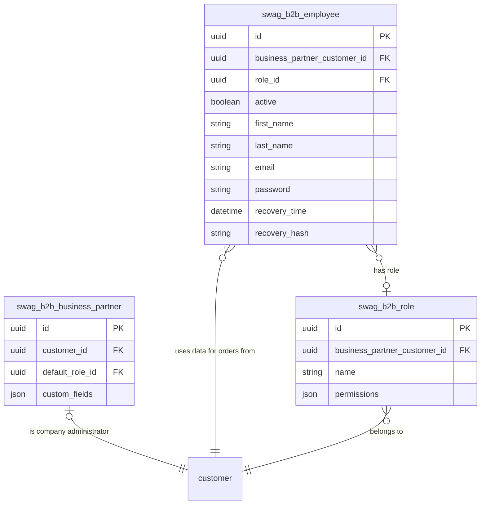

---
nav:
  title: Entities & Schema
  position: 10

---

# Entities and schema

## Entities

### Business Partner

The business partner entity contains additional B2B company data and therefore extends the basic storefront customer. Business partners are used to pool employees, roles and global settings.

### Employee

The employee entity represents a separate login within the context of the same business partner. This is to say that, employees operate on behalf of the linked business partner, facilitating actions like order placement. Additionally, these employees can be assigned specific roles.

### Role

The role entity represents a set of permissions that can be assigned to an employee. Permissions can restrict or allow employees to perform certain actions in the shop, like ordering or managing roles as well as employees.

## Schema

