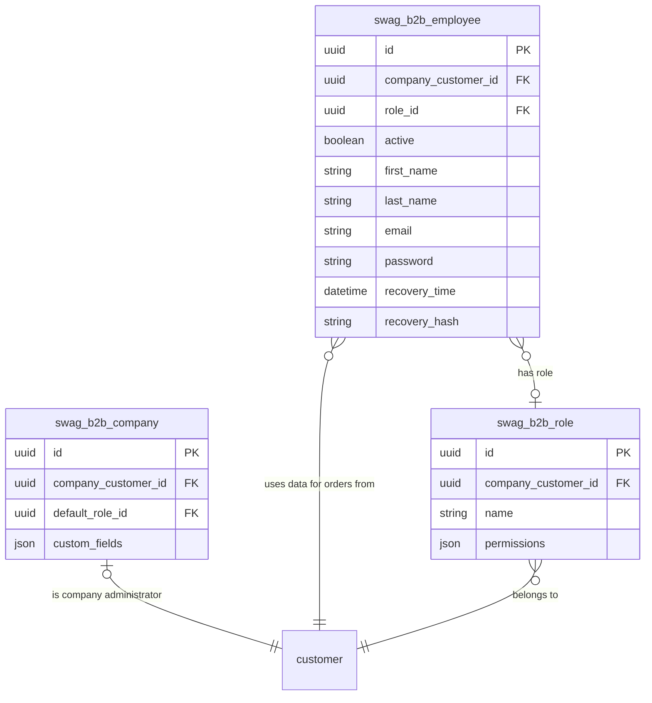

# Entities and schema

## Entities

### Company

The company entity contains additional B2B company data and therefore extends the basic storefront customer. Companies are used to pool employees, roles and global settings.

### Employee

The employee entity represents a separate login for the same company customer / B2B business partner. Employees act on behalf of the associated company, e.g., to place orders. An employee can have a role assigned.

### Role

The role entity represents a set of permissions that can be assigned to an employee. Permissions can restrict or allow employees to perform certain actions in the shop, like ordering or managing roles as well as employees.

## Schema

