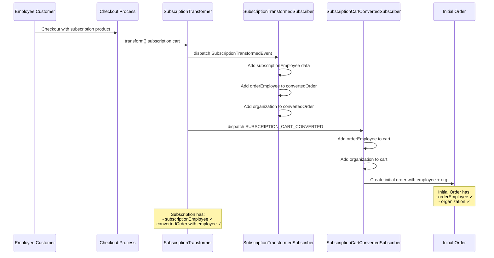
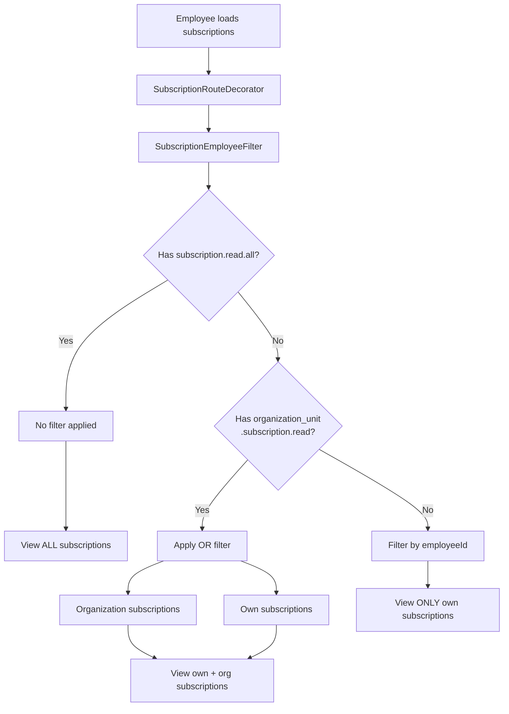

---
nav:
  title: Subscription Integration
  position: 60

---

# B2B Employee Integration for Subscriptions

This guide describes how B2B Employees are integrated with the Subscription module, enabling employee-based subscription management and tracking within a B2B context.

## Overview

The B2B Employee Integration for Subscriptions extends subscription functionality to support B2B employee workflows without modifying the core Subscription module. All B2B-specific logic is contained within the B2B Employee Management module using decorators, extensions, and event subscribers.

This integration enables:

- **Permission-based subscription access** - Control which subscriptions employees can view
- **Employee tracking** - Track which employee created each subscription
- **Organization context preservation** - Maintain organization data throughout the subscription lifecycle

## Prerequisites

- Shopware 6.7 with Subscriptions extension
- B2B Components with Employee Management module
- Understanding of [Subscription concepts](../../../../extensions/subscriptions/concept.md)
- Understanding of [B2B Employee Management concepts](../concepts/index.md)

## Key Features

### Employee-Based Subscription Permissions

Employees can view subscriptions based on their assigned permissions:

| Permission | Access Level |
|------------|--------------|
| `subscription.read.all` | View all subscriptions in the system |
| `organization_unit.subscription.read` | View subscriptions from assigned organization unit + own subscriptions |
| (no permission) | View only own subscriptions |

These permissions are checked when employees access subscription lists, ensuring data isolation and security in B2B contexts.

### Employee Tracking

Subscriptions track which employee created them through the `b2b_components_subscription_employee` association table. This enables:

- **Permission-based filtering** - Filter subscriptions by employee and organization
- **Employee context in orders** - Both initial and renewal orders maintain employee context
- **Audit trails** - Track which employee initiated each subscription

### Organization Context

Organization data is preserved throughout the subscription lifecycle:

- **Initial orders** - Organization data is added when subscription is created during checkout
- **Renewal orders** - Organization data is maintained in subsequent automated orders
- **Context preservation** - Organization information flows through all subscription-related processes

## Architecture

### Core Components

The integration is built using several key components in the B2B Employee Management module:

**Decorators:**

- `SubscriptionRouteDecorator` - Decorates `SubscriptionRoute` to apply permission-based filtering
- `SalesChannelContextServiceDecorator` - Adds employee context to subscription sales channel contexts

**Event Subscribers:**

- `SubscriptionTransformedSubscriber` - Adds employee and organization data during subscription creation
- `SubscriptionCartConvertedSubscriber` - Adds employee and organization data to initial orders
- `SubscriptionOrderPlacedSubscriber` - Maintains employee context in renewal orders

**Entity Extension:**

- `SubscriptionExtension` - Extends `SubscriptionDefinition` with `subscriptionEmployee` association
- `SubscriptionEmployeeDefinition` - Defines the subscription-employee relationship

**Filter Service:**

- `SubscriptionEmployeeFilter` - Implements permission-based subscription filtering logic

### Integration Patterns

The integration follows Shopware best practices:

**1. Decorator Pattern**

Instead of modifying core Subscription code, the integration uses decorators to extend functionality:

```php
// SubscriptionRouteDecorator wraps the core SubscriptionRoute
$this->decorated->load($request, $context, $criteria);
// Then applies employee-based filtering
$this->subscriptionEmployeeFilter->applyEmployeeFilter($criteria, $employee);
```

**2. Event-Based Integration**

Key subscription events are used to inject employee data:

- `SubscriptionTransformedEvent` - Fired when subscription is created from cart
- `SUBSCRIPTION_CART_CONVERTED` - Fired when subscription cart is converted to order
- `CheckoutOrderPlacedEvent` - Fired when renewal order is placed

**3. Entity Extension Pattern**

The `SubscriptionExtension` adds the employee association to subscriptions without modifying the core entity:

```php
new OneToOneAssociationField(
    'subscriptionEmployee',
    'id',
    'subscription_id',
    SubscriptionEmployeeDefinition::class,
    false
);
```

## Database Schema

### b2b_components_subscription_employee Table

This table links subscriptions to the employees who created them:

| Column | Type | Description |
|--------|------|-------------|
| `id` | BINARY(16) | Primary key |
| `subscription_id` | BINARY(16) | Foreign key to `subscription` (UNIQUE) |
| `employee_id` | BINARY(16) | Foreign key to `b2b_employee` |
| `created_at` | DATETIME(3) | Creation timestamp |
| `updated_at` | DATETIME(3) | Update timestamp |

**Key characteristics:**

- One-to-one relationship between subscription and subscription_employee
- `subscription_id` has a UNIQUE constraint ensuring one employee per subscription
- Foreign keys maintain referential integrity

## Technical Flows

### Initial Subscription Order Flow

When an employee checks out with a subscription product, the following flow occurs:



**Key Points:**

1. `SubscriptionTransformedSubscriber` adds employee and organization data to the subscription being created
2. `SubscriptionCartConvertedSubscriber` ensures the initial order contains employee and organization data
3. The subscription's `convertedOrder` field stores this data for future renewal orders

### Permission-Based Subscription Filtering

When an employee views their subscriptions, filtering is applied based on permissions:



**Permission Logic:**

- **No filter** (`subscription.read.all`) - Employee sees all subscriptions
- **OR filter** (`organization_unit.subscription.read`) - Employee sees own subscriptions OR subscriptions from their organization unit
- **Default filter** - Employee sees only subscriptions they created

## Developer Integration Points

### Accessing Employee Data from Subscriptions

To access the employee who created a subscription:

```php
use Shopware\Core\Framework\DataAbstractionLayer\Search\Criteria;

// Add association when loading subscriptions
$criteria = new Criteria();
$criteria->addAssociation('subscriptionEmployee.employee');

$subscription = $subscriptionRepository->search($criteria, $context)->first();

if ($subscription->getSubscriptionEmployee()) {
    $employee = $subscription->getSubscriptionEmployee()->getEmployee();
    // Access employee data
}
```

### Accessing Employee Data from Orders

Employee data is stored in order extensions:

```php
// For initial or renewal orders
$order = $orderRepository->search($criteria, $context)->first();

// Check if order has employee context
$orderEmployee = $order->getExtension('orderEmployee');
if ($orderEmployee) {
    $employeeId = $orderEmployee->getEmployeeId();
}

// Check if order has organization context
$organization = $order->getExtension('organization');
if ($organization) {
    $organizationId = $organization->getId();
}
```

### Event Subscribers

The integration provides several event subscribers you can use as reference:

**SubscriptionTransformedSubscriber** - Priority: 0

Listens to: `SubscriptionTransformedEvent`

Use case: Add custom data when subscription is created from cart

**SubscriptionCartConvertedSubscriber** - Priority: 0

Listens to: `SUBSCRIPTION_CART_CONVERTED` event

Use case: Modify the initial order data during subscription checkout

**SubscriptionOrderPlacedSubscriber** - Priority: 0

Listens to: `CheckoutOrderPlacedCriteriaEvent` and `CheckoutOrderPlacedEvent`

Use case: Add employee context to renewal orders

### Adding Custom Logic

To add custom B2B logic to subscriptions:

1. **Create a decorator** for subscription services (follow `SubscriptionRouteDecorator` pattern)
2. **Subscribe to subscription events** to inject your data
3. **Use entity extensions** to add custom associations without modifying core entities
4. **Check context state** instead of relying on event priorities for more robust integration

Example decorator pattern:

```php
use Shopware\Core\System\SalesChannel\SalesChannelContext;

class CustomSubscriptionServiceDecorator extends AbstractSubscriptionService
{
    public function __construct(
        private readonly AbstractSubscriptionService $decorated,
        private readonly CustomLogicService $customService
    ) {}

    public function getDecorated(): AbstractService
    {
        return $this->decorated;
    }

    public function someMethod(SalesChannelContext $context): void
    {
        // Your custom logic before
        $this->customService->doSomething($context);
        
        // Call decorated service
        $this->decorated->someMethod($context);
        
        // Your custom logic after
    }
}
```

## Related Documentation

- [Subscription Concept](../../../../extensions/subscriptions/concept.md) - Core subscription concepts
- [Mixed Checkout](../../../../extensions/subscriptions/guides/mixed-checkout.md) - Mixed cart checkout flow
- [Separate Checkout](../../../../extensions/subscriptions/guides/separate-checkout.md) - Separate subscription checkout
- [B2B Employee Management Concepts](../concepts/index.md) - Employee and role concepts
- [Creating Permissions via Plugin](./creating-own-permissions-via-plugin.md) - How to extend permissions
- [API Route Restriction](./api-route-restriction-for-employees.md) - Route-level permission control

## Summary

The B2B Employee Integration for Subscriptions provides a clean, maintainable way to add employee context to subscriptions without modifying core code. By using decorators, event subscribers, and entity extensions, the integration:

- Maintains separation of concerns between modules
- Follows Shopware architectural patterns
- Enables permission-based subscription access
- Preserves employee and organization context throughout the subscription lifecycle
- Provides clear extension points for custom logic
