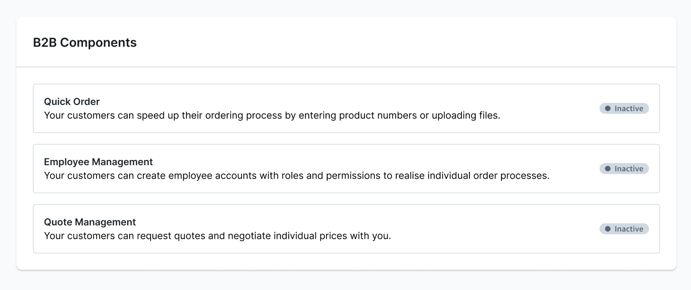

---
nav:
  title: B2B Components
  position: 30

---

# Introduction

The B2B components enable you to enhance your shop with essential B2B functionalities. Below are the available components.

In the world of digital B2B commerce, where businesses engage with other companies, we emphasize this vital distinction through these specific features :

* **Employee Management** enables B2B Merchants to create a buyer platform for their business partners.

* **Quote Managements** covers Sales Representative related jobs around negotiating quotes with customers.

* **Order Approval** allows for a more controlled buying process by introducing an approval workflow.

* **Individual Pricing** enables merchants to define catalog-wide discounts and special pricing based on flexible conditions for B2B scenarios, including volume pricing and company-specific pricing agreements.

* **Quick Order and Shopping List** takes care of distinctive B2B buying behaviors.

* **Organization Unit** allows for the configuration of more differentiated and specific access rights to meet the needs of businesses with complex structures.

* **Digital Sales Composables** aims to provide a set of composable frontends to cover more complex Sales Representative jobs.

## Configuring custom toggles for B2B components

The B2B components allow merchants to selectively choose and configure B2B features according to their needs. They offer merchants the ability to craft a tailored B2B ecommerce experience for their business partners while also allowing agencies to fine-tune Shopware to meet specific requirements. This means that B2B components can be individually activated or deactivated for each business partner within the shop.

The following articles will guide you how to do this by creating custom toggles via a plugin for B2B Components (Customer-specific features).

The **Customer-specific features** section on the Customer detail page allows the shop merchant to turn these B2B features on or off for a specific customer.



To achieve this, you need to address the following cases where functionality may be hidden:

1. If a merchant has not activated a feature for a particular customer, it should be hidden.
2. If the B2B admin has not granted an employee access to a specific feature, it should not be visible.

Considering these scenarios, we can ensure that the appropriate B2B features are displayed and accessible based on feature toggles and admin-granted permissions.

### Prerequisite

To improve organization and maintain a clear structure, it is advisable to relocate all B2B Components into the `B2B` folder within the Commercial plugin. By doing so, you can centralize the B2B-related functionality, making it easier to locate, manage, and maintain the codebase. This folder structure promotes better separation of concerns and enhances the overall modularity of the application.

```text
├── src
│   ├── B2B
│   │   ├── QuickOrder
│   │   ├── AnotherB2BComponent
│   │   │   CommercialB2BBundle.php
...
```

To ensure consistency and clarity, it is recommended to make your B2B Component extend `CommercialB2BBundle` instead of `CommercialBundle` and add the `type` as **B2B** attribute inside the `describeFeatures()` method of each B2B Component. This attribute will help identify and categorize the features specifically related to B2B functionality.

By including `type => 'B2B'` in the `describeFeatures()` method, you can distinguish B2B features from other types of features within your application. This will facilitate easier maintenance, organization, and identification of B2B-related functionalities, ensuring a streamlined development process.

For example, consider the following code snippet:

```php
namespace Shopware\Commercial\B2B\YourB2BComponent;

class YourB2BComponent extends CommercialB2BBundle
{
    public function describeFeatures(): array
    {
        return [
            [
                ...,
                'type' => self::TYPE_B2B,
            ],
        ];
    }
}
```

## Using feature toggle in Route/API/Controller

To determine if a customer is allowed to access a specific B2B feature, we will utilize the `isAllowed()` method from the `Shopware\Commercial\B2B\QuickOrder\Domain\CustomerSpecificFeature\CustomerSpecificFeatureService` service. This method accepts two parameters: the customer ID and the technical code of the B2B component.

We will place this check before every route, controller or API as follows:

```php
use Shopware\Commercial\B2B\QuickOrder\Domain\CustomerSpecificFeature\CustomerSpecificFeatureService;

class ApiController
{
    public function __construct(private readonly CustomerSpecificFeatureService $customerSpecificFeatureService)
    {
    }

    #[Route(
        path: '/your/path',
        name: 'path.name',
        defaults: ['_noStore' => false, '_loginRequired' => true],
        methods: ['GET'],
    )]
    public function view(Request $request, SalesChannelContext $salesChannelContext): Response
    {
        if (!$this->customerB2BFeatureService->isAllowed($salesChannelContext->getCustomerId(), 'QUICK_ORDER')) {
            throw CustomerSpecificFeatureException::notAllowed('QUICK_ORDER');
        }

        ...
    }
```

## Using feature toggle in Twig - Storefront

You can use a new Twig extension called `customerHasFeature()` to implement the functionality of retrieving customer-specific features in Twig templates. This method accepts only one parameter. The parameter is the technical code of the B2B component.

Here is an example implementation:

```php
namespace Shopware\Commercial\B2B\QuickOrder\Storefront\Framework\Twig\Extension;

class CustomerSpecificFeatureTwigExtension extends AbstractExtension
{
    public function getFunctions(): array
    {
        return [
            new TwigFunction('customerHasFeature', $this->isAllowed(...), ['needs_context' => true]),
        ];
    }

    public function isAllowed(array $twigContext, string $feature): bool
    {
        $customerId = null;
        if (\array_key_exists('context', $twigContext) && $twigContext['context'] instanceof SalesChannelContext) {
            $customerId = $twigContext['context']->getCustomerId();
        }

        if (!$customerId) {
            return false;
        }

        return $this->customerSpecificFeatureService->isAllowed($customerId, $feature);
    }
}
```

Use it to check if a specific feature is allowed for a given customer in Twig.

```html

    ...

```
