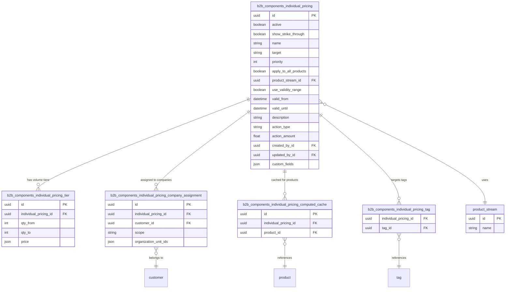
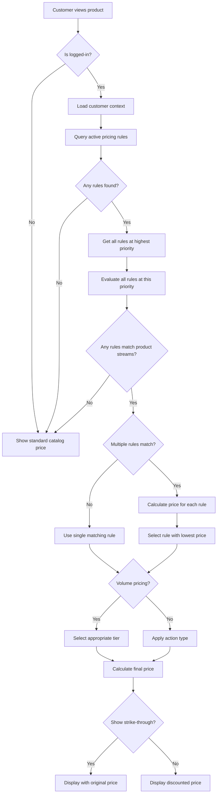

---
nav:
  title: Entities and workflow
  position: 10

---

# Entities and workflow

## Entities

### Individual Pricing

The Individual Pricing entity is the main configuration entity that defines a pricing rule. It contains all the settings needed to determine which products get special pricing, who receives it, and how the pricing is calculated.

**Key properties:**

- **name**: Human-readable name for the pricing rule
- **description**: Optional description of the pricing rule
- **active**: Boolean flag to enable/disable the rule
- **priority**: Integer value determining evaluation order (higher values = higher priority)
- **target**: Type of audience (companies, tags)
- **actionType**: Type of price modification (by_percent, by_fixed, to_fixed, volume_pricing)
- **actionAmount**: Amount for the pricing action (percentage or fixed value)
- **applyToAllProducts**: If true, applies to all products in the catalog
- **productStreamId**: Reference to a Shopware product stream for filtering specific products
- **useValidityRange**: Boolean indicating if time-based validity is used
- **validFrom**: Start date/time for the pricing rule
- **validUntil**: End date/time for the pricing rule
- **showStrikeThrough**: Whether to show original price with strike-through

**Action Types:**

- `by_percent`: Reduce price by a percentage (e.g., 10% off)
- `by_fixed`: Reduce price by a fixed amount (e.g., 5$ off)
- `to_fixed`: Set price to a specific amount (e.g., 99.99$)
- `volume_pricing`: Use tiered pricing based on quantity

### Individual Pricing Tier

The tier entity defines volume-based pricing tiers for quantity discounts. Multiple tiers can be associated with a single Individual Pricing rule when the action type is set to `volume_pricing`.

**Key properties:**

- **individualPricingId**: Reference to the parent pricing rule
- **qtyFrom**: Minimum quantity for this tier (inclusive)
- **qtyTo**: Maximum quantity for this tier (inclusive, null for unlimited)
- **price**: Price collection containing prices for different currencies

**Example tiers:**

- Tier 1: 1-9 units @ 10$ each
- Tier 2: 10-49 units @ 9$ each
- Tier 3: 50+ units @ 8$ each

### Individual Pricing Company Assignment

This entity links pricing rules to specific business partner companies or organization units. It determines which companies or parts of companies receive the special pricing.

**Key properties:**

- **individualPricingId**: Reference to the pricing rule
- **customerId**: Reference to the business partner customer
- **scope**: Defines assignment scope (whole_company, all_org_units, specific_units)
- **organizationUnitIds**: JSON array of specific organization unit IDs (when scope is specific_units)

**Scopes:**

- `WHOLE_COMPANY`: Applies to all employees of the business partner
- `ALL_ORG_UNITS`: Applies to all organization units within the company
- `SPECIFIC_UNITS`: Applies only to specific organization units (requires organizationUnitIds)

### Individual Pricing Computed Cache

The computed cache entity pre-calculates which products are affected by which pricing rules. This significantly improves performance by avoiding repeated filter evaluations.

**Key properties:**

- **individualPricingId**: Reference to the pricing rule
- **productId**: Reference to the affected product (NULL if rule applies to all products)

This cache uses a hybrid approach: specific cache entries for targeted rules, and NULL entries for catalog-wide rules.

## Schema

## Workflow

The following diagram shows how individual pricing is applied to a product:

## Target type evaluation

Depending on the target type, different evaluation logic applies:

### Companies target

- Customer must be a business partner or employee
- Company assignment must exist linking the pricing rule to the customer's company
- Scope is checked (whole company, all units, or specific units)
- If specific units, customer must belong to one of the specified organization units

### Tags target

- Customer must have at least one of the tags specified in the pricing rule

## Priority and rule selection

When multiple pricing rules could apply to the same product:

1. Only rules at the highest priority level are considered
2. All rules at this priority level are evaluated
3. If multiple rules match, the one resulting in the lowest price is selected
4. If no rules match at the highest priority, standard catalog pricing is used

**Note:** Lower priority rules are never evaluated. This ensures the most important pricing takes precedence, and when multiple rules compete at the same level, customers always get the best price.
