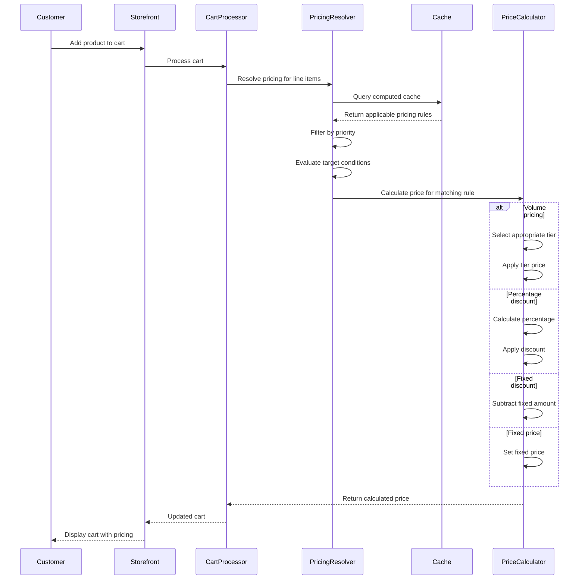
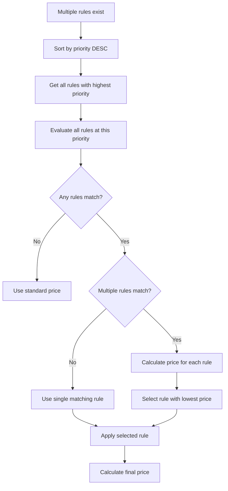
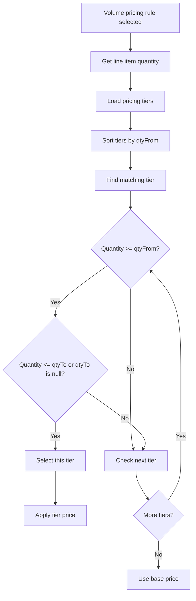
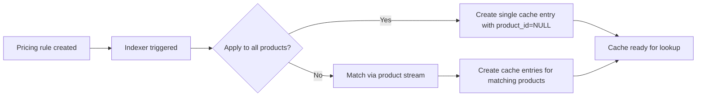

---
nav:
  title: Pricing workflow
  position: 20

---

# Pricing workflow

This document describes how Individual Pricing integrates with Shopware's pricing system and how prices are calculated at runtime.

## Price Override Flow

Individual prices are applied to products at runtime during the sales channel product loading phase.

### Phase 1: Context Creation

The system identifies the customer type (business partner, employee, or tag-based customer) and prepares the audience context for pricing resolution. This is handled by `AudienceContextResolver` during request initialization.

### Phase 2: Product Loading

When products are loaded via the Store API, `IndividualPricingProductSubscriber` listens to the product loaded event and triggers the pricing application process.

### Phase 3: Price Resolution

The system queries the computed cache to find applicable pricing rules for each product based on the customer's audience context. If multiple rules match at the highest priority level, the one with the lowest price is selected.

### Phase 4: Price Application

Prices are applied differently based on the pricing type:

- **Single pricing**: The product gets one price with optional strike-through of the original price
- **Volume pricing**: Multiple tier prices are assigned with quantity ranges, allowing different prices based on order quantity

If strike-through is enabled, the original price is preserved for display alongside the discounted price.

### High-level sequence

## Pricing resolution process

The pricing resolution follows these steps:

1. **Context identification**: Determine the customer's company, groups, tags, and organization units
2. **Cache lookup**: Query the computed cache for applicable pricing rules
3. **Rule filtering**: Filter rules by:
   - Active status
   - Validity period (if configured)
   - Target type matching (company, group, or tag)
   - Product stream matching
4. **Priority sorting**: Sort matching rules by priority (highest first)
5. **Rule evaluation and selection**: For all rules at the highest priority, calculate their resulting prices and select the rule that yields the lowest price
6. **Price calculation**: Apply the selected pricing rule's action to calculate the final price

### Priority-based selection

## Volume pricing calculation

When the action type is `VOLUME_PRICING`, the system evaluates tiers based on quantity:

## Caching and indexing

Individual Pricing uses a hybrid caching strategy combining pre-computed entries with runtime-evaluated rules. This balances query performance with storage efficiency.

**Two approaches:**

- **Specific products**: Pre-computed cache entries for each product-rule pair (instant lookup)
- **Apply to all products**: Single NULL entry per rule (fast lookup + runtime calculation)

### Cache workflow

The system maintains cache entries automatically:

Cache entries are regenerated when rules are updated and removed when rules are deleted.

## Interaction with standard pricing

Individual Pricing works alongside Shopware's standard pricing system:

1. **Standard price as base**: The product's standard price serves as the starting point
2. **Individual pricing override**: When applicable, individual pricing replaces or modifies the standard price
3. **Advanced prices respected**: Product-level advanced prices (graduated prices) are considered if no individual pricing applies
4. **Rule-based prices**: Shopware's rule-based prices have lower priority than individual pricing

**Priority evaluation:** Only the highest priority level is considered. If multiple rules match at that level, the one producing the lowest price is selected, ensuring customers always get the best available price.

## Custom Pricing and Individual Pricing

Individual Pricing takes precedence over Shopware's custom pricing feature. When an Individual Pricing rule applies to a customer and product combination, any existing custom pricing is bypassed.

**Priority hierarchy:**

1. Individual Pricing (highest priority when applicable)
2. Shopware custom pricing
3. Product advanced/graduated prices
4. Rule-based prices
5. Standard list price (lowest priority)

This ensures that B2B customers receive their negotiated Individual Pricing rates rather than generic custom pricing. Custom pricing will only apply when no Individual Pricing rules match the customer and product.

## Future Development and Migration Plans

### Migration from Custom Pricing

We plan to provide a migration path from Shopware's custom pricing to Individual Pricing. This migration will help consolidate pricing management into a single, B2B-optimized system.

**Benefits of migration:**

- Unified pricing management interface
- Better performance through pre-computed caching
- Priority-based rule evaluation
- Target-based pricing (companies, tags)
- Volume pricing support
- Time-based validity periods

### Mass Upsert API

A mass upsert API endpoint is planned for Individual Pricing to support:

- Bulk import of pricing rules from external systems
- Migration of existing custom pricing data
- Efficient creation/update of large pricing rule sets
- Integration with ERP and pricing management systems

This API will enable merchants to programmatically manage thousands of pricing rules efficiently, supporting large-scale B2B pricing scenarios.

## Strike-through pricing

When `showStrikeThrough` is enabled:

1. The original standard price is preserved
2. The calculated individual price is set as the current price
3. The storefront can display both prices with the original price struck through
4. This visually communicates the discount to the customer

## Limitations and Workarounds

### Price Sorting and Filtering Limitations

Individual Pricing modifies product prices **at runtime after products are loaded** via the Store API. This architectural approach creates limitations with database-level and search index operations.

#### The Issue

**Database queries and Elasticsearch:**

- Store original product prices in indexes (MySQL/MariaDB and Elasticsearch)
- Price sorting uses these indexed original prices
- Price range filtering uses these indexed original prices
- Individual pricing is applied AFTER query execution

**Impact on customers:**

- **Price sorting**: Products may appear in incorrect order based on individual prices
  - Example: A product with 100$ original price but 80$ individual price sorts by 100$
- **Price filtering**: Products may be incorrectly included or excluded from results
  - Example: Filtering 50$-75$ might miss a 100$ product that costs 60$ with individual pricing
  - Example: Filtering 50$-75$ might include a 50$ product that costs 85$ with individual pricing

#### Why This Happens

Individual Pricing's runtime modification approach provides flexibility and performance benefits but is incompatible with persistent storage operations:

- **Runtime modification**: Allows dynamic pricing based on customer context
- **Pre-computed caching**: Ensures fast price lookups without database queries
- **Audience-based resolution**: Different customers see different prices for the same product

However, database indexes and Elasticsearch contain only one price per product (the original price), not the customer-specific individual price.

#### Workaround

To prevent displaying incorrect results to customers:

**Price sorting and price range filtering features are automatically disabled in the storefront when Individual Pricing applies to the logged-in customer.**

This ensures customers don't see misleading or incorrect product ordering/filtering based on prices they won't actually pay.

## Performance considerations

### Lookup optimization

The hybrid caching approach ensures optimal performance:

**Pre-computed cache (specific products):**

- No runtime calculation needed
- Direct cache hit returns the rule immediately
- Best for frequently accessed products with complex filters

**Runtime-evaluated cache (all products):**

- Cache lookup is still indexed and fast
- Calculation happens once per request

### HTTP Cache Strategy

Individual Pricing's HTTP caching behavior depends on the customer type:

| Customer Type               | Cacheable    | Reason                                             |
|-----------------------------|--------------|----------------------------------------------------|
| Tag-based customers         | Yes (shared) | Responses shared by customers with same tags       |
| Organization unit employees | Yes (shared) | Responses shared within departments/teams          |
| Business partner accounts   | No           | Customer-specific pricing, ensures confidentiality |
| Employees without org unit  | No           | Individual pricing cannot be shared                |

The system prioritizes cacheability by checking for tags first, then organization units, falling back to non-cacheable for customer-specific pricing. This balances performance with price accuracy and confidentiality.

### Indexing strategy

> **Notice:** Individual Pricing uses queue-based indexing. After creating or updating pricing rules, it may take some time for the new prices to be visible to customers. The actual time depends on:
>
> - Number of products affected by the rule
> - Queue worker configuration and processing speed
> - Current queue load
>
> For rules with "Apply to all products" enabled, prices are available immediately as they use runtime calculation. For rules with specific products, wait for the queue to finish processing before the computed prices become available.

Individual Pricing uses an asynchronous indexing system that pre-computes cache entries via Shopware's message queue. This ensures optimal runtime performance while handling large product catalogs efficiently.

#### Indexing flows

Individual Pricing maintains the computed cache through 5 indexing flows:

**1. Product Indexing** - When products change, cache entries for those specific products are rebuilt incrementally.

**2. Rule Changes** - When pricing rules are created or updated, `IndividualPricingCacheEntryUpdaterMessage` is dispatched to rebuild cache for all matching products.

**3. Product Stream Filters** - When stream conditions change (e.g., changing product tags), affected pricing rules are re-indexed to reflect new product matches.

**4. Tier Changes** - When volume pricing tiers are modified, only the affected rule's cache is updated via `IndividualPricingBuildCacheSingleRuleMessage`.

**5. Full Re-index** - Manual command to rebuild the entire cache, coordinated by `IndividualPricingIndexingMessage`.

All indexing happens asynchronously via Shopware's message queue in batches of 1,000 products, ensuring that pricing rule updates don't block other operations.
