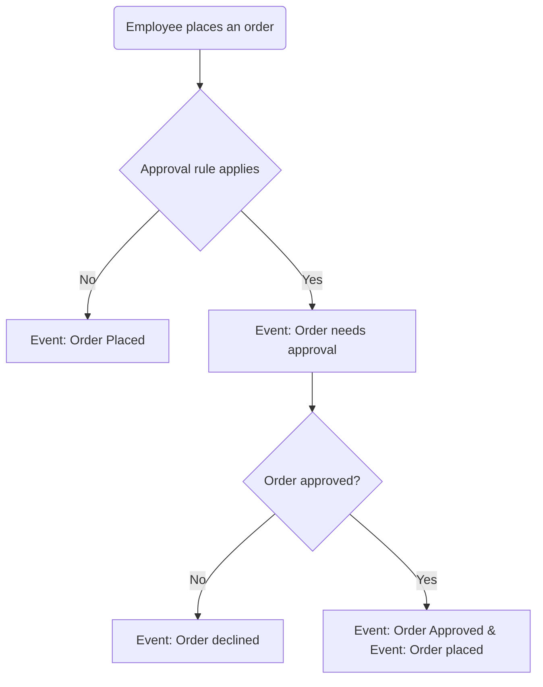

---
nav:
  title: Entities and workflow
  position: 10

---

# Entities and workflow

## Entities

### Approval Rule

The approval rule entity represents a set of conditions that need to be met in order for an order to be approved. These conditions can be based on the order's total value, the order's currency or for all orders placed by employees with a specific role. Each approval rule can be assigned the reviewer to a specific role, which means that only employees with that role can approve orders that match the rule's conditions, and it can be assigned to specific role, which means that only employees with that role will need to request approval for orders that match the rule's conditions; and a priority, which is used to determine the order in which the rules are evaluated.

### Pending Order

The pending order entity represents an order that has been placed by an employee that requires approval. It contains the order's data, the employee that placed the order and the approval rule that matched the order.

## Workflow

The following diagram shows the workflow of the order approval component:

## Who can request approval?

- Employees which have the role that is assigned as the "Effective role" of the approval rule that matched the order.

## Who can view pending orders?

- Employees with the "Can view all pending orders" permission can view all pending orders.
- Employees who requested approval for the order can view their pending orders.
- Business Partners can view all pending orders of their employees.

## Who can approve or decline pending orders?

- Employees with the "Can approve/decline all pending orders" permission can approve/decline all pending orders.
- Employees with the "Can approve/decline pending orders" permission can approve/decline pending orders that assigned to him.
- Business Partners can approve/decline all pending orders of their employees.