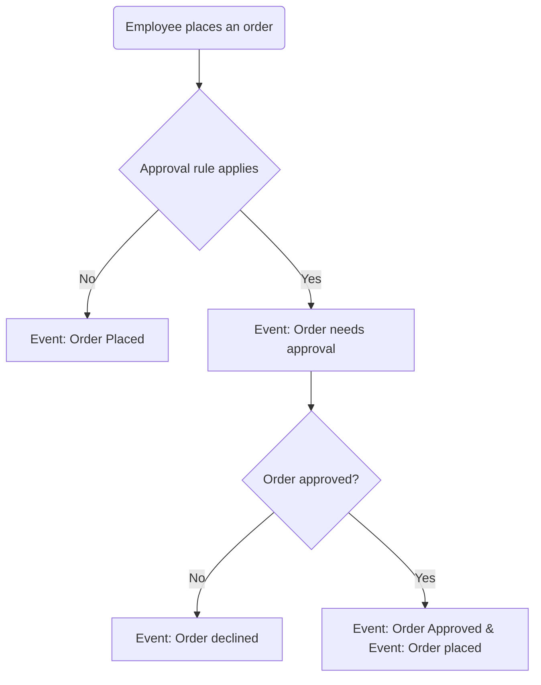

---
nav:
  title: Entities and workflow
  position: 10

---

# Entities and workflow

## Entities

### Approval Rule

The approval rule entity represents a set of conditions that need to be met for an order to be approved. These conditions might be based on the order's total value, the order's currency or orders placed by employees with a specific role. Each approval rule can be assigned to a reviewer with specific role, which means that only employees that only employees possessing that role are authorized to approve orders meeting the rule's conditions. Additionally, it can be assigned to a particular role, requiring employees with that role to seek approval for orders meeting the rule's criteria. The rule also includes a priority, dictating the sequence in which the rules are evaluated.

### Pending Order

The pending order entity represents an order that has been placed by an employee that requires approval. It contains the order's data, the employee that placed the order and the approval rule that matched the order.

## Workflow

The following diagram shows the workflow of the order approval component:

## Who can request approval?

* Employees holding the role designated as the "Effective role" in the approval rule corresponding to the order are authorized to request approval.

## Who can view pending orders?

- Employees with the "Can view all pending orders" permission can view all pending orders.
- Employees who requested approval for the order can view their pending orders.
- Business Partners can view all pending orders of their employees.

## Who can approve or decline pending orders?

- Employees with the "Can approve/decline all pending orders" permission can approve or decline all pending orders.
- Employees with the "Can approve/decline pending orders" permission can approve or decline pending orders that assigned to them.
- Business Partners can approve or decline all pending orders of their employees.