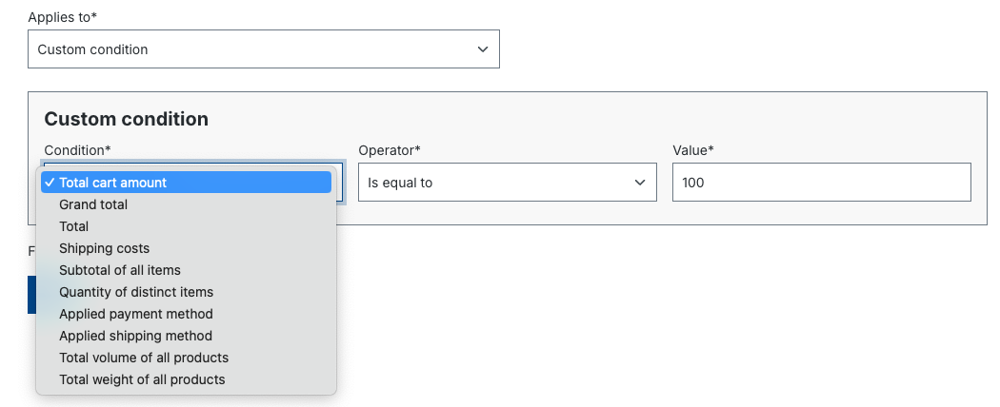

---
nav:
  title: How to add a new approval condition
  position: 40

---

# How to add a new approval condition

The order approval component provides a set of conditions for defining your approval rules. However, if you need to add a new condition, you can do so via an app or a plugin.

## Plugin

To add a custom rule, following this document [Add custom rule](../../../../../guides/plugins/plugins/framework/rule/add-custom-rules.md)

Example:

```php
<?php declare(strict_types=1);

namespace YourPluginNameSpace;

use Shopware\Core\Framework\Rule\Rule;
use Shopware\Core\Framework\Rule\RuleComparison;
use Shopware\Core\Framework\Rule\RuleConfig;
use Shopware\Core\Framework\Rule\RuleConstraints;
use Shopware\Core\Framework\Rule\RuleScope;

class CartAmountRule extends Rule
{
    final public const RULE_NAME = 'totalCartAmount';

    public const AMOUNT = 1000;

    protected float $amount;

    /**
     * @internal
     */
    public function __construct(
        protected string $operator = self::OPERATOR_GTE,
        ?float $amount = self::AMOUNT
    ) {
        parent::__construct();
        $this->amount = (float) $amount;
    }

    /**
     * @throws UnsupportedOperatorException
     */
    public function match(RuleScope $scope): bool
    {
        if (!$scope instanceof CartRuleScope) {
            return false;
        }

        return RuleComparison::numeric($scope->getCart()->getPrice()->getTotalPrice(), $this->amount, $this->operator);
    }

    public function getConstraints(): array
    {
        return [
            'amount' => RuleConstraints::float(),
            'operator' => RuleConstraints::numericOperators(false),
        ];
    }

    public function getConfig(): RuleConfig
    {
        return (new RuleConfig())
            ->operatorSet(RuleConfig::OPERATOR_SET_NUMBER)
            ->numberField('amount');
    }
}
```

Then, we have to register it in our `services.xml` and tag it as `shopware.approval_rule.definition`

```xml
 <service id="YourPluginNameSpace\CartAmountRule" public="true">
    <tag name="shopware.approval_rule.definition"/>
 </service>
```

## App

::: info
Note that the approval rule conditions for app is introduced in Commercial plugin 6.4.0, and are not supported in previous versions.
:::

### Overview

Following the same methodology as [Add custom rule conditions](../../../../../guides/plugins/apps/rule-builder/add-custom-rule-conditions.md) in the Administration Rule Builder, approval custom conditions is configured with fields displayed on the Storefront Approval Rule detail page and the logic is defined within [App Scripts](../../../../../guides/plugins/apps/app-scripts/).

### Concepts

#### Folder structure

The folder structure is similar to [Add custom rule conditions](../../../../../guides/plugins/apps/rule-builder/add-custom-rule-conditions.md). An App Approval Rule Condition is defined in the `manifest.xml` file of your app and its condition logic is defined in app script file. The difference is all scripts for rule conditions must be placed inside `Resources/scripts/approval-rule-conditions` within the root directory of the app.

```text
└── DemoApp
    ├── Resources
    │   └── scripts                         // all scripts are stored in this folder
    │       ├── approval-rule-conditions    // reserved for scripts of approval rule conditions
    │       │   └── custom-condition.twig   // the file name may be freely chosen but must be identical to the corresponding `script` element within `rule-conditions` of `manifest.xml`
    │       └── ...
    └── manifest.xml
```

#### Manifest file

Similar to [Add custom rule conditions](../../../../../guides/plugins/apps/rule-builder/add-custom-rule-conditions.md), a condition's manifest file has `identifier`, `name` and `script`.

The `name` is a descriptive and translatable name for the condition. The name will be shown within the Condition's selection in the Storefront Approval Rule detail or create page.

Within the script tag, the path of the twig script file must include the `/approval-rule-conditions/` prefix.

Let's create a custom condition that compares the total price of the current shopping cart.

<<< @/docs/snippets/config/app/approval-rule-conditions.xml

The fields in `constraints` tag are used for rendering `operators` and `value` fields.

::: info
Note that the value field is only supported with number fields (`float`, `int`), text fields (`text`), single-selection fields (`single-select`), and multi-selection fields (`multi-select`).
:::

This is how the custom condition appears on the Approval Rule detail page, the `Total cart amount` condition in added to condition selection list. In this case, the value is displayed as a number field that allows decimals, with each increment being 0.01. This is because the `float` tag is defined in the manifest file.



#### Scripts

Script logic is similar to [Add custom rule conditions](../../../../../guides/plugins/apps/rule-builder/add-custom-rule-conditions.md). Let's continue with our example by creating a script file that compares the current shopping cart's total price with the pre-established value in the approval rule.

```twig
// Resources/scripts/approval-rule-conditions/custom-condition.twig

    



```

In the example above, we first check whether we can retrieve the current cart from the instance of `RuleScope` and return `false` otherwise.

We then use the variables `operator` and `totalPrice`, provided by the constraints of the condition, to evaluate whether the total price in question matches the total price of the cart.

### Other examples

#### Text field


```xml
<!-- manifest.xml -->
<!-- ... -->
<rule-condition>
    <identifier>cart_tax_status_rule_script</identifier>
    <name>Customer's first name</name>
    <group>customer</group>
    <script>/approval-rule-conditions/custom-condition.twig</script>
    <constraints>
        <single-select name="operator">
            <options>
                <option value="=">
                    <name>Is equal to</name>
                </option>
                <option value="!=">
                    <name>Is not equal to</name>
                </option>
            </options>
        </single-select>
        <text name="firstName">
            <placeholder>Enter customer's first name</placeholder>
        </text>
    </constraints>
</rule-condition>
<!-- ... -->
```

```twig
// Resources/scripts/approval-rule-conditions/custom-condition.twig

    



```

#### Single-select


```xml
<!-- manifest.xml -->
<!-- ... -->
<rule-condition>
    <identifier>cart_tax_status_rule_script</identifier>
    <name>Cart tax status</name>
    <group>cart</group>
    <script>/approval-rule-conditions/custom-condition.twig</script>
    <constraints>
        <single-select name="operator">
            <options>
                <option value="=">
                    <name>Is equal to</name>
                </option>
                <option value="!=">
                    <name>Is not equal to</name>
                </option>
            </options>
        </single-select>
        <single-select name="taxStatus">
            <options>
                <option value="net">
                    <name>Net</name>
                </option>
                <option value="gross">
                    <name>Gross</name>
                </option>
            </options>
        </single-select>
    </constraints>
</rule-condition>
<!-- ... -->
```

```twig
// Resources/scripts/approval-rule-conditions/custom-condition.twig

    



```

#### Multi-select


```xml
<!-- manifest.xml -->
<!-- ... -->
<rule-condition>
    <identifier>cart_currency_rule_script</identifier>
    <name>Cart currency</name>
    <group>cart</group>
    <script>/approval-rule-conditions/cart-currency.twig</script>
    <constraints>
        <single-select name="operator">
            <options>
                <option value="=">
                    <name>Is one of</name>
                </option>
                <option value="!=">
                    <name>Is none of</name>
                </option>
            </options>
             <required>true</required>
        </single-select>
        <multi-select name="isoCode">
            <options>
                <option value="EUR">
                    <name>Euro</name>
                </option>
                <option value="USD">
                    <name>US-Dollar</name>
                </option>
                <option value="GBP">
                    <name>Pound</name>
                </option>
            </options>
            <required>true</required>
        </multi-select>
    </constraints>
 </rule-condition>
<!-- ... -->
```

```twig
// Resources/scripts/approval-rule-conditions/custom-condition.twig

    


```
