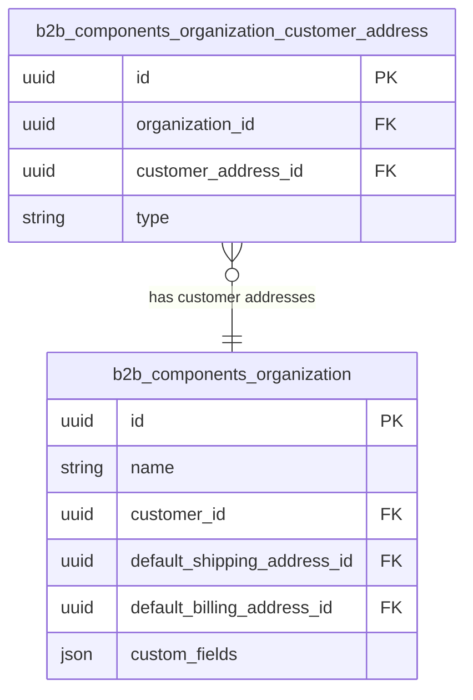

---
nav:
  title: Entities & Schema
  position: 20

---

# Entities and schema

## Entities

### Organization

The organization entity represents a structural unit within a customer account. Each organization has a name, belongs to a specific customer, and defines both a default billing address and a default shipping address, selected from the customer's addresses.
An organization can have multiple employees assigned to it and can also be assigned specific payment and shipping methods. These assignments define which options are available to employees of the organization during checkout.

### Organization Customer Address

The organization customer address entity defines a customer address that is assigned to a specific organization. It links a customer address to an organization and specifies whether the address is used for billing or shipping purposes.

## Schema

