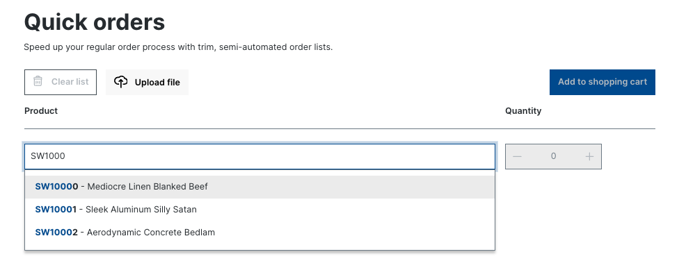
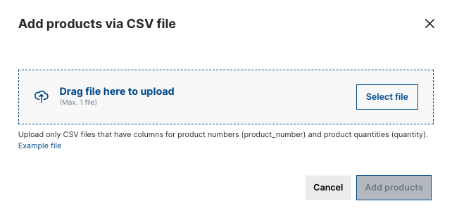

---
nav:
  title: Quick order
  position: 10

---

# Quick Order

## Introduction 

Quick Order is a feature of the B2B component that significantly enhances the user experience by enabling customers to create new orders from a list of multiple products. Customers are provided with two convenient methods for populating their shopping carts with multiple line items: either by manually inputting product numbers and quantities one by one in the Quick Order form or by importing data from a CSV file. This feature is a time-saving solution that eliminates the need for users to individually search, navigate to product detail pages, and select items. It is implemented into the Storefront and can be enabled or disabled through the Specific Features toggle on the Customer Detail page in the Administration.





The CSV file must adhere to two key requirements: it should not exceed 100MB in size, and it must maintain the correct format. This format entails the presence of two essential columns: `product_number` and `quantity`. To simplify the process, users can download the template.csv file on the Upload File modal and continue filling in list with product numbers and their corresponding quantities. Here is an example in CSV file content. 

template.csv:
```txt
product_number,quantity
SW1001,1
SW1002,2
```

## Store API 
### Search product API
```txt
POST/GET: /store-api/quick-order/product
```

#### Parameters
|Parameter name|Type| Description|
|--------------|----|------------|
| search| String | Keyword of the product |
| page| Integer | Search result page |

Example: 
```txt
/store-api/quick-order/product?search=product-name&page=1
```


### Upload CSV file API
```txt
POST: /store-api/quick-order/load-file
```

#### Parameters
|Parameter name|Type| Description|
|--------------|----|------------|
| file | File | CSV file |