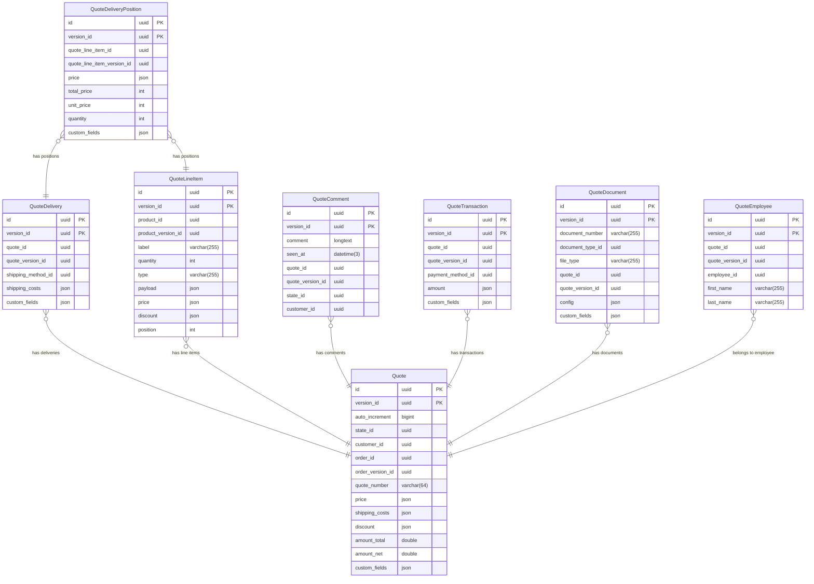

---
nav:
  title: Entities & Schema
  position: 20

---

# Entities and schema

## Entities

### Quote

The quote entity stores fundamental information about each quote such as state, pricing, discount, associated users, customer and customers.

### Quote Delivery

The quote delivery represents the delivery information of a quote. It includes details such as the shipping method, earliest and latest shipping date.

### Quote Delivery Position

The quote delivery position represents the line items of a quote delivery. It has a quote line item, price, total price, unit price, quantity, and custom fields.

### Quote Line item

The quote line item represents the line items of a quote. Only product type is supported currently.

### Quote Transaction

The quote transaction entity captures payment amount and also allows saving an external reference.

### Quote Comment

The quote comment entity stores comments related to a quote.

### Quote Employee

The quote employee entity represents employees associated with a quote.

### Quote Document

The quote document entity represents documents associated with a quote.

## Schema

