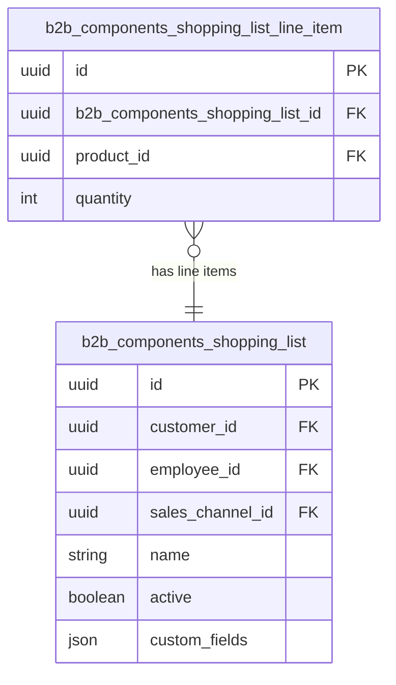

---
nav:
  title: Entities & Schema
  position: 20

---

# Entities and schema

## Entities

### Shopping Lists

Shopping lists represent a list of products prepared for a customer or a sales channel. They show basic information about the product list, such as the name, customer, sales channel and so on.

### Line item

The Shopping lists line item represents a set of products. These products are line items of the shopping list.

## Schema

