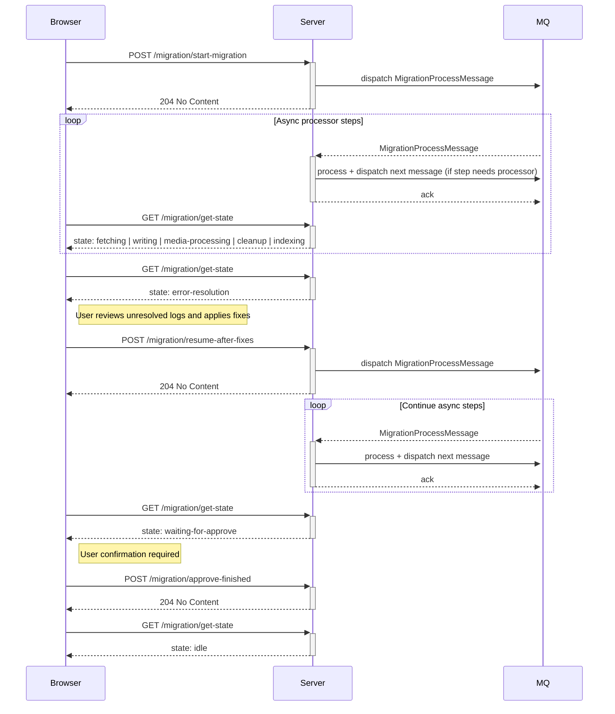
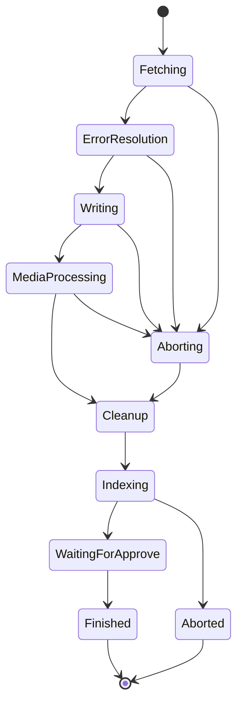

---
nav:
  title: Migration Process
  position: 5

---

# Migration Process

## The migration procedure

The following diagram visualizes how the migration process is executed in the message queue from a high level:

Inside this process it can run through these states:

## Migration Process Overview

The following steps will give you a general overview of what happens in what classes during a common migration.

These steps can be done multiple times. Each migration is called a "run" or "migration run" and will be saved to inform the users about any errors that occurred \(in the form of a detailed history\).

### 1. Create or Select a Connection

The user selects or creates a connection (including profile and gateway).

- `StatusController::checkConnection()`
- Reads environment information
- Stores a **source fingerprint**
- Prevents duplicates via `MigrationFingerprintService`

### 2. Select Data to Migrate

The user selects the data to migrate (`DataSelections`).

### 3. Generate and Configure Premapping

Premapping is generated for the selected connection.

- The user maps data from the source system to the target system.
- Mapping decisions are stored with the connection.

### 4. Start Migration Run

The user starts a migration run.

### 5. Fetching Step

For each `DataSet` in the selected `DataSelections`, source data is read and converted.

1. The corresponding **Reader** reads source data.
2. The corresponding **Converter**
   - Converts the data
   - Stores converted data in `swag_migration_data`
   - Stores mapping information (`old identifier`, `new identifier`, `checksum`) in the mapping table

### 6. Validation During Conversion

Converted data is validated during the conversion process (including nested required fields and associations).

- `MigrationEntityValidationService`
- `MigrationFieldValidationService`

Validation issues are written to the migration logs.

### 7. Error Resolution

Users inspect grouped logs and define fixes.

- Field validation issues can be resolved by providing a new value.
- Fixes are stored in `swag_migration_fix`

### 8. Resume Migration

After resolving errors, the user can resume the migration.

- Fixes are applied.
- The system attempts to write the data.

### 9. Writing Step

For every `DataSet` in every selected `DataSelection`, data is written to the system.

- The corresponding **Writer** writes the data.

### 10. Media Processing

Pending records from `swag_migration_media_file` are processed by the selected media processor.

1. The processor reads queued media files (`written = true`).
2. Files are downloaded or copied and persisted to Shopware media storage.
3. The record is updated with `processed = true` or `processFailure = true`.

### 11. Cleanup and Indexing

Cleanup and indexing steps are executed.

- The migration run enters the state: `WAITING_FOR_APPROVE`.

### 12. Approval

The user approves the completion of the migration.
