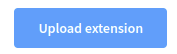
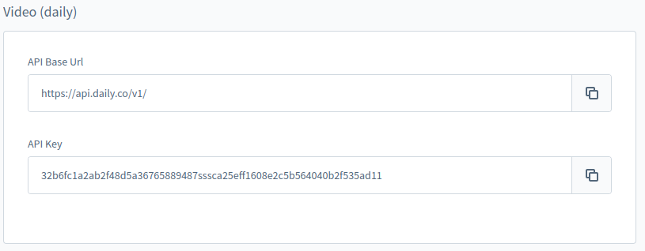

# Guided Shopping installation

Guided Shopping is the state-of-the-art new feature that seamlessly integrates into your Shopware system landscape and co-operates with your existing ecommerce infrastructure.

Create interactive live video events for your customers straight from your Shopware website – without having to switch between a presentation tool, video conferencing system, and store system. It is one sophisticated solution to highlight your products, engage your customers and reinforce brand loyalty.


## Requirements

1. Bring the instance of https://github.com/vuestorefront/shopware-pwa up and running (supported versions: > 1.2.0)
2. Instance of Shopware 6 (supported versions: > 6.4.0.0)
3. https://github.com/shopware/SwagShopwarePwa plugin installed in an instance of Shopware 6 (supported versions > 0.3)
4. `"symfony/mercure": "^0.5.3"` \**\*\*[package](https://packagist.org/packages/symfony/mercure#v0.5.3) installed in your Shopware 6 instance application (command *composer require symfony/mercure ^0.5.3\*)
5. _Mercure_ service is available with one of the options:
   1. [self-hosted installation](./selfHostedMercureInstallation.md)
   2. [cloud](https://mercure.rocks/) - service publicly accessible in further configuration (see Configuration section)
6. An account at [daily.co](http://daily.co/) - developer’s API KEY required in the further configuration (see Configuration section)

## Get the plugin for Shopware 6

### 🔓 Last published version (no access required, might be outdated)

Download the recently uploaded stage of the plugin from

[](https://drive.google.com/u/0/uc?id=19YNc6X_H6LyMGelWEXEbIVkl1RlHigB4&export=download)

dev-master version from 16.03.2022

### 🔐 The most recent version (extra access required, always up to date)

<aside>
💡 The temporary way of getting the plugin, until it’s published on *packagist* or some dedicated repository. This one contain the whole environment setup for development purposes and need to be extracted beforehand.

</aside>

1. Visit **[URL](https://bitbucket.org/dasistweb/shopware-guided-shopping/src/master/custom/plugins/SwagGuidedShopping/)** to clone or download the repository
2. Extract the plugin from `custom/plugins/SwagGuidedShopping` directory, including the outer folder `SwagGuidedShopping`
3. Make sure the plugin has a PHP package structure (containing _`composer.json`_ file, _`src/`_ folder and so on)
4. Prepare a zip file containing the plugin in followed structure

```bash
# SwagGuidedShopping.zip

**SwagGuidedShopping**/
├── bin
├── composer.json
├── composer.lock
├── makefile
├── phpstan.neon
├── phpunit.xml
├── [README.md](http://readme.md/)
├── src
└── tests
```

## Install the plugin via the admin panel using the zip package

1. Login into the admin panel.
1. Go to Extensions > My extensions

   

1. Click on the “Upload extension” button and choose the zip file containing the plugin from your device.

   

1. Once it is uploaded and listed, click “Install app”


1. On successful installation, activate the plugin by clicking on the switch button on the left

🏁

## Alternative ways of installation

### Terminal on the server

1. Log into a server.
2. Put the plugin in the zip package into `<shopware-root-dir>/custom/plugins` directory.
3. Extract the zip file onto the `<shopware-root-dir>/custom/plugins` directory.
4. Run available Symfony commands:

```bash
# refresh the list of available plugins
bin/console plugin:refresh
# find the plugin **name** (first column on the list). In this case, it is "**SwagGuidedShopping"**
# and use it in the next command:
bin/console plugin:install **SwagGuidedShopping** --activate
# clear the cache afterwards
bin/console cache:clear

# Now its ready to use :) 🏁
```

### Marketplace 🚧

NOT AVAILABLE YET as it is not published

### Composer 🚧

NOT AVAILABLE YET as it is not published

# Basic configuration

Minimum configuration for a working stack. Apart from project specific CMS configuration.

## Mercure

Except for the self-hosted service, we recommend using any cloud-based.

<aside>
💡 We tested the service provided by StackHero: [https://www.stackhero.io/en/services/Mercure-Hub/pricing](https://www.stackhero.io/en/services/Mercure-Hub/pricing)

Depending on the expected traffic, you can easily switch between the plans. For a small demo between few people at the same time, the “Hobby” plan is enough.

</aside>

### Set up the CORS allowed origins

In our case, it would be the domain where the Shopware PWA is hosted and available.

For instance: [https://shopware-pwa-gs.herokuapp.com](https://shopware-pwa-gs.herokuapp.com/) (frontend)

### Set up publish allowed origins

The domains which the requests to the Mercure service are calling from.

For instance: (protocol must not be included):
[shopware-pwa-gs.herokuapp.com (frontend)](http://shopware-pwa-gs.herokuapp.com/)
[pwa-demo-api.shopware.com](http://pwa-demo-api.shopware.com/) (backend - API)

### Set up the publisher (JWT) key

set whatever you want

### Set up the Subscriber (JWT) key

set whatever you want

### Additional settings

default recommended
🏁

[Sample Mercure config on StackHero](sampleMercureConfig.md)

## Daily

The service responsible for streaming a video between the attendees.

### Set up an account

1. Go to the dashboard at [https://dashboard.daily.co/](https://dashboard.daily.co/).
2. Visit the “developers” section on the left.
3. Get the **API KEY**.

🏁

## The plugin

Once the plugin is installed, the services are set up and running. You have all the required credentials. The next thing to do is to configure the Guided Shopping plugin itself.

Here, we focus on the external services only because it is crucial for working a plugin itself.

### Video section

1. If not necessary, leave the default value “[https://api.daily.co/v1/](https://api.daily.co/v1/)”.
2. Put you **API KEY** into the right input.



An example of a video section in the plugin’s configuration.

### Mercure section

1. For fields: Mercure Hub Url and Mercure Hub Public Url replace ***http://my-domain.com*** with your domain’s URL where the Mercure service is working and accessible from your stack. For instance, for URL **https://fcoxpx.stackhero-network.com** it would be [https://fcoxpx.stackhero-network.com**/.well-known/mercure](https://fcoxpx.stackhero-network.com/.well-known/mercure)
1. Paste the secret tokens that were set up in your Mercure service configuration.


An example of the Mercure section in the plugin’s configuration

🏁

## Rebuild Shopware PWA

In order to synchronize SwagGuidedShopping plugin on the backend (installed before), the Shopware PWA must be rebuilt (recompiled) after the plugins are downloaded. Thanks to this, the PWA will contain the Guided Shopping plugin installed and ready to use.

1. Check credentials in `.env` file (ADMIN_USER & ADMIN_PASSWORD)
1. Run the build command.

```bash
# being in the root directory of your Shopware PWA project:
yarn build
# under the hood, plugins synchronization will be processed at the same time
```

<aside>
💡 Alternatively, you can invoke the `plugins` command manually, using directly:
`npx @shopware-pwa/cli@canary plugins --user YOUR_ADMIN_USERNAME --password=YOUR_SECRET_PASS`
then, the application is ready for the rebuild process.

Note that the admin credentials are required to connect to the installed plugin library through an ADMIN API.

</aside>

1. Re-deploy Shopware PWA

🏁

**Let’s try to summarize the whole process to organize a flow:**

[Checklist](checklist.md)

# Troubleshooting 🚧
