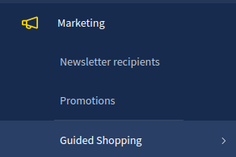

# Checklist

## Requirements

::: info
💡 This checklist does not cover project specific configurations like cms pages, specific presentations, etc. The only intention of the checklist is to provide a fully working plugin at every step and make it ready to use in terms of administration and end-user experience.
:::

### Shopware fundamentals

* Shopware 6 is available on the web over HTTPS.
* PWA plugin for Shopware 6 is installed.
* Shopware PWA is generated and available as a public URL over HTTPS.

### External services

* [Mercure.rocks](http://Mercure.rocks) service is available on the web over HTTPS with the required settings.
* [Daily.co](http://Daily.co) service is available on the web with default settings.

### Plugin Setup

* The plugin is installed with no errors and is available in the “Marketing” section.
  
* The plugin is set up with settings based on the configuration of external services.

### Refresh Shopware PWA

* An instance of Shopware PWA is rebuilt using `yarn build` and redeployed.

Now it is time to set up the presentations and prepare the appointments in order to start using the Guided Shopping.
