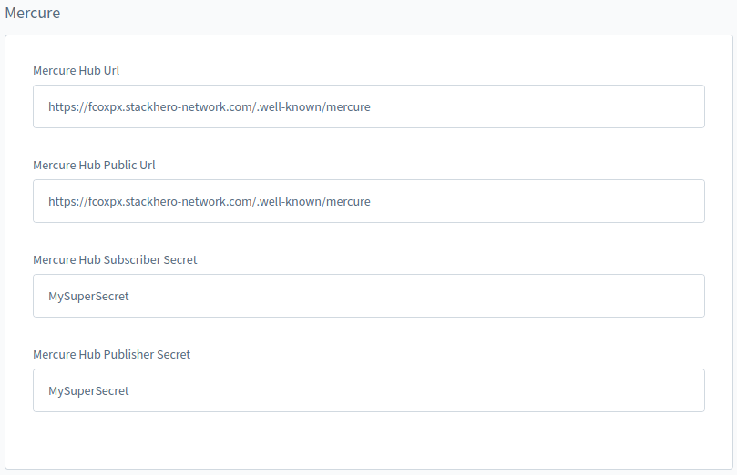

# Guided Shopping Installation

## Install and use the Guided Shopping feature

To install and use the Guided Shopping feature, follow the below steps:

### Get the plugin

1. Clone or download the [guided-shopping repository](https://gitlab.com/shopware/shopware/shopware-6/services/swagguidedshopping).
1. Extract the plugin, including the outer folder `SwagGuidedShopping`, to `platform/custom/plugins` directory of Shopware repository.
1. Make sure the plugin has a PHP package structure containing `composer.json` file, `src/` folder, and so on.
1. Prepare a zip file containing the plugin as in the following structure:

```bash
# SwagGuidedShopping.zip

**SwagGuidedShopping**/
├── bin
├── composer.json
├── composer.lock
├── makefile
├── phpstan.neon
├── phpunit.xml
├── README.md
├── src
└── tests
```

### Install the plugin

You can install the plugin via the admin panel or terminal server.

#### Admin panel

1. Log in to the admin panel.
1. Go to Extensions > My extensions

   

1. Click on the “Upload extension” button and choose the zip file containing the plugin from your device.

   

1. Once it is uploaded and listed, click “Install”.

    

1. On successful installation, activate the plugin by clicking on the switch button on the left.

#### Terminal server

1. Log in to a server.
1. Zip the plugin and place it in `<shopware-root-dir>/custom/plugins` directory.
1. Extract the zip file from `<shopware-root-dir>/custom/plugins` directory.
1. Run the below Symfony commands:

```bash
# refresh the list of available plugins
bin/console plugin:refresh
# find the plugin **name** (first column on the list). In this case, it is "**SwagGuidedShopping"**
bin/console plugin:install **SwagGuidedShopping** --activate
# clear the cache afterwards
bin/console cache:clear

# Now it is ready to use
```

### Basic configuration of Mercure Hub

Except for the self-hosted service, we recommend using any cloud-based service.

::: info
💡 We tested the service provided by [StackHero](https://www.stackhero.io/en/services/Mercure-Hub/pricing). Depending on the expected traffic, you can easily switch between the plans. For a small demo among a few people at the same time, the “Hobby” plan is sufficient.
:::

Detailed below is the minimum configuration needed for a working stack apart from project specific CMS configurations.

* **Set up CORS allowed origins** - In our case, it would be the domain where the Shopware PWA is hosted and available. For instance: `https://shopware-pwa-gs.herokuapp.com`(frontend).

* **Set up publish allowed origins** - The domains which request the Mercure service must be added to *publish allowed origins* else it gets rejected. For instance (HTTP protocol must not be included): `shopware-pwa-gs.herokuapp.com` (frontend) and `pwa-demo-api.shopware.com`(backend - API).

* **Set up the publisher (JWT) key** - Set whatever you want.

* **Set up the subscriber (JWT) key** - Set whatever you want.

* **Other settings** - Take a look at the below sample Mercure configuration on StackHero (Default settings is recommended).


### Daily service access

Daily service is responsible for streaming a video between the attendees. It is necessary to have an account to avail its services.

#### Set up an account

1. Go to the [Daily dashboard](https://dashboard.daily.co/).
1. Visit the “developers” section on the left.
1. Get the **API KEY**.

### Configure the plugin

Once the plugin is installed, the services are up and running and have all the required credentials, then the next thing to do is to configure the Guided Shopping plugin itself.

To do so,

1. Navigate to the admin panel where the Guided Shopping plugin is installed.
1. Click the menu and select configure option to configure the below two sections:

    * **Video (daily.co)**

      * You can leave the **API Base URL** as it is `https://api.daily.co/v1/` if not necessary.
      * Insert your **API KEY**.

    

    * **Mercure**

      * Replace *Mercure Hub Url* and *Mercure Hub Public Url* with your domain’s URL where the Mercure service is working and accessible from your stack. For instance, for the URL `https://fcoxpx.stackhero-network.com`, it would be `https://fcoxpx.stackhero-network.com/.well-known/mercure`.
      * Input the secret tokens that were set up in your Mercure service configuration.

    

Daily and Mercure are two external services that are crucial for working with the Guided Shopping plugin.

### Install the plugin into PWA

1. Make sure you have the `guided-shopping` repository.

1. Generate a [PWA project](https://shopware-pwa-docs.vuestorefront.io/)

1. Link the guided-shopping plugin to PWA using the below command:

    ```text
    ln -s <your-path-to-guidedShoppingRepo>/src/Resources/app/pwa <your-path-to-shopware-pwa-repo>/sw-plugins/guided-shopping
    ```

1. Navigate to the folder `pwa` > `sw-plugins` and open `local-plugins.json` file to add `"guided-shopping": true`.
1. Edit `PWA_PATH` in makefile in guided-shopping folder with your current pwa folder path.
1. Install additional dependencies using the below command:

    ```text
    make install-pwa
    ```

1. Update `jest.config.ts` with the following example file:

    ```js
    module.exports = {
      preset: "ts-jest",
      testEnvironment: "jsdom",
      moduleNameMapper: {
        "^@/(.*)$": "<rootDir>/$1",
        "^~/(.*)$": "<rootDir>/$1",
        "^vue$": "vue/dist/vue.common.js",
      },
      verbose: true,
      testMatch: [
        "<rootDir>/sw-plugins/guided-shopping/**/__tests__/**/*.spec.{js,ts}",
      ],
      moduleFileExtensions: ["ts", "tsx", "js", "json"],
      transform: {
        "^.+\\.js$": "babel-jest",
        "^.+\\.ts$": "ts-jest",
        ".*\\.(vue)$": "vue-jest",
      },
      coverageDirectory: "coverage",
      coverageReporters: ["html", "lcov", "text", "cobertura"],
      collectCoverage: true,
      watchPathIgnorePatterns: ["/node_modules/", "/dist/", "/.git/"],
      modulePathIgnorePatterns: [".yalc"],
      roots: [
        "<rootDir>/sw-plugins",
      ],
      coveragePathIgnorePatterns: [
        '/node_modules/',
        '/.nuxt/',
        '/.shopware-pwa/'
      ],
      transformIgnorePatterns: [
        "/node_modules/(?!@shopware-pwa)"
      ],
      collectCoverageFrom: [
        "sw-plugins/guided-shopping/logic/**/*.{js,ts}",
      ],
    }
    ```

1. Open `tsconfig.json` file to add `@types/jest` into `compilerOptions.types` array and save it.

### Rebuild Shopware PWA

In order to synchronize the installed `SwagGuidedShopping` plugin in the backend, the Shopware PWA must be rebuilt (recompiled) after the plugins are downloaded. Follow the below steps:

1. Check credentials in the `.env` file (ADMIN_USER and ADMIN_PASSWORD).

::: info
    💡 Alternatively, you can invoke the `plugins` command manually using:
    `npx @shopware-pwa/cli@canary plugins --user YOUR_ADMIN_USERNAME --password=YOUR_SECRET_PASS`
    Now, the application is ready for the rebuild process.

    Note that the admin credentials are required to connect to the installed plugin library through an Admin API.
:::

1. Run the build command.

    ```bash
    # being in the root directory of your Shopware PWA project:
    yarn build
    # under the hood, plugins synchronization will be processed at the same time
    ```

1. Re-deploy Shopware PWA.

With this, the PWA will contain the Guided Shopping plugin and be ready to use.

Now let us rehearse the steps before deployment by going through the [Checklist](./checklist).
