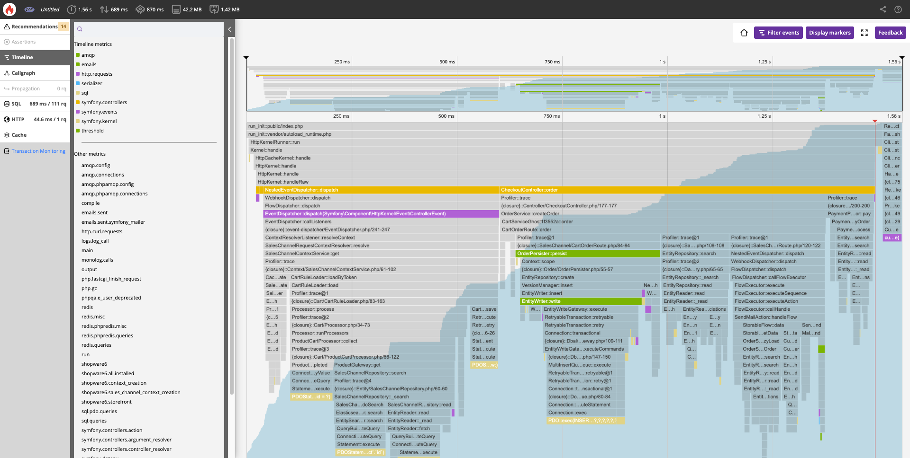

---
nav:
  title: Blackfire
  position: 90

---

# Blackfire Continuous Observability Solution

Blackfire is bundled with every Enterprise Shopware PaaS project without any additional fees.  
All the people invited to the project can access Blackfire, and all environments can be monitored.

The APM will show you when, where, and why performance issues happen.

Here are the main Blackfire features:

* Monitoring (Live metrics from your app): identify slow transactions, background jobs, services or third-party calls
* Deterministic Profiling (Deep, runtime code analysis): get function-call level metrics and spot root causes of bottlenecks
* Continuous Profiling (Combines profiling and monitoring with minimal overhead): easily identify hotspots, optimize resource usage, and compare timeframes to visually identify the flaky parts of your application
* Testing (Performance budget control): verify code behavior and performance
* Alerting (Warnings upon abnormal behaviors)
* Recommendations (Actionable insights and expert advice): benefit from unique, cutting-edge issue detection with documented resolution recommendations
* CI/CD integration (Automated testing and regression prevention): add Blackfire to any testing pipeline and existing tests, or start from scratch with our Open-Source crawler, tester, and scraper

## Access

You'll find the link to access Blackfire on the Shopware PaaS Console at the environment level.
Once you click on the link, you'll be redirected to the Platform.sh authentication portal.

If this is your first authentication, please use your usual Shopware PaaS email and follow the "reset password" workflow so you can set your Platform.sh password.

## Onboarding Guide

We encourage you to look at our [self-onboarding guide](https://docs.blackfire.io/onboarding/index). It includes extensive documentation and videos to help use and understand Blackfire.

## Deterministic Profiling

We recommend you install the [Firefox Blackfire extension](https://addons.mozilla.org/en-US/firefox/addon/blackfire/) or the [Chrome Blackfire extension](https://chromewebstore.google.com/detail/blackfire-profiler/miefikpgahefdbcgoiicnmpbeeomffld?hl=en) so you can trigger profiles of targeted transactions or group of transactions.

