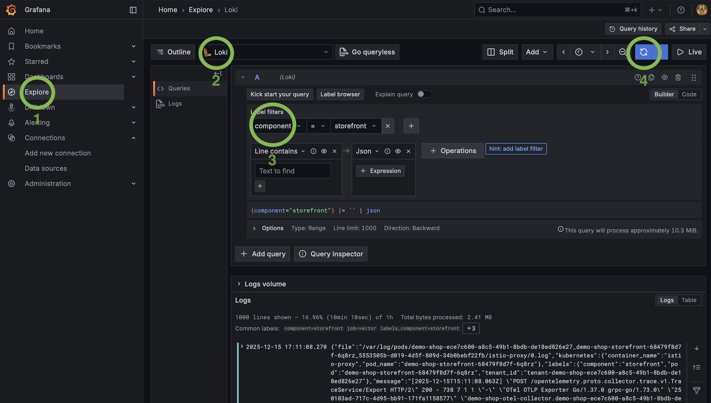

---
nav:
  title: Logs
  position: 20
---

# Logs

## Application Logs

Shopware PaaS Native allows you to query and follow logs for a given application environment directly from the CLI.

To view recent runtime logs, run:

```bash
sw-paas application logs
```

By default, the command returns the latest logs from the last 15 minutes. If the CLI cannot infer the target from your current git remote, it will ask you to select the organization, project, and application. You can also pass them explicitly:

```bash
sw-paas application logs \
  --organization-id <org-id> \
  --project-id <project-id> \
  --application-id <app-id>
```

After printing the selected logs, the CLI prints a Grafana Explore URL for the same query. Open that URL if you want to continue investigating the result in Grafana.

### Follow logs

Use `--follow` or `-f` to stream new log lines:

```bash
sw-paas application logs --follow
```

When following logs, the command starts with new lines only. Add `--since` to include recent history before the live stream begins:

```bash
sw-paas application logs --follow --since 30m
```

### Filter runtime logs

Use `--component` to focus on a specific application component:

```bash
sw-paas application logs --component storefront
```

Supported components are:

- `admin`
- `command`
- `cronjob`
- `migration`
- `scheduled-task`
- `setup`
- `storefront`
- `worker`

Use `--time-range` to inspect a local time window for the current day:

```bash
sw-paas application logs --time-range 09:00-10:00
```

Use `--limit` to change the maximum number of returned log lines:

```bash
sw-paas application logs --limit 500
```

For advanced filtering, pass a raw `LogQL` query:

```bash
sw-paas application logs --query '{job="vector",component="storefront"} |= "error"'
```

### Output formats

Use `--raw` to print only log messages:

```bash
sw-paas application logs --raw
```

Use `--output json` for machine-readable output:

```bash
sw-paas application logs --output json
```

### Specialized log commands

Deployment setup and migration logs are available through `sw-paas application deployment logs`. The short alias `deploy` is also supported:

```bash
sw-paas application deploy logs
```

If you know the deployment ID, pass it directly:

```bash
sw-paas application deploy logs --deployment-id <deployment-id>
```

Add `--follow` or `-f` to stream deployment setup and migration logs.

Cron job run logs are available through the cronjob logs command:

```bash
sw-paas application cronjob logs
```

If you know the run ID, pass it directly:

```bash
sw-paas application cronjob logs --run-id <run-id>
```

You can also filter run selection by cron job and control how many history entries are used for selection:

```bash
sw-paas application cronjob logs \
  --cronjob-id <cronjob-id> \
  --history-limit 100
```

The short alias `cron` is also supported:

```bash
sw-paas application cron logs
```

Add `--follow` or `-f` to stream logs for the selected cron job run.

Logs for commands executed in dedicated containers are available through:

```bash
sw-paas command logs
```

If you know the command ID, pass it directly:

```bash
sw-paas command logs --command-id <command-id>
```

Add `--follow` or `-f` to stream command logs.

These specialized commands also print a Grafana Explore URL at the end so you can open the same log query in Grafana.

## Grafana

You can also view and investigate application logs directly in Grafana.

To access Grafana, run the following command:

```bash
sw-paas open grafana
```

This command will provide you with the Grafana URL, username, and password.

Once logged in to Grafana:

1. Open the **Explore** tab.
2. Select **Loki** as the data source.
3. Filter logs by setting the `component` label to the service you want to inspect.
4. Run the query to view the logs for that component.



## Tips

In the Explore view, you can refine results using the search box:

- Line contains — matches the exact string.
- Line contains case-insensitive — recommended, as it matches the string regardless of the letter case.

A predefined dashboard named `Logs Dashboard` is available.
It displays the log ingestion volume and includes a built-in case-insensitive search box.


## Log retention

Shopware PaaS Native keeps your latest logs available for review. Logs older than 45 days are automatically removed.
