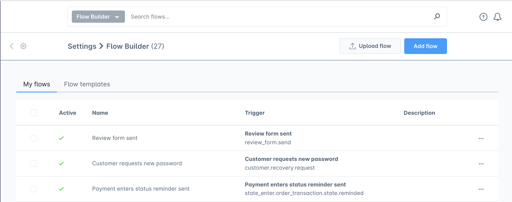
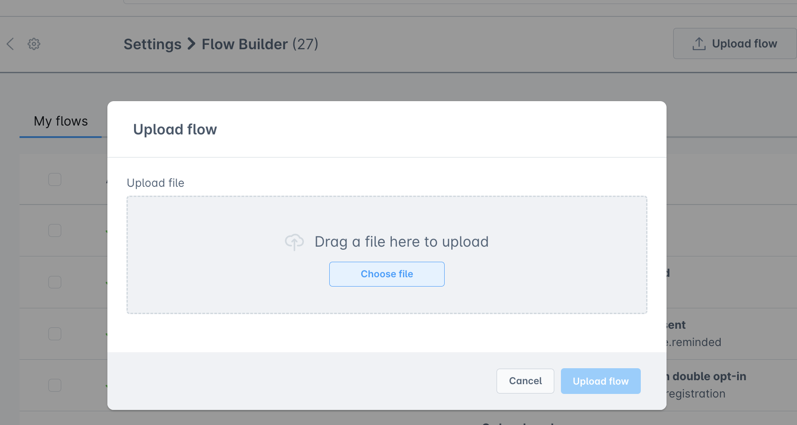

# Flow Sharing

## Overview

The flows will be able to be exchanged between different systems. Importing and exporting can streamline your flows - which takes a lot of time to set everything up, and there are many things to look out for. By giving merchants the option to synchronize flows between various systems through Flow Sharing, we can aid them in reducing the complexity involved in constructing a flow.

## Upload FLow

Uploading your flows can be as nice and simple as creating a JSON file and uploading that into Shopware.

Create your JSON flow file:

* To get you started, you can add a flow via Flow Listing page and then download that JSON to create your flow basic template.

Upload your flow:

* Go to: **Settings -> Flow Builder**
* Upload modal can be opened clicking **Upload flow** button

Select **Choose File**, and **upload a file** from your computer or drag and drop from wherever your flow JSON file is located.

Map fields:

You may check that rules and email templates are mapped to the relevant fields in Flow Builder before finishing the upload flow procedure. To ensure that everything will be uploaded properly, this serves as the last check.

When you’re happy, summit by clicking **Upload** button.
Your flow will be uploaded.

## Download Flow

Merchants wishing to export their current flow for any reason can generate a JSON using the Flow Sharing.

Download your flow:

* Go to: **Settings -> Flow Builder**
* Select a flow, then Download triggered via context menu.
* Click the **Download** option.
* Wait for the download to finish.

The download JSON file contains all data necessary to recreate the flow.
