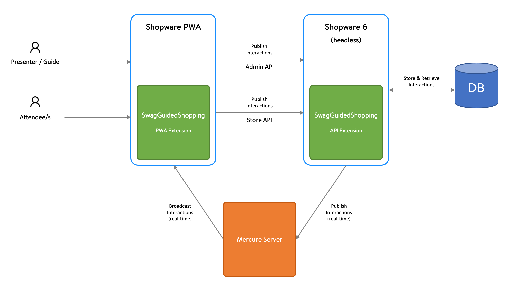

# Guided Shopping

This extension adds interactive presentations and real-time co-browsing capabilities to your Shopware 6 Store.


As of now it is only available for **Shopware PWA** and **self-managed** instances of Shopware 6.


## Installation and setup

Shopware Guided Shopping is installed as a [plugin extension](../../../concepts/extensions/plugins-concept.md). On top of that it requires the setup of a [Shopware PWA](../../pwa.md) frontend, a real-time communication server and a video/sound communication service.



## Configuration

After the installation you have to do some configuration to hook up Shopware PWA, the real-time communication server and the video/sound communication service.

## API

The extension is developed in an API-first fashion, which means that you can rely on the API endpoints to build a fully custom user interface.

## Implementation