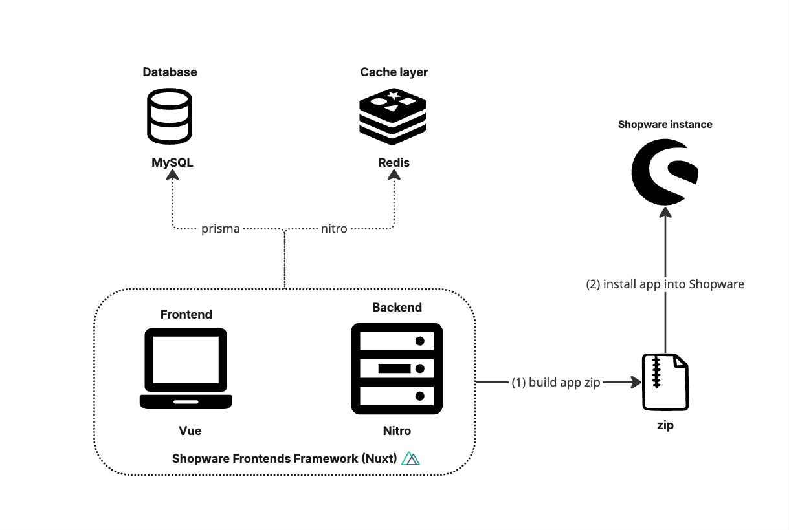

---
nav:
  title: Sales Agent
  position: 10

---

# Sales Agent Overview

This project is designed to streamline the communication and sales processes between sales representatives and their customers. By integrating Shopware, it enables sales representatives to handle various tasks in an optimized environment, without the overhead added by the Shopware Administration.

:::info
**Sales Agent** is a licensed application and not available as open source.
:::

:::info
The **Sales Agent** application does not belong to the *default Storefront*. It is a standalone Frontend app running with Nuxt instance. This template will be hosted in a separate instance with a new domain, which will be different from the Storefront domain.
:::

To get access to the private Gitlab repository, create a support ticket in your [Shopware Account](https://account.shopware.com). Access is granted after a short validation or a purchase of the Beyond or the Evolve license.

## Prerequisites

Review the below minimum operating requirements before you install *Sales Agent* on your infrastructure:

* [node](https://nodejs.org/en) >= v18
* [pnpm](https://pnpm.io/installation) >= 8
* [Shopware Frontends framework](https://frontends.shopware.com/) based on [Nuxt 3](https://nuxt.com/).
* Instance of [Shopware 6](../../guides/installation/) (version 6.7.3 and above).
* Database: MySQL
* Beyond or Evolve license needed for the Shopware instance.

## API Documentation

[API documentation](https://shopware.stoplight.io/docs/swag-sales-agent/) provides detailed information about the available endpoints and their functionalities.

## Architecture

The architecture depicted in the image shows a system with the following components:

* **Frontend**: Using Vue.

* **Backend**: Nuxt uses Nitro as its server engine.

* **Database**: Uses MySQL. Nuxt interacts with the backend through [Prisma](https://www.prisma.io/).

* **Cache Layer**: Uses Redis. Nitro provides a caching system built on top of the storage layer.
