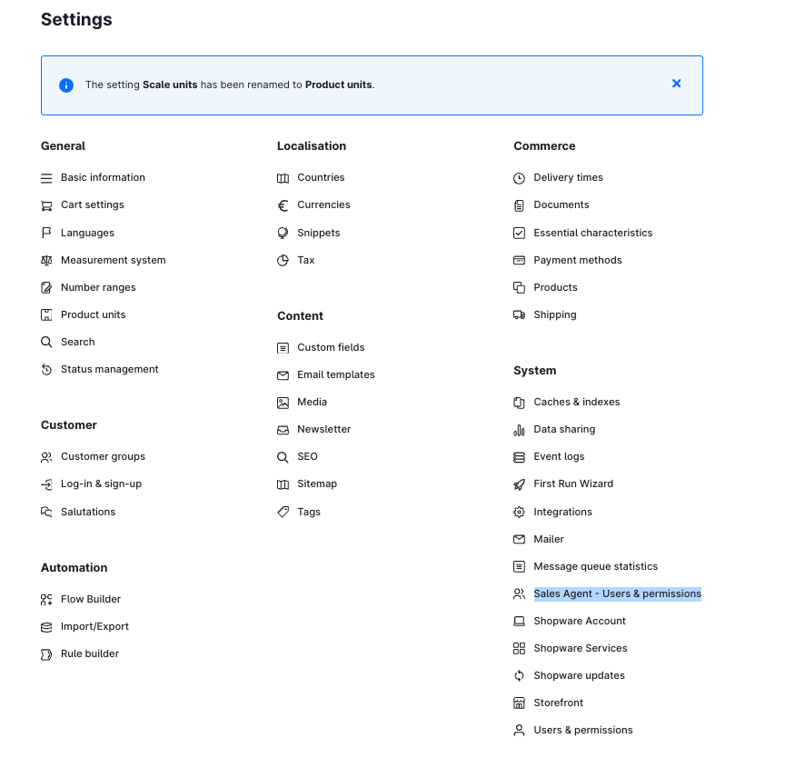

---
nav:
  title: Local installation
  position: 20
---

# Local installation

## Prepare

Obtain all the credentials to connect to the following services:

- Database (MySQL).

- Cache layer (Redis).

## Setup App Server

### Clone the Repository

```shell
git clone https://github.com/shopware/swagsalesagent.git
cd swagsalesagent
```

### Create a `.env` File

- Use the provided `.env.template` file as an example.

```shell
cp .env.template .env
```

Fill in the required details in the `.env` file. All detailed explanations of the properties are written in the `.env.template`.

### Install dependencies

```shell
pnpm install --frozen-lockfile --prefer-offline
```

### Migrate Database

Choose one of the following commands based on your needs:

- Execute existing migrations without creating new files:

```bash
  pnpm db:migration:deploy
```

- Execute & create new migration files if there are schema changes:

```bash
  pnpm db:migration:dev
```

### Run the Development Server

```shell
pnpm dev
```

### Build code for Production

```shell
pnpm build
```

## Connect App to Shopware Instance

- Build zip

```bash
pnpm app:build
```

- Upload zip from `bundle/swagsalesagent.zip` into Shopware Extensions.

- Verify the Installed App: after installation, you should see the Sales Agent menu item appear in the Settings.


