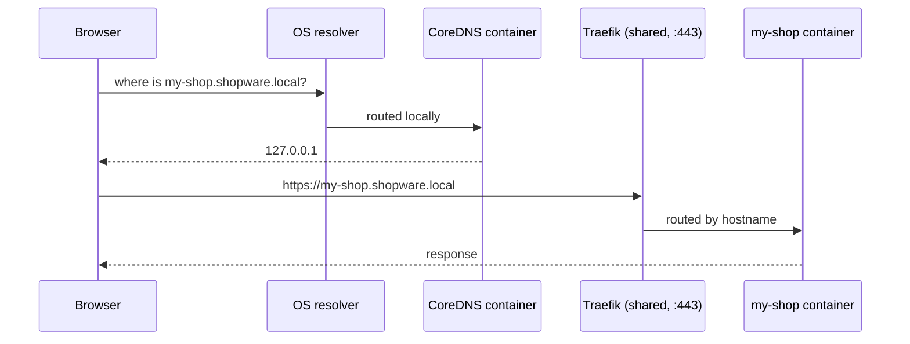

---
nav:
  title: Local Proxy
  position: 2

---

# Local Proxy — Run Multiple Shops in Parallel (CLI Reference)

A single `shopware-cli project dev` environment publishes fixed host ports (`8000`, `9080`, …), so only one shop can run at a time — a second one collides on those ports.

The **local proxy** removes the conflict: every shop is served at its own stable HTTPS hostname (for example `https://my-shop.shopware.local`) through one shared reverse proxy, so any number of shops run side by side with no port juggling.

For the underlying single-shop workflow, see [Development Environment](./dev-environment.md).

## How it works

A shop running under the proxy publishes **no host ports**. Instead:

- a small **CoreDNS** container answers every `*.shopware.local` name with `127.0.0.1` — the lookup never leaves your machine;
- one shared **Traefik** container reads the requested hostname and routes the request to the matching shop;
- a local **certificate authority** signs the HTTPS certificates, trusted once per machine.



Nothing leaves your machine: the DNS resolver only ever answers `127.0.0.1`, and shops reach each other by the same trusted hostnames.

## One-time setup

Run once per machine. It points the operating system's resolver at the local DNS and installs the certificate authority into your trust stores — the single `sudo` moment:

```bash
shopware-cli project proxy setup
```

To use a different base domain (persisted machine-wide), pass `--domain`:

```bash
shopware-cli project proxy setup --domain shopware.test
```

## Run a shop through the proxy

### New project

The simplest path is interactive — create the project and answer the prompts:

```bash
shopware-cli project create my-shop
```

`project create` asks whether to use **local domains** and offers to run the one-time machine setup for you (the `sudo` step). Answer yes, then start the shop — it comes up at `https://my-shop.shopware.local` with no further steps:

```bash
cd my-shop
shopware-cli project dev
```

For scripting or CI, skip the prompts with flags (the machine setup must have been run once beforehand):

```bash
shopware-cli project create --local-domain --no-interaction my-shop
```

### Existing project

Opt an existing port-based project in, and revert it when you are done:

```bash
# Start the shop under the proxy
shopware-cli project proxy up

# Stop it and restore its previous URL and ports
shopware-cli project proxy down
```

`proxy up` records the previous `APP_URL`, sales-channel domain, and configuration, and `proxy down` restores them exactly.

## Command reference

| Command                  | Description                                                                            |
|--------------------------|----------------------------------------------------------------------------------------|
| `project proxy setup`    | One-time machine setup: DNS routing and HTTPS trust. Flags: `--domain`, `--skip-trust` |
| `project proxy up`       | Register the current project with the shared proxy and start it                        |
| `project proxy down`     | Remove the current project from the proxy, stop it, and restore its URLs               |
| `project proxy status`   | Report whether the current project is registered                                       |
| `project proxy list`     | List every registered project with its URLs and running state                          |
| `project proxy verify`   | Health-check the whole chain (Docker, DNS, resolver, Traefik, HTTPS)                   |
| `project proxy teardown` | Remove every project and stop the shared proxy and DNS. Flag: `--force`                |

### Example: see what is running

```bash
shopware-cli project proxy list
```

```text
my-shop.shopware.local   running   ~/projects/my-shop
    Shop    https://my-shop.shopware.local
    Admin   https://my-shop.shopware.local/admin
other-shop.shopware.local   stopped   ~/projects/other-shop
```

## Troubleshooting

If a shop is not reachable, run the bottom-up health check. It stops at the first broken layer and prints how to fix it:

```bash
shopware-cli project proxy verify
```

## Requirements

- **Docker** — the shared proxy runs as Docker containers.
- **macOS or Linux.** On Windows, run shopware-cli inside **WSL2**.

## Related

- [Development Environment](./dev-environment.md) — the single-shop `project dev` reference
- [Development Environment guide](../../../../guides/development/dev-environment.md) — full workflow, setup, and configuration
