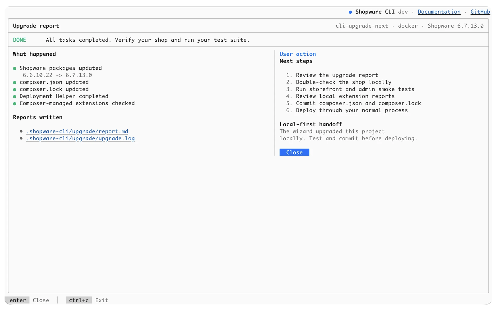

---
nav:
  title: Upgrade a Shopware Project
  position: 8
---

# Upgrade a Shopware Project

`shopware-cli project upgrade` guides a Shopware project through a local-first upgrade. It checks whether the project is ready, analyzes Composer-managed extensions, verifies the target dependency set with Composer, lets you review the plan before files change, runs the upgrade locally, and writes a shareable report.

::: info
The upgrade wizard prepares and applies the upgrade to your local project. It does not deploy the upgraded project to production. Test the result, commit the changed files, and deploy through your normal process.
:::

## Before you start

Run the upgrade on a Git branch or a disposable copy of the project. The wizard checks these prerequisites before continuing:

- `composer.lock` exists and contains the installed `shopware/core` version.
- The Git working tree is clean. If the directory is not a Git repository, the wizard warns instead of blocking. Use `--disable-git` to skip Git-related checks.
- All discovered extensions are managed through Composer.
- PHP and Composer are available through the project's configured environment.
- The Deployment Helper workflow is available. If `shopware/deployment-helper` is not required yet, the wizard can add it during the upgrade.

For Docker and other configured environments, PHP and Composer are checked through the project executor rather than only on the host machine.

### Migrate local extensions to Composer first

The wizard resolves and pins extension versions with Composer. Extensions living outside `vendor/`, for example in `custom/plugins`, cannot participate in that resolution and therefore block the upgrade readiness check.

Migrate eligible locally managed extensions with:

```bash
shopware-cli project autofix composer-plugins
```

See [Migrate custom/plugins extensions to Composer](./autofix.md#migrate-customplugins-extensions-to-composer) for details.

## Run the interactive upgrade

From the Shopware project, run:

```bash
shopware-cli project upgrade
```

The terminal wizard follows six phases:

1. Check project readiness.
2. Choose a target Shopware version.
3. Analyze extension compatibility and run a Composer resolution check.
4. Review the planned project changes.
5. Apply the upgrade locally with live progress and logs.
6. Review the generated upgrade report and next steps.

The readiness and preparation phases are read-only. Project files are not changed until you review the plan and start the upgrade.

## Choose and verify the target version

The version picker offers a recommended release, the latest patch in the current release line when available, and a searchable list of other supported versions.

After you choose a target, the wizard combines two kinds of compatibility information:

- Extension and repository metadata provide an early compatibility signal.
- A Composer dry run verifies whether the target dependency set can actually be resolved for this project.

Composer resolution is the final gate for the dependency set. Repository or Store metadata can be missing or incomplete; when Composer successfully resolves a previously uncertain extension, the wizard reflects the resolved result instead of keeping a stale compatibility blocker.

The extension queue distinguishes extensions that are ready, need an update, need manual review, or block the selected upgrade. Where available, extension details and the generated report link to the Shopware Store listing and include release changelogs for updates.

If Composer cannot resolve the target dependency set, the wizard stops before modifying the project and includes the Composer conflict output in the report.

## Review what will change

Before execution, the wizard shows the planned project changes and a summary of the extension results. Starting the upgrade then performs the local workflow:

1. Back up `composer.json` and `composer.lock`.
2. Rewrite the Shopware and resolved extension requirements in `composer.json`.
3. Run `composer update --with-all-dependencies`.
4. Refresh Symfony Flex recipes with `composer symfony:recipes:install --force --reset`.
5. Run `vendor/bin/shopware-deployment-helper run`.
6. Write the upgrade report.

The Flex recipe refresh is best-effort: a recipe-refresh failure is reported as a warning, while failures in essential upgrade steps stop the run.

If an essential step fails or you cancel the running upgrade, Shopware CLI restores `composer.json` and `composer.lock` and writes a failure report. Other files changed by tools during the workflow are not covered by that Composer-file rollback, which is another reason to start from a clean Git state.

## Run a non-interactive preflight

The same workflow can run without the interactive TUI. This is useful for CI, scripts, and agent-assisted workflows.

To inspect a target without modifying the project:

```bash
shopware-cli project upgrade \
  --no-interaction \
  --target latest-patch \
  --dry-run
```

In non-interactive mode, `--target` is required. It accepts:

- an exact supported Shopware version, for example `6.7.13.0`;
- `recommended`;
- `latest-patch`.

With `--dry-run`, Shopware CLI performs the readiness checks, extension analysis, and Composer resolution, prints the planned changes, writes a report, and stops before changing project files.

Remove `--dry-run` to execute the upgrade non-interactively after a successful preflight.

### Security advisory blocking

Composer may refuse a dependency set because packages are affected by known security advisories. The `--no-audit` option allows the upgrade to continue by disabling that Composer audit block for the workflow.

::: warning
Use `--no-audit` only when you understand and have accepted the reported security risk. Prefer a target and dependency set without known security advisories whenever possible.
:::

## Read and share the upgrade report

The wizard writes a Markdown report to:

```text
.shopware-cli/upgrade/report.md
```

The report includes:

- source and target Shopware versions;
- readiness and PHP requirement information;
- planned Composer changes;
- extension results grouped as blocked, needs review, needs update, or OK;
- extension update changelogs where available;
- the package changes predicted by Composer resolution;
- raw Composer conflict output when dependency resolution fails.

The final wizard screen links to the report and execution log and summarizes the local-first outcome and next steps:



The upgrade also writes its execution log below `.shopware-cli/upgrade/`. The report and log can be shared with a colleague, agency, extension vendor, hosting provider, Shopware support, or a coding agent when investigating an upgrade problem.

## What the wizard does not guarantee

The wizard makes upgrade risk visible earlier, but a successful run is not a guarantee that every application behavior remains compatible. It does not:

- rewrite incompatible custom extension code;
- create a missing compatible release from an extension vendor;
- remove hosting or infrastructure constraints;
- replace application, Storefront, Administration, integration, or business-flow testing;
- deploy the upgraded project to production.

After a successful run, review the report and changed files, test the shop and extensions locally, run your automated test suite, commit the resulting project changes, and deploy through your normal process.

For the wider operational upgrade procedure, see [Upgrade Shopware](../../../../guides/upgrades-migrations/upgrade-shopware.md) and [Performing Shopware Updates](../../../../guides/hosting/installation-updates/performing-updates.md).
