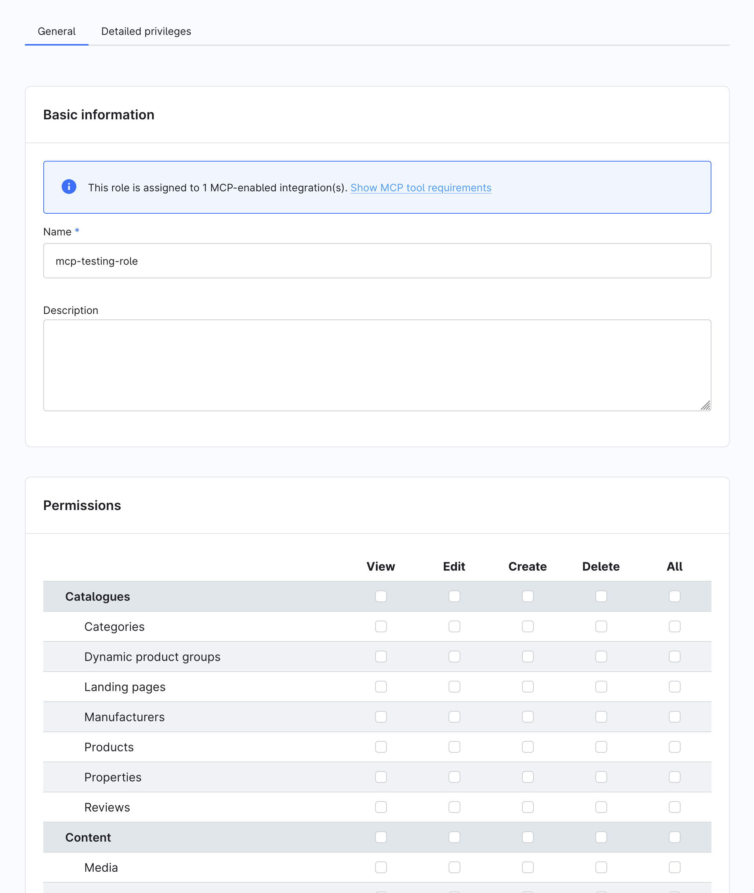
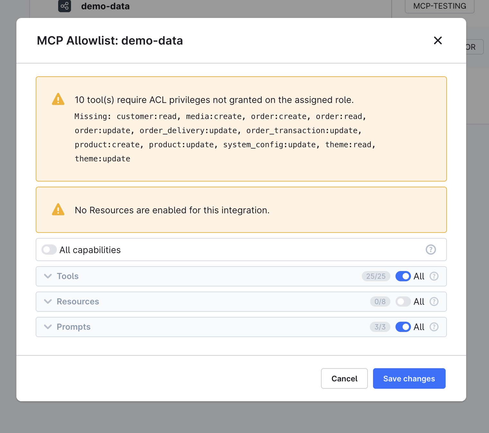

---
nav:
  title: Configuration
  position: 30

product: tools
lifecycle: maintenance
---

# Configuration

:::info Version requirements
This page describes Shopware 6.7.14.0 and later, where the MCP server is always enabled and progressive tool discovery is active.

On Shopware 6.7.11.0 to 6.7.13.x, the MCP server is gated behind the `MCP_SERVER` feature flag. Set `MCP_SERVER=1` in your `.env` file to enable the endpoint. Those versions advertise every allowed tool in `tools/list`; the discovery tools, tool groups, toolsets, cursor pagination, and `listChanged` notifications do not exist there.

Starting with 6.7.14.0, the flag is removed and has no effect. Remove `MCP_SERVER` from your `.env` file. The MCP classes stay marked as experimental until 6.8.0.
:::

## Shopware MCP configuration

Shopware-specific MCP settings live under the `shopware.mcp` key in `config/packages/shopware.yaml` or any config file loaded in your application:

```yaml
shopware:
    mcp:
        allowed_tools: []       # Empty = all tools allowed. List tool names to restrict globally.
        app_tool_timeout: 10    # Timeout in seconds for app webhook tool calls.
```

These two keys are the complete `shopware.mcp` configuration:

| Key                | Type            | Default | Description                                                             |
|--------------------|-----------------|---------|-------------------------------------------------------------------------|
| `allowed_tools`    | list of strings | `[]`    | Installation-wide tool allowlist applied at compile time. Empty = all.  |
| `app_tool_timeout` | integer         | `10`    | Timeout in seconds for app webhook tool calls. Minimum `1`.             |

Everything else — the endpoint path, server instructions, and list pagination — is configured on the `symfony/mcp-bundle` extension, not under `shopware.mcp`.

### Global tool allowlist

`allowed_tools` is an installation-wide safety switch. It restricts which tools are available across **all** integrations at compile time:

```yaml
shopware:
    mcp:
        allowed_tools:
            - shopware-tool-search
            - shopware-toolsets-list
            - shopware-toolset-enable
            - shopware-entity-schema
            - shopware-entity-search
            - shopware-system-config-read
```

An empty list (the default) means no compile-time restriction; all registered tools are available. When the list is not empty, add the three discovery tools and every domain tool that should remain available globally. The domain tools in the example are only an illustrative subset; you do not need to list every registered tool unless you want all of them available.

Removing the discovery tools at compile time prevents clients from finding and enabling the remaining tools. The per-integration and per-user allowlists in the Administration are the primary controls for day-to-day access management.

:::info Per-principal allowlist
Shopware applies a per-principal MCP allowlist depending on how the client authenticates:

| Auth mode                                | Allowlist source                                                                          |
|------------------------------------------|-------------------------------------------------------------------------------------------|
| Integration access key (`SWIA...`)       | Per-integration allowlist under **Settings → Integrations → Edit MCP Allowlist**          |
| User access key (`SWUA...`)              | Per-user allowlist under **Settings → Users & Permissions → [user] → MCP tool allowlist** |
| Bearer JWT, password / refresh grant     | Per-user allowlist of the authenticated user                                              |
| Bearer JWT, client_credentials           | Per-integration allowlist                                                                 |
| Integration + `sw-app-user-id` (Copilot) | Intersection of the integration allowlist and the user allowlist                          |

`null` per key means all capabilities of that type are allowed; a JSON array restricts access to the listed names; an empty array `[]` denies access to that capability type.

The three server-owned discovery tools are the exception for tool allowlists. They remain available so that clients can use the discovery flow, but their search results and toolsets contain only tools permitted by the effective allowlist.

Admin user accounts (`admin = true`) always bypass the allowlist regardless of auth mode. This applies to user accounts, not to integrations created with `--admin` (which bypasses ACL but still respects the per-integration allowlist).
:::

### Delegated user calls (`sw-app-user-id`)

Apps that act on behalf of a logged-in user (for example, a Copilot sidebar embedded in the Admin UI) can pass the `sw-app-user-id` header alongside integration credentials:

```text
sw-access-key: SWIA...
sw-secret-access-key: ...
sw-app-user-id: <user-uuid>
```

The value must be the Shopware user ID (a UUID in hex format, e.g., `01932f3a...`). Apps embedded in the Admin UI can read it from:

- The current session in JavaScript: `Shopware.Store.get('session').currentUser.id`
- The Admin API: `GET /api/_info/me` — the `data.id` field in the response

If the header is absent or invalid (i.e., not a valid UUID), Shopware ignores it and applies only the integration allowlist.

When this header is present, and a valid user UUID is provided, Shopware applies the **intersection** of the integration allowlist and the user allowlist. A tool is only available if both the integration and the user have it enabled:

| Integration allowlist | User allowlist        | Effective allowlist |
|-----------------------|-----------------------|---------------------|
| `null` (unrestricted) | `null` (unrestricted) | unrestricted        |
| `null`                | `[tool-b]`            | `[tool-b]`          |
| `[tool-a, tool-b]`    | `null`                | `[tool-a, tool-b]`  |
| `[tool-a, tool-b]`    | `[tool-b, tool-c]`    | `[tool-b]`          |
| `[tool-a]`            | `[]`                  | `[]` (nothing)      |

Admin users bypass the user side of the intersection — if the user is an admin, their allowlist is treated as `null` (unrestricted), so the integration allowlist alone applies.

This pattern lets the app owner control which tools the integration may ever call, while users control which of those tools they personally allow the app to use on their behalf. Neither side can grant more than what the other has permitted.

## MCP bundle configuration

The underlying `symfony/mcp-bundle` is configured in `config/packages/mcp.php`. Shopware ships this file, and Symfony loads it automatically. You do not need to create or modify it for standard setups.

This file also sets the server `instructions` that clients receive during `initialize`. They tell the agent that the advertised tool list is not the full catalogue and that it should call `shopware-tool-search` before concluding that an action is unsupported.

## Capability list pagination

The `tools/list`, `resources/list`, and `prompts/list` methods use MCP cursor pagination. When a response contains `nextCursor`, pass that value unchanged as `cursor` in the next request. Continue until `nextCursor` is absent.

The default page size is 50 entries. It is the MCP bundle's `pagination_limit` option, not a `shopware.mcp` key. Shopware does not set it, so to change it, configure the `mcp` extension in your own config file:

```yaml
# config/packages/mcp.yaml
mcp:
    pagination_limit: 100
```

Treat cursors as opaque values. Shopware applies the effective allowlist before pagination, so each page contains only capabilities the current principal may access, and a cursor is only meaningful for the principal that received it. An unknown, malformed, or out-of-range cursor is answered with the JSON-RPC error `-32602` and the message `Invalid value for pagination parameter "cursor"`.

In practice `tools/list` rarely paginates: it only contains the discovery tools plus the tools of the toolsets enabled for the current session. `resources/templates/list` is not allowlist-filtered.

## Session store

MCP sessions track an ongoing conversation across multiple requests. The client performs an `initialize` handshake first, then sends subsequent `tools/call` requests referencing that session ID. Session data and enabled toolsets must survive between requests.

Shopware defaults to a file-based session store that writes to `%kernel.cache_dir%/mcp-sessions/`.

Enabled toolsets are stored separately, in the `mcp_toolset_session` database table, keyed on the `Mcp-Session-Id` header only — not per user and not per integration. Rows are deleted when the client ends the session with `DELETE /api/_mcp`. Sessions that are abandoned without a `DELETE` are cleaned up by the daily `mcp_toolset_session.cleanup` scheduled task, so the scheduler must run in production.

| Store                                           | Multi-worker | Multi-server | Backend                                                                       |
|-------------------------------------------------|--------------|--------------|-------------------------------------------------------------------------------|
| `file` (default)                                | No           | No           | `%kernel.cache_dir%/mcp-sessions/`                                            |
| `memory`                                        | No           | No           | Per-process RAM                                                               |
| `cache` (avoid)                                 | No in dev    | No           | `cache.app` (ArrayAdapter in dev)                                             |
| `framework` (unusable in Shopware)              | Yes          | Yes          | Requires active PHP session, not available because the Admin API is stateless |
| Custom Redis store (recommended for production) | Yes          | Yes          | Redis / Valkey                                                                |

### Production: Redis session store

The file store works on a single machine. In a multi-server or Kubernetes environment, `initialize` and subsequent tool calls may land on different workers that do not share a local filesystem. Switch to Redis:

**`config/services.yaml`:**

```yaml
services:
    mcp.session.cache_psr16:
        class: Symfony\Component\Cache\Psr16Cache
        arguments: ['@cache.mcp_sessions']

    mcp.session.store:
        class: Mcp\Server\Session\Psr16SessionStore
        arguments:
            - '@mcp.session.cache_psr16'
            - 3600   # TTL in seconds
```

**`config/packages/framework.yaml`:**

```yaml
framework:
    cache:
        pools:
            cache.mcp_sessions:
                adapter: cache.adapter.redis_tag_aware
                provider: 'redis://your-redis-host:6379'
                default_lifetime: 3600
```

If you already have a Redis/Valkey connection configured for Shopware, set `provider` to the same DSN to avoid opening a second connection.

## ACL and permissions

All MCP tool operations respect the integration's Admin API ACL role. To restrict what an MCP client can do:

1. Create an ACL role in **Settings → Users & Permissions → Roles** with only the required permissions.
2. Assign that role to the integration (omit `--admin` when creating via CLI).
3. Under **Settings → Integrations → Edit MCP Allowlist**, enable only the tools needed for this integration.

The Admin UI surfaces two helpers for getting ACL right:

- The **Role detail** page shows a banner when the role is assigned to MCP-enabled integrations. Click **Show MCP tool requirements** to open the MCP Tool Requirements modal, which lists every privilege required by the allowed tools. Switch between **By Permission** (per-entity view with Grant buttons) and **By Tool** (per-tool view). Use **Grant all missing** to add the missing privileges in one click:



- The **Edit MCP Allowlist** modal groups tools by their tool group — the same taxonomy that becomes a toolset for progressive discovery. Each group has its own checkbox that also reflects partial selections, plus expand and collapse controls, so you can allow a whole toolset in one click. A tool that another selected tool declares as a dependency is included automatically and marked as such. The modal also shows a coverage warning when the assigned role is missing privileges required by an allowed tool:



## CLI: `debug:mcp`

List all registered capabilities:

```bash
bin/console debug:mcp
```

The tool output shows five columns: **Name**, **Group**, **Source**, **Dependencies**, and **Privileges**. It reads from the complete live server registry and covers core and extension tools in one view. The **Group** becomes the toolset name used for progressive discovery.

The command prints separate sections for **Tools**, **Prompts**, **Resources**, and **Resource Templates**. It covers the Admin API server only; Store API capabilities are not listed — see [Store API MCP](./store-api.md).

Filter by capability type:

```bash
bin/console debug:mcp --tools      # tools only
bin/console debug:mcp --prompts    # prompts only
bin/console debug:mcp --resources  # resources only
```

Drill into a single capability by name:

```bash
bin/console debug:mcp shopware-entity-search
```

See the registry from a specific integration's perspective (honors its per-integration allowlist):

```bash
bin/console debug:mcp --integration=SWIA...
```

If a tool is missing from this output, it is also missing from the live endpoint. Common causes:

- Plugin is not installed or activated
- Service tag is missing (`shopware.mcp.tool`)
- `#[McpTool]` attribute is on `__invoke()` instead of the class
- App tool's webhook URL is not reachable

## Rate limiting

Both MCP endpoints are rate limited with their own buckets, configured under `shopware.api.rate_limiter` in `config/packages/shopware.yaml`. Rate limiting protects the endpoints from brute-force attempts and runaway agent loops.

| Bucket           | Endpoint          | Keyed on                                    | Limits                                |
|------------------|-------------------|---------------------------------------------|---------------------------------------|
| `mcp_admin_api`  | `/api/_mcp`       | Access token, falling back to client IP     | 300 per minute, 1000 per 10 minutes   |
| `mcp_store_api`  | `/store-api/_mcp` | Sales channel and context token, plus client IP | 120 per minute, 600 per 10 minutes |

Both use the `time_backoff` policy and reset after one hour. Exceeding a limit returns HTTP 429 with the remaining wait time in the response body; no `Retry-After` header is sent.
